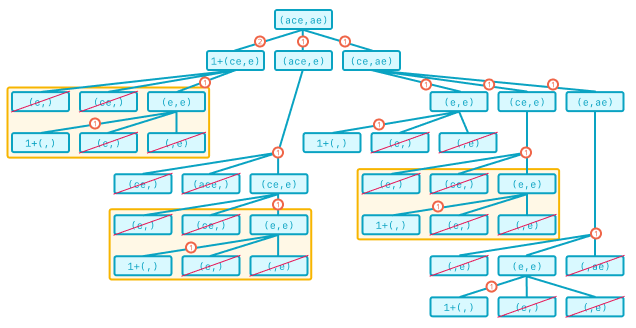

# Dynamic Programming

<iframe src="https://adaacademy.hosted.panopto.com/Panopto/Pages/Embed.aspx?pid=06de5ab7-88ef-495d-a313-ad440033b00c&autoplay=false&offerviewer=true&showtitle=true&showbrand=false&start=0&interactivity=all" height="405" width="720" style="border: 1px solid #464646;" allowfullscreen allow="autoplay"></iframe>

## Learning Goals

- Define dynamic programming
- Define memoization
- Use dynamic programming to optimize programming solutions

## Overview

**Dynamic Programming** is a way to optimize both recursive and iterative solutions. When we see a problem that repeatedly involves solving the same problem, we can optimize it by using dynamic programming.

The key concept of dynamic programming is to recognize subproblems we solve again and again, and store the solutions to those problems. This is called _memoizing_. Then we use the stored solutions to help solve the larger problems.

Dynamic programming is in some ways similar to divide and conquer.

A dynamic-programming problem breaks the problem into subproblems and saves the solutions to those subproblems. The key difference is that in dynamic programming the subproblems are often overlapping, such that we need the solution to a particular subproblem multiple times.

In a divide-and-conquer problem the larger problem is divided into several non-overlapping subproblems and the solutions to each subproblem is used to solve the larger problem.

## Terms

| Term                | Definition                                                                                                                                                                             | How to Use in a Sentence                                                                                                               |
| ------------------- | -------------------------------------------------------------------------------------------------------------------------------------------------------------------------------------- | -------------------------------------------------------------------------------------------------------------------------------------- |
| Dynamic Programming | An algorithmic strategy of breaking a problem down into subproblems that need to be calculated multiple times, allowing us to improve performance by storing results and reusing them. | "This algorithm calculates the same subproblem over and over, so let's use a dynamic-programming approach to improve the performance!" |
| Memoization         | An optimization technique used primarily to speed up algorithms by storing the results of subproblems and returning the cached result when the same subproblem occurs again.           | "If we memoize the results of that function call, we can improve the performance if it gets called again with the same arguments."     |

## Dynamic Programming in a Nutshell

To paraphrase a great discussion that can be found on Quora (link in the references), here's a concise way to think about dynamic programming.

```
*writes down "11111111" on a sheet of paper*
"How many 1s are there?"
*counting* "Eight!"
*writes down another "1"*
"How about now?"
*quickly* "Nine!"
"How'd you know it was nine so fast?"
"You just wrote one more"
"So you didn't need to recount because you remembered there were eight!
  Dynamic programming is just a fancy way to say:
  'remembering stuff to save time later'"
```

## Example: Fibonacci

Let's consider how to create a solution for the Fibonacci sequence that uses dynamic programming.

Let's recall what the Fibonacci sequence is `fibonacci(n)`:

`fibonacci(0)` = 0, for \(n = 0\)  
`fibonacci(1)` = 1, for \(n = 1\)  
`fibonacci(n)` = `fibonacci(n-1)` + `fibonacci(n-2)`, for \(n > 1\)

We _could_ code the Fibonacci sequence with a recursive solution as follows:

```python
def fibonacci(n):
    if n == 0 or n == 1:
        return n

    return fibonacci(n - 1) + fibonacci(n - 2)
```

However this is wildly inefficient!

  
_Fig. Fibonacci of 5. Notice how the same subproblems are repeatedly called!_

For the Fibonacci of 5, `fibonacci(2)` is called 3 times, and `fibonacci(1)` is called 5 times. As \(n\) grows larger, this will occur more and more often. For any \(n > 1\), we end up making \(2^n\) method calls!

Instead of solving the same problems over and over again we can solve these problems by storing them in a _memo_ and using the stored subproblems to make calculating the larger problem more efficient.

Let's take a look at a few variations of `fibonacci` which make use of memoization to improve their performance.

All of these solutions _memoize_ results by storing different in-progress solutions in a collection named `solutions`. By storing them for later use, we avoid performing identical sub-calculations, since we can instead simply look them up!

<br />

<details>

<summary>Iterative solution. Starts from the base cases of [0, 1] building up to the desired number.</summary>

```python
def fibonacci(n):
    if n == 0 or n == 1:
        return n

    solutions = [0, 1]
    current = 2

    while current <= n:
        solutions.append(solutions[current - 1] + solutions[current - 2])
        current += 1

    return solutions[n]
```

</details>

<details>

<summary>Recursive solution. A recursive adaptation of the iterative solution.</summary>

```python
def fibonacci_recursive(n, solutions=None, current=None):
    if solutions is None:
        solutions = [0, 1]
        current = 2

    solutions.append(solutions[current - 1] + solutions[current - 2])

    if n <= current:
        return solutions[n]

    return fibonacci_recursive(n, solutions, current + 1)
```

</details>

<details>

<summary>"Fixed" recursive solution. Based on the inefficient initial recursive solution, but memoizes calculations as they are performed. Notice how similar this implementation is to that initial version. The addition of memoization preserves the core of the original logic, but improves the performance significantly!</summary>

```python
def fibonacci_recursive(n, solutions=None):
    if solutions is None:
        solutions = {}

    if n in solutions:
        return solutions[n]

    if n == 0 or n == 1:
        solutions[n] = n
    else:
        solutions[n] = (fibonacci_recursive(n - 1, solutions) +
            fibonacci_recursive(n - 2, solutions))

    return solutions[n]
```

</details>

To really appreciate the improvements that dynamic programming can bring, we can try running `fibonacci(40)` with the original, recursive implementation and note how long this takes to run. If we then run _any_ of the versions that use dynamic-programming techniques, we should see a significant improvement!

### !callout-info

## Fibonacci Challenges

Notice how when solving `fibonacci(n)`, the only solutions we need are `fibonacci(n-1)` and `fibonacci(n-2)`. Using this observation, can we reduce our space complexity from \(O(n)\) to \(O(1)\) for the iterative solution? Are we able to apply this strategy to the recursive version of that solution?

### !end-callout

## Example: Longest Common Subsequence

Let's create a function named `lcs`, which stands for "longest common subsequence."

This function takes two strings `str1` and `str2`, and returns the length of their longest common subsequence.

A subsequence of a string is a new string generated from the original string with some characters (can be none) deleted without changing the relative order of the remaining characters. (eg, "ace" is a subsequence of "abcde" while "aec" is not). A common subsequence of two strings is a subsequence that is common to both strings.

If there is no common subsequence, return 0.

| `str1`    | `str2`      | Subsequence | Length (result) |
| --------- | ----------- | ----------- | --------------- |
| `"abcde"` | `"ace"`     | `"ace"`     | 3               |
| `"abcde"` | `"aqzcrwe"` | `"ace"`     | 3               |
| `"abc"`   | `"abc"`     | `"abc"`     | 3               |
| `"abc"`   | `"def"`     | `""`        | 0               |
| `"abc"`   | `""`        | `""`        | 0               |

### !callout-info

## From Genomics to Git Diffs

The longest common subsequence problem is relevant to a lot of different subjects, such as comparing gene sequences, or even creating Git diffs!

### !end-callout

One approach we might take to solve this problem is at each position, to consider the current letter in each string and the remaining portion of each string. If the current characters match, they contribute one matched character count to our total length, plus however many matches there are in the remainders of the strings.

But maybe we can get a better alignment (a longer subsequence) if we don't take the current pair of characters as part of the subsequence. What if we advanced the first string, looking for a better place to start the match. Or what if we advanced the second string? And what if this wasn't a match in the first place? We can advance both strings. For any of these cases, the current characters don't add anything to the overall length of the subsequence. The final length would be the maximum of those three options.

And how do we find the maximum subsequence of the remaining strings? Why with recursion!

```python
def lcs(str1, str2):
    if not str1 or not str2:
        return 0

    # split the first character from the rest
    first1 = str1[0]
    rest1 = str1[1:]
    first2 = str2[0]
    rest2 = str2[1:]

    # is this spot a match?
    if first1 == first2:
        current_score = 1
    else:
        current_score = 0

    # the result for this position is the max of the current score
    # and each of the maxes from the three possibilities:
    # 1. advance both characters (adding to score if a match)
    # 2. advance only the first character
    # 3. advance only the second character
    result = max(
        current_score + lcs(rest1, rest2),
        lcs(rest1, str2),
        lcs(str1, rest2)
    )

    return result
```

And let's visualize this solution in a diagram. In this example, we're finding the longest common subsequence for the strings "ace" and "ae." When we illustrate the number of function calls needed, we see there are _a lot_.

  
_Fig. If the recursive explosion of Fibonacci seemed bad, get a load of this! Crossed-out nodes indicate calls that result in a 0 length due to at least one of the input strings being empty. The numbers indicate the maximum value being returned back from a particular branch of execution. Repeated regions are outlined in yellow._

The explosion of calls in this diagram puts Fibonacci to shame! But for small examples, like in the example table above, this recursive implementation might be manageable.

But increasing the input size by even a little bit can slow things down significantly! If we try using the strings `"tagacgttagtc"` and `"qaqaqgqtqgqc"` as input to our current implementation, even though they are only 12 characters long each, it will take a noticeable amount of time to run! What if we were using this to align genes, which can often span tens of thousands of characters?

From the example call diagram, if we notice that there are many repeated sub-trees (especially the calls to `lcs("ce", "e")`, outlined in yellow), we might think about applying dynamic programming practices to reuse these calculations.

To add memoization to the Fibonacci algorithm, we only had to check whether a single value had been calculated before. But for the longest common subsequence we need to look up a result based on two inputs.

<br />

<details>

<summary>Consider how we might accomplish this. Then click here to review a possible solution. Comments are included to indicate the newly added code.</summary>

```python
# include a parameter to receive the memo
def lcs(str1, str2, memo=None):
    if not str1 or not str2:
        return 0

    # initialize the memo or lookup the current values
    if memo is None:
        memo = {}
    elif str1 not in memo:
        memo[str1] = {}
    elif str2 in memo[str1]:
        return memo[str1][str2]

    first1 = str1[0]
    rest1 = str1[1:]
    first2 = str2[0]
    rest2 = str2[1:]

    if first1 == first2:
        current_score = 1
    else:
        current_score = 0

    result = max(
        # include the memo in the recursive calls
        current_score + lcs(rest1, rest2, memo),
        lcs(rest1, str2, memo),
        lcs(str1, rest2, memo)
    )

    # store this calculation for later
    memo[str1][str2] = result

    return result
```

</details>

## Summary

Dynamic programming is an algorithmic strategy which involves breaking down a large problem into easier-to-solve subproblems.

In a dynamic-programming approach, the solved subproblems are saved for use in solving larger instances of the problem. In this manner we exchange larger space complexity for smaller time complexity.

## Resources

- [Geeks for Geeks: Dynamic Programming](https://www.geeksforgeeks.org/dynamic-programming/)
- [Geeks for Geeks: Ugly Number Problem](https://www.geeksforgeeks.org/ugly-numbers/)
- [Quora: How should I explain dynamic programming to a 4-year-old?](https://www.quora.com/How-should-I-explain-dynamic-programming-to-a-4-year-old/answer/Jonathan-Paulson)
- [Medium: Dynamic Programming an Induction Approach](https://medium.com/@tiagot/dynamic-programming-an-induction-approach-b5c5e73c4a19)

## Check for Understanding

<!-- Question Takeaway -->
<!-- prettier-ignore-start -->
### !challenge
* type: paragraph
* id: 78c6c09f
* title: Dynamic Programming
##### !question

What was your biggest takeaway from this lesson? Feel free to answer in 1-2 sentences, draw a picture and describe it, or write a poem, an analogy, or a story.

##### !end-question
##### !placeholder

My biggest takeaway from this lesson is...

##### !end-placeholder
### !end-challenge
<!-- prettier-ignore-end -->
