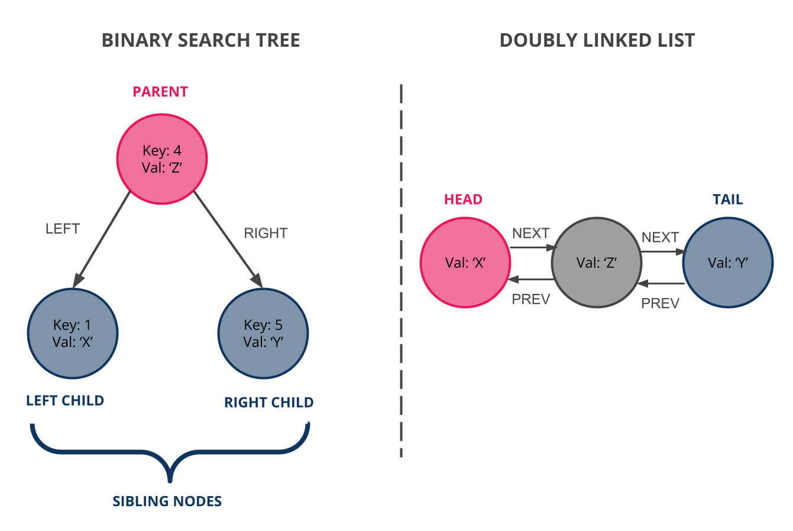
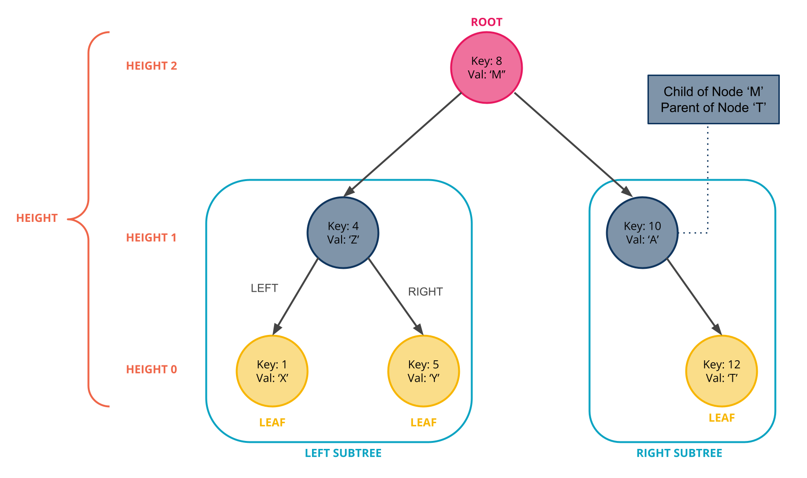
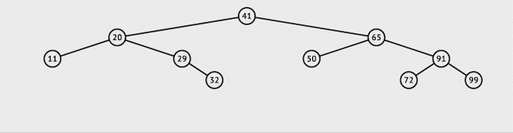
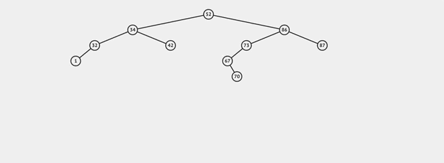

# Binary Search Trees

<iframe src="https://adaacademy.hosted.panopto.com/Panopto/Pages/Embed.aspx?pid=ceac4982-192f-44a7-88a8-ad91016c972b&autoplay=false&offerviewer=true&showtitle=true&showbrand=false&captions=true&interactivity=all" height="405" width="720" style="border: 1px solid #464646;" allowfullscreen allow="autoplay"></iframe>

## Learning Goals

Students should be able to:

- Compare a binary tree to a linked list
- Explain how a binary search tree differs from a generic binary tree
- Write and/or understand methods to perform the following on a binary search tree:
  - Search for a value
  - Insert value
  - Delete value
  - Perform traversals including: 
    - Depth first traversals: pre-order, in-order, post-order
    - Breadth first traversal

## Video Lesson & Exercises

Please note that the video lesson above is for the C16 version of content. The written content has been updated since the video was recorded and may not perfectly align with what is in the written lesson. However, the overall concepts are the same.

- [C16 Video Lesson](https://adaacademy.hosted.panopto.com/Panopto/Pages/Viewer.aspx?id=d9746397-8a10-43be-b1cc-aaaf00720b31)
- [C16 Slide Deck](https://docs.google.com/presentation/d/1Fj0deIUswGZ3ooJMpgVUqPEaWHKTkQ1w2Ci-yf8v66M/edit#slide=id.p)

## Overview

We commonly encounter problems which require us to maintain ordered collections of data. This could be a list of students by name, jobs to process by priority, or a collection of accounts by username. 

When dealing with an ordered collection of data, we need to consider the time and space complexity of the following operations:


* **Searching** - Finding an element in the collection
* **Insertion** - Adding elements to the collection
* **Deletion** - Removing elements from the collection
* **Serialization** - Converting the collection to an array or string to write to a file, network, or database

So far, the data structures we've reviewed allow us to maintain ordered collections of data in a _linear structure_. Linked lists are a linear structure, with each node directly linking to exactly one other node in the structure (the next node). Arrays are also a linear structure, with neighboring elements contained in adjacent pieces of memory.

### Big-O For Linked Lists & Arrays
Recall that the Big-O for our linear data structures, linked lists and arrays, is as follows. 

**#**|**Data Structure**|**Access**|**Search**|**Insertion (Middle)**|**Deletion (Middle)**|**Add First**|**Add Last**|**Delete First**|**Delete Last**
:-----:|:-----:|:-----:|:-----:|:-----:|:-----:|:-----:|:-----:|:-----:|:-----:|
1|Unsorted Array|O(1)|O(n)|O(n)|O(n)|O(n)|O(1)|O(n)|O(1)|
2|Sorted Array|O(1)|O(log n)|O(n)|O(n)|O(n)|O(1)|O(n)|O(1)|
3|Singly Linked List| O(n)| O(n)| O(n)| O(n)|O(1)|O(n)|O(1)|O(n)|
4|Doubly Linked List|O(n)|O(n)|O(n)|O(n)|O(1)|O(1)|O(1)|O(1)|

Can we do even better? If at all possible, we want to maintain an ordered collection of data and outperform both arrays and linked lists in terms of insertion, deletion, searching and serialization.

The key requirements for this new data structure are:

1. Maintain a list of items in order.
2. Add and delete elements in better than O(n) time
3. Find elements with an O(log n) time
4. Serialize the list into a string or another data type that can be written to a file, network, or database in O(n) time or better.

If need 1 & 2 are maintained, an array will struggle to add and delete items. A linked list will require O(n) for all 4 operations because it has to traverse the sorted list to do anything.

A new non-linear data structure, a *binary search tree*, offers us a solution.

### Consider A Nonlinear Structure

Binary search trees have a _non-linear structure_. Whereas each node in a (singly) linked list maintains a pointer to one other node in a linked list, each node in a binary search tree has pointers to two other nodes in the data structure. We refer to these pointers as the _child_ nodes of the original _parent_ node. We label each of the parent node's two children as the `left` and `right` children or pointers. Collectively, we can refer to a parent node's children as _siblings_. The parent node can be thought of as similar to the `prev` pointer in a doubly linked list; however, unlike a linked list, tree nodes do not generally maintain a pointer to their parent/previous node. 

A binary search tree's `left` and `right` child nodes are required to maintain special properties. The `left` child must have a `key` that is less than the `key` of its parent node. The `right` child must have a `key`  that is greater than or equal to that of its parent node.

### !callout-info

## Keys vs Values

Nodes can store a `value` or piece of data that is not a number. For example a node can have a string as a `value`. When our nodes store non-numerical data, we still need to determine whether one node is less than or greater than another node. This can be done by assigning each node a separate numerical `key` in addition to a `value`. 

### !end-callout

When a new node's `key` is equal to a `key` already present in the binary search tree, the person(s) implementing the binary search tree can choose to add the new node to either the `left` or `right` subtree. The most important consideration here is _consistency_. In this lesson, we can assume when a new node has a `key` equal to a `key` already present in the binary search tree that new node is added to the *right* subtree of the node with which it shares a `key`.


In the image above, both data structures maintain the nodes in the order `X`, `Z`, `Y` (where we use the `val` attribute to represent each node). Notice that to maintain this order, the parent node in the binary tree is not equivalent to the head node of the linked list. Also notice that unlike the linked list, the binary search tree's left and right children do not maintain a `prev` pointer to their parent node. Unlike a binary search tree, linked list nodes do not need a `key` attribute to help maintain order. 


Each node in a binary search tree can refer to other nodes. Like a real person, a node can be both a parent _and_ a child. Notice that we could consider a child node and any of its descendants - the child node's children, the child node's children's children, etc. - their own tree. We refer to these trees as _subtrees_ of the parent node. A parent node can have both a left and right subtree.

The topmost node in a tree is known as the _root_. The root has no parent node. Nodes with no children are called _leaves_. 

When we draw a binary search tree, parent nodes are always drawn above children nodes with the root node at the very top. We sometimes refer to the links or pointers between a parent and child node as an _edge_ between the parent and child. The _height_ of a node is the maximum number of edges it takes to travel from one of the leaves in the node's subtrees to the node itself. The height of the tree overall is the the height of the root node.
 



In summary, in a binary search tree:

- Nodes with keys/values less than any node are stored to the **left** of that node.
- Nodes with keys/values greater than any node are stored to the **right** of that node.

<!-- available callout types: info, success, warning, danger, secondary, star  -->
### !callout-info

## Tree Data Structure

A binary search tree is a subtype of a more general data type: a _tree_. Trees are always both non-linear and hierarchical, meaning that they are always a collection of nodes where each node points to a series of other _child_ nodes. 

Different types of trees will maintain different properties including but not limited to the number of children each node can have and the values child nodes can have in relation to their parent node.

### !end-callout

### Binary Search Tree Node

We can create a `TreeNode` class to encapsulate a single element or node within a binary search tree. Whereas our linked list nodes maintained a single `next` pointer, our binary search tree nodes will maintain two pointers, `left` and `right`, to reference its left and right child nodes respectively.

Our `TreeNode` class also maintains both `key` and `value` attributes.  The `Tree` class we create further on in the lesson will compare the key attribute of `TreeNode` objects to maintain node order.

```python
class TreeNode:
    def __init__(self, key, val = None):
        if val == None:
            val = key

        self.key = key
        self.value = val
        self.left = None
        self.right = None
```

### The Tree Class

We can create a `Tree` to represent a full binary search tree data structure. Similar to how the `LinkedList` class for a singly linked list maintains only a `head` attribute pointing at the first node in the list, the `Tree` class maintains a single attribute `root` referencing the topmost node in the tree. 

The `Tree` class will use nodes of type `TreeNode` to build the tree. 

```python
class Tree:
    def __init__(self):
        self.root = None # The root is the starting
                  # node in the Tree
    # Tree methods go here...
```

The next step is to implement our four methods for ordered collections of data: search, insert, delete, and serialize.

### Searching

When we search for a node in a linked list, we start our traversal at the head of the list. In a binary search tree, the equivalent of the head of the list is the root of the tree. The root is where the tree begins; the topmost node. Thus, when we search for a node in a binary search tree, we will always start our traversal at the root of the tree.

Our search method will find the first node in the tree with a given key. Unlike a linked list, we won't have to search the entire tree to find the node we are looking for. Because the left subtree of a given node will only hold nodes with keys less than the given node, and the right subtree will only hold nodes with keys greater than or equal to the given node, we have to search through at most one of the root node's subtrees to find our node.

We can then look at the root of the relevant subtree and make the same decision about which of its own subtrees we should next traverse. 

Notice that this is a naturally recursive process: We can call search on each subtree until we find the node we are searching for or reach a leaf in the tree. If we reach a leaf (our base case - a tree with a single node) and still haven't found the node we are searching for, we return None. 

### Finding A Node With Python



_Fig.  A visualization of finding a value in a BST._


We can outline a recursive implementation of `find` as follows:

```
Method Find:

Base Case(s):
    If the current root's key equals the given key:
        Return current root's value

    If the current root is None:
        Return None

Recursive Case:
    If the given key is less than current root's key:
        Return search on current node's left child
    If the given key is greater than current root's key:
        Return search on current node's right child
```

We can see a full recursive implementation of find below:

```python

    def find_helper(self, current, key):
        # base case - reached a leaf
        if not current:
            return None
        # base case - found what we are looking for
        elif key == current.key:
            return current.value
        # recursive case - key is less than current root's key
        elif key < current.key:
            # call find on left subtree
            return self.find_helper(current.left, key)
        # recursive case - key must be greater than current root's key
        # call find on right subtree
        return self.find_helper(current.right, key)

    def find(self, key):
        return self.find_helper(self.root, key)
```


<!-- >>>>>>>>>>>>>>>>>>>>>> BEGIN CHALLENGE >>>>>>>>>>>>>>>>>>>>>> -->
<!-- Replace everything in square brackets [] and remove brackets  -->

### !challenge

* type: code-snippet
* language: python3.6
* id: 377c6818-080d-42c1-b3b6-6e82cd52da44
* title: Binary Search Tree Iterative Search
* points: 1
  
##### !question

Now that you have seen `find` implemented recursively, try implementing the same function iteratively. The function takes in a key 'key',

Spend no more then 15 minutes working through this independently. Use the hints below or reach out for help if you are still feeling stuck after 15 minutes.

##### !end-question

##### !placeholder
```py
class TreeNode:
    def __init__(self, key, val = None):
        if val == None:
            val = key

        self.key = key
        self.value = val
        self.left = None
        self.right = None

class Tree:
    def __init__(self):
        self.root = None
    
    def find(self, key):
        # implement using iteration
        pass
```

##### !end-placeholder

##### !tests

```py
import unittest
from main import *

class TreeExtended(Tree):

    def add_helper(self, current_node, new_node):
        if new_node.key  < current_node.key:
            if not current_node.left:
                current_node.left = new_node
                return
            self.add_helper(current_node.left, new_node)
        else:
            if not current_node.right:
                current_node.right = new_node
                return
            self.add_helper(current_node.right, new_node)

    def add(self, key, value = None):
        if not self.root:
            self.root = TreeNode(key, value)
        else:
            new_node = TreeNode(key, value)
            self.add_helper(self.root, new_node)

class TestPython1(unittest.TestCase):
    def setUp(self) -> None:

        def tree_with_nodes() -> TreeExtended():
            t = TreeExtended()
            t.add(5, "Peter")
            t.add(3, "Paul")
            t.add(1, "Mary")
            t.add(10, "Karla")
            t.add(9, "Mae")
            t.add(8, "Angela")
            t.add(15, "Ada")
            t.add(25, "Kari")
            return t

        def tree_with_dupe() -> TreeExtended():
            t = TreeExtended()
            t.add(5, "Peter")
            t.add(3, "Paul")
            t.add(1, "Mary")
            t.add(5, "Peter's Twin")
            return t
        
        self.empty_tree = TreeExtended()
        self.tree_with_nodes = tree_with_nodes()
        self.tree_with_dupe = tree_with_dupe()
    
    def tearDown(self) -> None:
        self.empty_tree = TreeExtended()
    
    def test_find_returns_none_for_empty_tree(self):
        self.assertEqual(None, self.empty_tree.find(5))

    def test_can_find_single_root_node(self):
        self.empty_tree.add(25, "Kari")
        
        self.assertEqual("Kari", self.empty_tree.find(25))

    def test_can_find_large_tree(self):
        
        self.assertEqual("Peter", self.tree_with_nodes.find(5))
        self.assertEqual("Ada", self.tree_with_nodes.find(15))
        self.assertEqual("Paul", self.tree_with_nodes.find(3))
        self.assertEqual("Mae", self.tree_with_nodes.find(9))

    def test_finds_first_node_in_tree_with_dupes(self):
        self.assertEqual("Peter", self.tree_with_dupe.find(5))

    def test_can_find_leaf_nodes(self):
        self.assertEqual("Mary", self.tree_with_nodes.find(1))
        self.assertEqual("Angela", self.tree_with_nodes.find(8))
        self.assertEqual("Kari", self.tree_with_nodes.find(25))

    def test_find_returns_none_for_values_not_in_tree(self):
        self.assertEqual(None, self.tree_with_nodes.find(6))
    
```

##### !end-tests
##### !hint 
Look back at the [Linked Lists Problem Set](../02-linked-lists/02-linked-lists-implementation.md) to see how you iteravely stepped through a linked list. 

Look at the recursive solution and try to translate each step into your iterative solution.

Still feeling stuck? Check this video walkthrough of the solution.

<iframe src="https://adaacademy.hosted.panopto.com/Panopto/Pages/Embed.aspx?id=7667104b-4c67-4d78-8f0d-af0e01444c23&autoplay=false&offerviewer=true&showtitle=true&showbrand=false&captions=true&interactivity=all" height="360" width="640" style="border: 1px solid #464646;" allowfullscreen allow="autoplay"></iframe>

##### !end-hint 
##### !explanation 
```python
    def find(self, key):
        # create a current variable and initialize it to the root
        current = self.root

        # while there are still nodes to iterate through
        while current != None:
            # if the key of the node we are iterating over 
            # is the key we are searching for
            if current.key == key:
                # return the value of the node we are iterating over
                return current.value
            # else if the key is less than that of the current node
            elif key < current.key:
                # we know the node we are searching for must be in the left subtree
                # so reassign current to the current node's left child
                current = current.left
            # else the key is greater than or equal to the current node
            else:
                # so the node we are searching for must be in the right subtree
                # reassign current to the current node's right child
                current = current.right
        # if we finish iterating through the tree, no node with the given key exists
        # return None
        return None
```
##### !end-explanation 

### !end-challenge

<!-- ======================= END CHALLENGE ======================= -->

### Insertion

 New nodes as they are added are placed to the left of a given node if they are less than the current node, and to the right if they are greater than or equal to the current node. 



_Fig.  Visualization of inserting a value into a BST_

You can experiment with this in the [Binary Tree Visualizer](https://visualgo.net/en/bst)


<!-- >>>>>>>>>>>>>>>>>>>>>> BEGIN CHALLENGE >>>>>>>>>>>>>>>>>>>>>> -->
<!-- Replace everything in square brackets [] and remove brackets  -->

### !challenge

* type: code-snippet
* language: python3.6
* id: 39be2c02-aef0-481f-91e6-7778420bc737
* title: Binary Search Tree Iterative Insertion
* points: 1

##### !question

Implement the `add` method iteratively. The method takes in a `key` and an optional `value` parameter that represent the key and value of the node the user would like to insert. A node with a value equal to that of its parent should be added to the parent's right subtree.

Spend no more then 15 minutes working through this independently. Use the hints below or reach out for help if you are still feeling stuck after 15 minutes.

##### !end-question

##### !placeholder

```py
class TreeNode:
    def __init__(self, key, val = None):
        if val == None:
            val = key

        self.key = key
        self.value = val
        self.left = None
        self.right = None

class Tree:
    def __init__(self):
        self.root = None
    
    def add(self, key, value = None):
        # implement using iteration
        pass
```

##### !end-placeholder

##### !tests

```py
import unittest
from main import *

class TestPython1(unittest.TestCase):

    def test_add_node_to_empty_tree(self):
        #Arrange
        t = Tree()

        #Act
        t.add(5, "Peter")

        #Assert
        self.assertEqual(5, t.root.key)
        self.assertEqual("Peter", t.root.value)
        self.assertEqual(None, t.root.left)
        self.assertEqual(None, t.root.right)

    def test_add_node_left_child(self):

        #Arrange
        t = Tree()

        #Act
        t.add(5, "Peter")
        t.add(3, "Paul")

        #Assert
        self.assertEqual(5, t.root.key)
        self.assertEqual("Peter", t.root.value)
        self.assertEqual(3, t.root.left.key)
        self.assertEqual("Paul", t.root.left.value)
        self.assertEqual(None, t.root.right)

    def test_add_node_right_child(self):
        #Arrange
        t = Tree()

        #Act
        t.add(5, "Peter")
        t.add(10, "Kara")

        #Assert
        self.assertEqual(5, t.root.key)
        self.assertEqual("Peter", t.root.value)
        self.assertEqual(None, t.root.left)
        self.assertEqual(10, t.root.right.key)
        self.assertEqual("Kara", t.root.right.value)

    def test_duplicate_key_added_to_right(self):
        #Arrange
        t = Tree()

        #Act
        t.add(5, "Peter")
        t.add(5, "Peter's twin")

        #Assert
        self.assertEqual(5, t.root.key)
        self.assertEqual("Peter", t.root.value)
        self.assertEqual(None, t.root.left)
        self.assertEqual(5, t.root.right.key)
        self.assertEqual("Peter's twin", t.root.right.value)

    def test_add_large_tree(self):
        #Arrange
        t = Tree()

        #Act
        t.add(5, "Peter")
        t.add(3, "Paul")
        t.add(1, "Mary")
        t.add(10,"Karla")
        t.add(9, "Char")
        t.add(15, "Ada")
        t.add(25, "Kari")

        #Assert
        self.assertEqual(5, t.root.key)
        self.assertEqual("Peter", t.root.value)
        self.assertEqual(3, t.root.left.key)
        self.assertEqual("Paul", t.root.left.value)
        self.assertEqual(1, t.root.left.left.key)
        self.assertEqual("Mary", t.root.left.left.value)

        self.assertEqual(10, t.root.right.key)
        self.assertEqual("Karla", t.root.right.value)
        self.assertEqual(9, t.root.right.left.key)
        self.assertEqual("Char", t.root.right.left.value)
        self.assertEqual(15, t.root.right.right.key)
        self.assertEqual("Ada", t.root.right.right.value)
        self.assertEqual(25, t.root.right.right.right.key)
        self.assertEqual("Kari", t.root.right.right.right.value)
```

##### !end-tests

##### !hint 

The `add` method is similar to the the `find` method - but your new node will always be the child of a node that is currently a leaf in the existing tree!

Still feeling stuck? Check this video walkthrough of the solution.

<iframe src="https://adaacademy.hosted.panopto.com/Panopto/Pages/Embed.aspx?id=c6c5c389-4ef4-48d5-bcb3-af0e0141616e&autoplay=false&offerviewer=true&showtitle=true&showbrand=false&captions=true&interactivity=all" height="360" width="640" style="border: 1px solid #464646;" allowfullscreen allow="autoplay"></iframe>
##### !end-hint 

##### !explanation

An example of a working implementation:

```python
    def add(self, key, value = None):
        new_node = TreeNode(key, value)
        if not self.root:
            self.root = new_node
            return
        current = self.root
        while current:
            if key < current.key:
                if not current.left:
                    current.left = new_node
                    return
                current = current.left
            else:
                if not current.right:
                    current.right = new_node
                    return
                current = current.right
```

##### !end-explanation

### !end-challenge

<!-- >>>>>>>>>>>>>>>>>>>>>> BEGIN CHALLENGE >>>>>>>>>>>>>>>>>>>>>> -->
<!-- Replace everything in square brackets [] and remove brackets  -->

### !challenge

* type: code-snippet
* language: python3.6
* id: c3f11a44-9eaf-48c9-8e18-64ac380cf987
* title: Binary Search Tree Recursive Insertion
* points: 1

##### !question

Now implement the same `add` function recursively. The method takes in a `key` and an optional `value` parameter that represent the key and value of the node the user would like to insert. A node with a value equal to that of its parent should be added to the parent's right subtree.

Spend no more then 15 minutes working through this independently. Use the hints below or reach out for help if you are still feeling stuck after 15 minutes.

##### !end-question

##### !placeholder
```py
class TreeNode:
    def __init__(self, key, val = None):
        if val == None:
            val = key

        self.key = key
        self.value = val
        self.left = None
        self.right = None

class Tree:
    def __init__(self):
        self.root = None
    
    def add(self, key, value = None):
        # implement using recursion
        pass
```

##### !end-placeholder

##### !tests

```py
import unittest
from main import *

class TestPython1(unittest.TestCase):

    def test_add_node_to_empty_tree(self):
        #Arrange
        t = Tree()

        #Act
        t.add(5, "Peter")

        #Assert
        self.assertEqual(5, t.root.key)
        self.assertEqual("Peter", t.root.value)
        self.assertEqual(None, t.root.left)
        self.assertEqual(None, t.root.right)

    def test_add_node_left_child(self):

        #Arrange
        t = Tree()

        #Act
        t.add(5, "Peter")
        t.add(3, "Paul")

        #Assert
        self.assertEqual(5, t.root.key)
        self.assertEqual("Peter", t.root.value)
        self.assertEqual(3, t.root.left.key)
        self.assertEqual("Paul", t.root.left.value)
        self.assertEqual(None, t.root.right)

    def test_add_node_right_child(self):
        #Arrange
        t = Tree()

        #Act
        t.add(5, "Peter")
        t.add(10, "Kara")

        #Assert
        self.assertEqual(5, t.root.key)
        self.assertEqual("Peter", t.root.value)
        self.assertEqual(None, t.root.left)
        self.assertEqual(10, t.root.right.key)
        self.assertEqual("Kara", t.root.right.value)

    def test_duplicate_key_added_to_right(self):
        #Arrange
        t = Tree()

        #Act
        t.add(5, "Peter")
        t.add(5, "Peter's twin")

        #Assert
        self.assertEqual(5, t.root.key)
        self.assertEqual("Peter", t.root.value)
        self.assertEqual(None, t.root.left)
        self.assertEqual(5, t.root.right.key)
        self.assertEqual("Peter's twin", t.root.right.value)

    def test_add_large_tree(self):
        #Arrange
        t = Tree()

        #Act
        t.add(5, "Peter")
        t.add(3, "Paul")
        t.add(1, "Mary")
        t.add(10,"Karla")
        t.add(9, "Char")
        t.add(15, "Ada")
        t.add(25, "Kari")

        #Assert
        self.assertEqual(5, t.root.key)
        self.assertEqual("Peter", t.root.value)
        self.assertEqual(3, t.root.left.key)
        self.assertEqual("Paul", t.root.left.value)
        self.assertEqual(1, t.root.left.left.key)
        self.assertEqual("Mary", t.root.left.left.value)

        self.assertEqual(10, t.root.right.key)
        self.assertEqual("Karla", t.root.right.value)
        self.assertEqual(9, t.root.right.left.key)
        self.assertEqual("Char", t.root.right.left.value)
        self.assertEqual(15, t.root.right.right.key)
        self.assertEqual("Ada", t.root.right.right.value)
        self.assertEqual(25, t.root.right.right.right.key)
        self.assertEqual("Kari", t.root.right.right.right.value)
```

##### !end-tests

<!-- other optional sections -->
##### !hint 
The `add` method is similar to the the `find` method - but your new node will always be the child of a node that is currently a leaf in the existing tree!

Try identifying your base and recursive cases in the iterative solution you just wrote.

Still feeling stuck? Check this video walkthrough of the solution.

<iframe src="https://adaacademy.hosted.panopto.com/Panopto/Pages/Embed.aspx?id=52a6dcd4-2dda-4a78-b7b6-af0e0142b465&autoplay=false&offerviewer=true&showtitle=true&showbrand=false&captions=true&interactivity=all" height="360" width="640" style="border: 1px solid #464646;" allowfullscreen allow="autoplay"></iframe>

##### !end-hint
##### !explanation 
An example of a working implementation:
```python
    # helper function handles the recursion
    def add_helper(self, current_node, new_node):

        # if new node should be in left subtree (less than current node)
        if new_node.key < current_node.key: 
            # if current node is a leaf
            if not current_node.left:
                # make new node left child of current node
                current_node.left = new_node
                return
            # Otherwise, recurse through left subtree of current node
            self.add_helper(current_node.left, new_node)
        # if new node should be in right subtree 
        # (greater than or equal to current node)
        else:
            # if current node is a leaf
            if not current_node.right:
                # make new node right child of current node
                current_node.right = new_node
                return
            # Otherwise, recurse through right subtree of current node
            self.add_helper(current_node.right, new_node)

    def add(self, key, value = None):
        # If tree is empty
        if not self.root:
            # Make new node the root
            self.root = TreeNode(key, value)
        # Otherwise, initiate tree traversal by calling add on root
        else:
            new_node = TreeNode(key, value)
            self.add_helper(self.root, new_node)
```

##### !end-explanation

### !end-challenge
<!-- ======================= END CHALLENGE ======================= -->


### Deletion
Deleting a node from a binary search tree is a little more complex than either searching for or inserting a node, because we need to ensure that when we remove the node the resulting tree still maintains the property that all left children are smaller than their parent nodes and all right children are larger than their parent nodes.

To delete a node from a binary search tree we must first find the node to delete. To find the node, we can use the same recursive technique we've used with `find` and `add` to traverse the root node's subtrees. Once we find the node we can delete it by changing the parent and child nodes' references.

```
Method delete:
    Base Case:
        If the root is None, return None
  
    Recursive Case:
        Otherwise, recur down the tree:
            If the key is less than the current node's key, call the delete function on current node's left subtree.

            If the key is greater than the current node's key, call the delete function on current node's right subtree.

            If the current node is the node to be deleted:
                If current node's left child is None:
                    return the right child
                If current node's right child is None:
                    return the left child
                Otherwise:
                    Find the minimum node in the right subtree
                    Set the current node equal to the minimum node
        Return the current node
```

As an optional extra chanllenge, you can attempt to implement `delete`  yourself. Our recursive solution to the `delete` method is below. 

<details>
<summary> Binary Search Tree Deletion </summary>

```py
# Helper function to find the minimum node in a tree
def min_node(self, root):
    # minimum node will be in last leaf in left subtree
    # traverse left subtree
    while root.left:
        # continue traversal, by replacing root with left subtree
        root = root.left
    # return the key and the value of minimum node
    return root.key, root.value

# Recursive helper function
def delete_helper(self, current_root, key):
    #if key is less than current node's
    if key < current_root.key:
        #call delete on left subtree
        current_root.left = self.delete_helper(current_root.left, key)
    #if key is greater than current node's
    elif key > current_root.key:
        #call delete on right subtree
        current_root.right = self.delete_helper(current_root.right, key)
    #if we found the node to delete
    else:
        #if node doesn't have a left subtree
        if not current_root.left:
            #return the right subtree
            return current_root.right
        #if node doesn't have a right subtree
        elif not current_root.right:
            # return right subtree
            return current_root.left
        # if node has both left and right subtrees
        # find the minimum node in the right subtree, and replace the deleted node with it
        current_root.key, current_root.value = self.min_node(current_root.right)
        # delete the minimum node in the right subtree
        current_root.right = self.delete_helper(current_root.right, current_root.key)
    # return the current node
    return current_root

def delete(self, key):
    # if the tree is empty
    if not self.root:
        # exit the function
        return

    # call our recursive helper on the root
    self.root = self.delete_helper(self.root, key)
```
</summary>

## Reflection

<!-- >>>>>>>>>>>>>>>>>>>>>> BEGIN CHALLENGE >>>>>>>>>>>>>>>>>>>>>> -->
<!-- Replace everything in square brackets [] and remove brackets  -->

### !challenge

* type: paragraph
* id: b4148882-340f-40e2-87c0-0b2b1265fc49
* title: Binary Search Trees Reflection
* points: 0
<!-- * topics: [python, pandas] (Checkpoints only, optional the topics for analyzing points) -->

##### !question

Take 5 minutes to review the above lesson and write down any questions you still have about the material. Is there anything that needs more clarification or you would like to go over again?

Bring these questions to class! If reviewing this material after class, bring these questions to the #study-hall Slack channel or ask in office hours.

##### !end-question

##### !placeholder

Ex. I'm having trouble understanding why the solutions all use a recursive helper function.

Ex. In what cases are binary search trees used in real life?

##### !end-placeholder

<!-- other optional sections -->
<!-- !hint - !end-hint (markdown, hidden, students click to view) -->
<!-- !rubric - !end-rubric (markdown, instructors can see while scoring a checkpoint) -->
<!-- !explanation - !end-explanation (markdown, students can see after answering correctly) -->

### !end-challenge

<!-- ======================= END CHALLENGE ======================= -->


