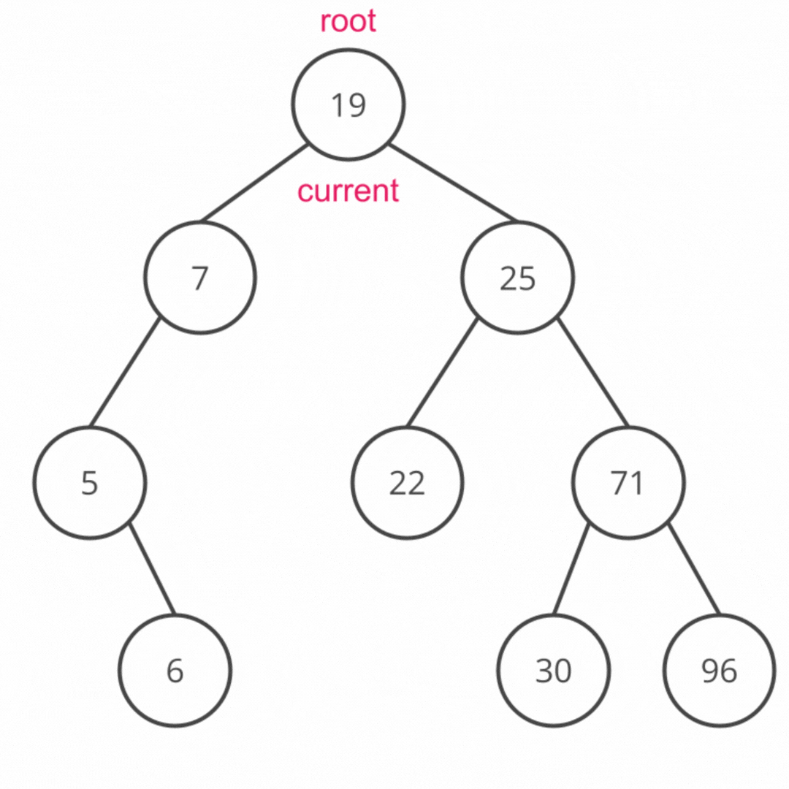
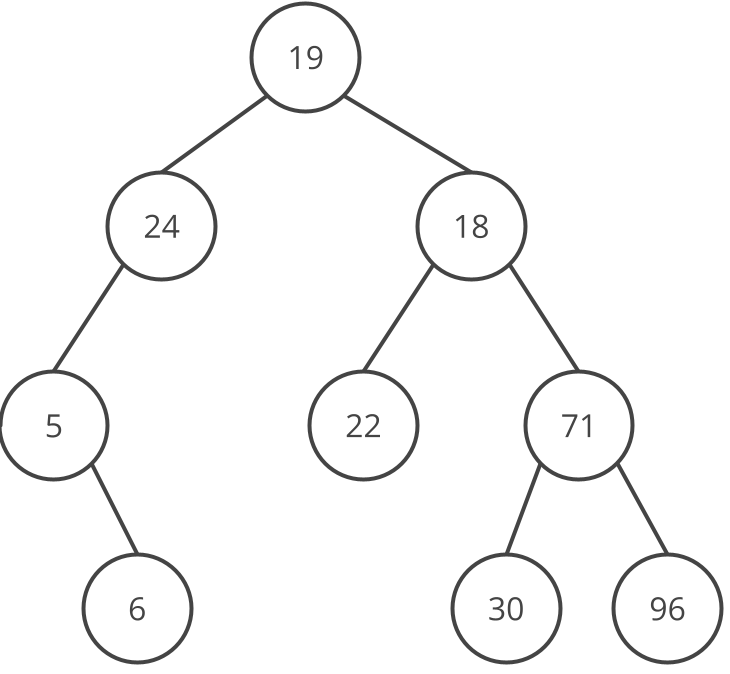
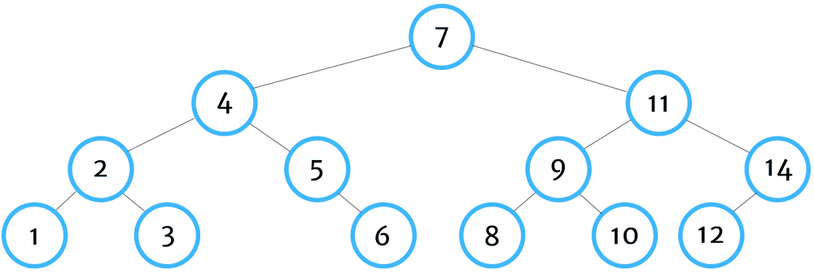
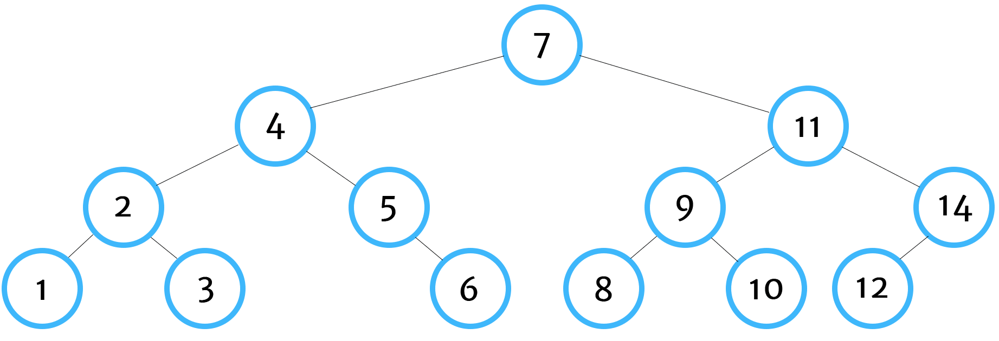

# Serializing with Tree Traversal

## Serialization

To serialize a tree, we need to traverse the tree.  This means we need to visit each node and add it to a string or array. There are several ways to do this.

A _traversal_ is an action visiting each node in a data structure such as a tree.  There are several kinds of traversals, Breadth First Traversals which visit each node level, by level and Depth First Traversals which visit a node's children before it's siblings.

### Breadth First Search Traversal

Unlike linear data structures like arrays or linked lists which have only one logical way to traverse them, trees can be traversed in several different ways. The first way we will explore is a _breadth first search_ (BFS), also called level order traversal. When we traverse with BFS, we begin at the tree's root node. We then examine nodes level by level: the root's direct children are examined, then the root's grandchildren, and so on and so forth.  

To implement breadth first search, we use a _queue_, which is a special type of linear ordered collection of data which adds and removes elements according to a first-in first-out (FIFO) principle similar to a queue or line of people in real life: the first element added to the queue is the first to be removed from the queue.


Pseudocode for the algorithm is as follows:

```
If the tree is empty:
    return

Create an empty queue
Create an empty list to store the explored nodes

Add the root into the queue

While the queue is not empty:
    Pop the next node off the queue 
    Add the popped node to the list of explored nodes

    Add each of the popped node's children to the queue
```

The following diagram shows a visualization of the algorithm.



In the above diagram, nodes that are outlined in pink have been added to the queue. Nodes shaded in pink are considered explored, or popped off the queue. BFS explores the nodes in the following order: `[19, 7, 25, 5, 22, 71, 6, 30, 96]`.


### !callout-info

## Deque

[`deque`](https://docs.python.org/3/library/collections.html#collections.deque) from the `collections` module is commonly used to create queues in Python. There are other libraries to create queues - we can even model a queue using Pythons native `list` datatype, but `deque` is the most popular and optimizes the time complexity of many operations. 

### !end-callout

<!-- >>>>>>>>>>>>>>>>>>>>>> BEGIN CHALLENGE >>>>>>>>>>>>>>>>>>>>>> -->
<!-- Replace everything in square brackets [] and remove brackets  -->

### !challenge

* type: multiple-choice
* id: 74100604-dc64-48a9-976d-6fb2caf59240
* title: Creating a new deque
* points: 1

##### !question

Using the [`deque` documentation](https://docs.python.org/3/library/collections.html#collections.deque) as a reference, which of the following would create a new empty queue? Assume our program inputs deque as `from collections import deque`

##### !end-question

##### !options

a| q = my_queue.deque([])
b| q = deque()
c| q = deque.new()

##### !end-options

##### !answer

b|

##### !end-answer

##### !explanation 

The documentation states that deque is a class and provides the constructor: `collections.deque([iterable[, maxlen]])`. Because the problem statement says we imported deque directly with `from collections import deque`, it is not necessary to specify that `deque` is part of `collections` with `q = collections.deque()`. It is enough to say `q = deque()`. 

We can optionally pass in an empty list, for example `deque([])`, however it is not required. The documentation reads, "Returns a new deque object initialized left-to-right (using append()) with data from iterable. **If iterable is not specified, the new deque is empty.**"

Option A uses an undefined variable `my_queue` and Option C uses a method `new()` which is not part of the `deque` documentation.
##### !end-explanation 

### !end-challenge

<!-- ======================= END CHALLENGE ======================= -->


<!-- >>>>>>>>>>>>>>>>>>>>>> BEGIN CHALLENGE >>>>>>>>>>>>>>>>>>>>>> -->
<!-- Replace everything in square brackets [] and remove brackets  -->

### !challenge

* type: checkbox
* id: 608d75c9-ba87-41fd-a9c2-a5a9ace3362d
* title: Inserting and Removing Elements from a Queue with Deque
 * points: 1

##### !question

Using the [`deque` documentation](https://docs.python.org/3/library/collections.html#collections.deque) as a reference, which of the following options would add `3` to a queue `q` then remove an element from the queue?

##### !end-question

##### !options

a| `q.append(3)`, `q.popleft()`
b| `q.append(3)`, `q.pop()`
c| `q.appendleft(3)`, `q.pop()`
d| `q.append(3)`, `q.remove()`

##### !end-options

##### !answer

a|
c|

##### !end-answer

<!-- other optional sections -->
#### !hint  
If we add an element to the right end of our `deque`, what side of our `deque` should we remove elements from to model a queue's first-in-first-out behavior?

Likewise, what if we insert elements to the left end of our `deque`?
#### !end-hint
<!-- !rubric - !end-rubric (markdown, instructors can see while scoring a checkpoint) -->
##### !explanation 
For option A, `append()` adds elements to the right end of the queue, which means the most recently added element is the rightmost element and the oldest element is the leftmost element. To model the first-in-first-out behavior of a queue, we should pop from the left end of the queue using `popleft()`

Conversely, if we use `appendleft()`, the most recently added element will be the leftmost element so we should pop from the right end of the `deque` using `pop()`.

When modeling a queue, `append` and `popleft` is the most common pairing for insertion and deletion respectively. 

`remove` requires the user to pass in a value to be removed from the `deque`. When modeling a queue, we should only remove the oldest element in the queue regardless of its value.

#### !end-explanation 
### !end-challenge


<!-- >>>>>>>>>>>>>>>>>>>>>> BEGIN CHALLENGE >>>>>>>>>>>>>>>>>>>>>> -->
<!-- Replace everything in square brackets [] and remove brackets  -->

### !challenge

* type: code-snippet
* language: python3.6
* id: 8212b93b-659f-42ac-9999-8c4ab416a2ac
* title: Breadth First Search
* points: 1
<!-- * topics: [python, pandas] (Checkpoints only, optional the topics for analyzing points) -->

##### !question

Using the pseudocode earlier in the lesson, implement a breadth first search method for a binary search tree class, `Tree()`. The method should accept no parameters other than `self`, and should return a list of visited nodes in the order they were traversed by the breadth first search algorithm. For example for the the following tree:


The method should return the values of each node in the order they were traversed: `[19, 7, 25, 5, 22, 71, 6, 30, 96]`.


 If the tree is empty, the method should return an empty list.

 Spend no more then 15 minutes working through this independently. Use the hints below or reach out for help if you are still feeling stuck after 15 minutes.

##### !end-question

##### !placeholder
```py
from collections import deque

class TreeNode:

    def __init__(self, key, value=None, left=None, right=None):
        if not value:
            value = key
        self.key = key
        self.val = value
        self.left = left
        self.right = right

    def __repr__(self):
        return f"TreeNode {self.val}"


class Tree:

    def __init__(self):
        self.root = None
    

    def bfs(self):
        # Implement your solution here
        pass
```

##### !end-placeholder

##### !tests

```py
import unittest
from main import *

class TreeExtended(Tree):

    def add_helper(self, current_node, new_node):
        if new_node.key  < current_node.key:
            if not current_node.left:
                current_node.left = new_node
                return
            self.add_helper(current_node.left, new_node)
        else:
            if not current_node.right:
                current_node.right = new_node
                return
            self.add_helper(current_node.right, new_node)

    def add(self, key, value = None):
        if not self.root:
            self.root = TreeNode(key, value)
        else:
            new_node = TreeNode(key, value)
            self.add_helper(self.root, new_node)

class TestPython1(unittest.TestCase):
    def setUp(self) -> None:

        def tree_with_nodes() -> TreeExtended():
            t = TreeExtended()
            t.add(5, "Peter")
            t.add(3, "Paul")
            t.add(1, "Mary")
            t.add(10, "Karla")
            t.add(9, "Mae")
            t.add(8, "Angela")
            t.add(15, "Ada")
            t.add(25, "Kari")
            return t
        
        self.empty_tree = TreeExtended()
        self.tree_with_nodes = tree_with_nodes()
    
    def tearDown(self) -> None:
        self.empty_tree = TreeExtended()

    def test_non_empty_Tree(self):
        expected_answer = ["Peter", "Paul", "Karla", "Mary", "Mae", "Ada", "Angela", "Kari"]
        answer = self.tree_with_nodes.bfs()
        self.assertEqual(expected_answer, answer)

    def test_empty_tree(self):
        expected_answer = []
        answer = self.empty_tree.bfs()
        self.assertEqual(expected_answer, answer)
```

##### !end-tests

<!-- other optional sections -->
##### !hint 
Feeling stuck? Watch the video walkthrough of the solution below:
<iframe src="https://adaacademy.hosted.panopto.com/Panopto/Pages/Embed.aspx?id=2785bbf7-1fe9-4e68-91d3-af89018a022c&autoplay=false&offerviewer=true&showtitle=true&showbrand=true&captions=true&interactivity=all" height="405" width="720" style="border: 1px solid #464646;" allowfullscreen allow="autoplay"></iframe>

##### !end-hint
<!-- !rubric - !end-rubric (markdown, instructors can see while scoring a checkpoint) -->
##### !explanation 
An example of a working implementation:

```py
    def bfs(self):
        # if the tree is empty
        if self.root is None:
            # return an empty list
            return []
        
        # create a new empty queue
        queue = deque()
        # create a list of nodes we have already explored
        visited = []

        # append the root of the tree to the queue
        queue.append(self.root)


        # while there are still nodes to explore
        while queue:
            # pop next node off the queue
            current_node = queue.popleft()

            # add the root to list of visited nodes
            visited.append(current_node.val)

            # if the current node has a left child
            if current_node.left is not None:
                # add the left child to the queue
                queue.append(current_node.left)

            # if the current node has a right child
            if current_node.right is not None:
                # add the right child to the queue
                queue.append(current_node.right)

        # return the list of visited nodes
        return visited
```
##### !end-explanation

### !end-challenge

<!-- ======================= END CHALLENGE ======================= -->
<!-- ======================= END CHALLENGE ======================= -->

### Depth First Traversals

 In a _depth first search_ (DFS) traversal you explore the children, grandchildren, and any further descendants of a node before moving to its sibling and traversing the sibling's descendants.

There are three standard types of depth-first traversals:

- **Pre-Order**:  Current, Left, Right
- **In-Order**: Left, Current, Right
- **Post-Order**: Left, Right, Current

In a **Pre-Order** traversal you execute the algorithm in this manner:

```
visit the current node
traverse the left subtree
traverse the right subtree
```


<!--Source: https://tylerewillis.com/page/depth-first-traversal-orders-->

In a **In-Order** traversal you execute the algorithm in this manner:

```
traverse the left subtree
visit the current node
traverse the right subtree
```

<!--Source: https://tylerewillis.com/page/depth-first-traversal-orders-->

In a **Post-Order** traversal you execute the algorithm in this manner:

```
traverse the left subtree
traverse the right subtree
visit the current node
```

<!--Source: https://tylerewillis.com/page/depth-first-traversal-orders-->

Notice that all of the algorithms are recursive in structure because each node can be treated as it's own subtree.


For the above Binary Search Tree
- **Pre-Order**:  [50, 25, 10, 30, 75, 60, 100]
- **In-Order**: [10, 25, 30, 50, 60, 75, 100]
- **Post-Order**: [10, 30, 25, 60, 100, 75, 50]

<!-- >>>>>>>>>>>>>>>>>>>>>> BEGIN CHALLENGE >>>>>>>>>>>>>>>>>>>>>> -->


<!-- ======================= END CHALLENGE ======================= -->


<!-- >>>>>>>>>>>>>>>>>>>>>> BEGIN CHALLENGE >>>>>>>>>>>>>>>>>>>>>> -->

### !challenge

* type: multiple-choice
* id: e755df96-56ec-4d50-a336-3834838abb96
* title: Inorder
* points: 1
* topics: bst, traversal

##### !question


In what order would you hit the nodes doing an inorder traversal

##### !end-question

##### !options

* [17, 14, 20, 19, 52]
* [14, 17, 19, 20, 52]
* [14, 19, 52, 20, 17]

##### !end-options

##### !answer

* [14, 17, 19, 20, 52]

##### !end-answer

### !end-challenge

<!-- ======================= END CHALLENGE ======================= -->

<!-- >>>>>>>>>>>>>>>>>>>>>> BEGIN CHALLENGE >>>>>>>>>>>>>>>>>>>>>> -->

### !challenge

* type: multiple-choice
* id: 08e94a48-fc15-4d95-8a47-d8ed9e199b34
* title: Preorder
* points: 1
* topics: bst, traversal

##### !question


In what order would you hit the nodes doing an preorder traversal

##### !end-question

##### !options

* [17, 14, 20, 19, 52]
* [14, 17, 19, 20, 52]
* [14, 19, 52, 20, 17]

##### !end-options

##### !answer

* [17, 14, 20, 19, 52]

##### !end-answer

### !end-challenge

<!-- ======================= END CHALLENGE ======================= -->

<!-- >>>>>>>>>>>>>>>>>>>>>> BEGIN CHALLENGE >>>>>>>>>>>>>>>>>>>>>> -->

### !challenge

* type: multiple-choice
* id: c6009e6c-5717-459a-ae66-4570918271b9
* title: Postorder
* points: 1
* topics: bst, traversal

##### !question


In what order would you hit the nodes doing an postorder traversal

##### !end-question

##### !options

* [17, 14, 20, 19, 52]
* [14, 17, 19, 20, 52]
* [14, 19, 52, 20, 17]

##### !end-options

##### !answer

* [14, 19, 52, 20, 17]

##### !end-answer

### !end-challenge

Depth first search traversals use a _stack_, which is a  another type of linear ordered collection of data which adds and removes elements according to a last-in first-out (LIFO) principle similar to a stack of plates. When you want to grab a plate, you normally take the topmost plate off the stack which is also the plate that was most recently added to the stack.

We could use the `deque` library again to model a stack, but more often depth first search traversals are implemented recursively. When we use recursion, we can take advantage of our machine's call stack. Each recursive call on our current node's left and right subtrees will be added to the call stack and popped off in LIFO order so there's no need for us to create our own stack.

We can look at the pseudocode for preorder to see how this looks applied to an example.

```
preorder():
    create an empty list to store the explored nodes
    call preorder helper on root
    
preorder_helper(current_node, explored_nodes):
    if the tree is empty:
        return explored_nodes
    call preorder_helper on left child
    call preorder_helper on right child
    add current_node to list of explored_nodes

```

If you are curious, you can try implementing dfs in a fork of the following replit: [BST Traversal Practice](https://replit.com/@adadev/bst-dfs-practice#binary_search_trees/dfs.py)

Otherwise, take a look at the full implementations of our three depth first traversals below. Notice how similar the code is for each.

<details>
<summary>Preorder Traversal</summary>

```py
    # recursive helper
    def preorder_helper(self, current_node, values):
        # if the tree is empty
        if not current_node:
            # return the list of values
            return values

        # Append current node to list of values
        values.append(current_node.value)
        # call helper function on the left child
        self.preorder_helper(current_node.left, values)     
        # call helper function on the right child   
        self.preorder_helper(current_node.right, values)

        return values

    def preorder(self):
        # create an empty list to hold the node's values
        values = []
        # call helper function on root
        return self.preorder_helper(self.root, values)
```
</details>

<details>
<summary>Inorder Traversal</summary>

```py
    # recursive helper
    def inorder_helper(self, current_node, values):
        # if the tree is empty
        if not current_node:
            # return the list of values
            return values

        # call helper function on the left child
        self.inorder_helper(current_node.left, values)
        # Append current node to list of values
        values.append(current_node.value)     
        # call helper function on the right child   
        self.inorder_helper(current_node.right, values)

        return values

    def inorder(self):
        # create an empty list to hold the node's values
        values = []
        # call helper function on root
        return self.inorder_helper(self.root, values)
```
</details>


<details>
<summary>Postorder Traversal</summary>

```py
    # recursive helper
    def postorder_helper(self, current_node, values):
        # if the tree is empty
        if not current_node:
            # return the list of values
            return values

        # call helper function on the left child
        self.postorder_helper(current_node.left, values)     
        # call helper function on the right child   
        self.postorder_helper(current_node.right, values)
        # Append current node to list of values
        values.append(current_node.value)

        return values

    def postorder(self):
        # create an empty list to hold the node's values
        values = []
        # call helper function on root
        return self.postorder_helper(self.root, values)
```
</details>

<!-- ======================= END CHALLENGE ======================= -->

### Why So Many Methods of Traversal?

It may seem unecessary to have so many different types of traversal. Indeed, there are many cases where it doesn't matter which traversal algorithm is used. However, there are also situations where one traversal is more advantageous than another. 

Generally depth first traversals are much more common with trees. 

- **Pre-order** Pre-order traversal processes nodes in the order they were inserted. For this reason, if we need to save a tree data structure to disk, or send it across the network and maintain the structure, pre-order traversals can be useful.
- **In-Order**: In-order traversal processes the left most node and end with the right most node; it processes nodes from smallest key to largest key. Thus, it is useful if we need to print or otherwise visit all the nodes of a tree in order.
- **Post-Order**: Post-order traversal processes all of the root node's descendants before processing the root itself. Therefore post-order is useful if we need to delete all the nodes in a BST.

There are cases where one might choose a breadth first approach. A breadth first search traversal explores nodes closest to the root (including the root itself) first. If we are searching a tree for an element we think is closer to the root, it may be advantageous to use breadth first search. 

Often times, when attempting to solve a tree problem, it can be helpful to draw out some example trees and reason out how we would need to traverse the tree in order to achieve our desired result. This can help you to determine the traversal approach that best suits the problem.

### !callout-info

## Why are they all left-to-right?

So why are all the traversals left-to-right instead of right-to-left?

Computer Science was initially pioneered in western cultures where people read left-to-right and so their cultural bias lead to designing traversals in that manner.  There's no inherent characteristics of binary search trees which require a left-to-right traversal.  You could create a right-to-left traversal, but for historical reasons, these are the standard binary search tree traversals.

### !end-callout


## Serialization Big O

Serialization algorithms are O(n) in both time and space complexity. Both breadth first search and depth first search algorithms visit each node in the array exactly once, giving O(n) time complexity where n is the number of nodes in the tree. They also both create an array to store each explored node giving O(n) space complexity.

If we were to just perform a traversal using either breadth first or depth first search without storing the explored nodes in an array or other auxiliary data structure, the space complexity would be slightly different.

With depth first search algorithms, we need to consider how many recursive calls would be on the call stack at any given time. The maximum number of recursive calls would be the height of the tree since depth first search algorithms go as deep as they can into the tree before turning back and exploring other subtrees. So we can say the space complexity is O(h) where h is the height of the tree.

With breadth first search, we need to consider the maximum number of nodes that would be in our queue at any given time. Since breadth first search adds all the nodes in a level to the queue before starting to pop them off, the space complexity would be O(b) where b is the breadth (the number of nodes on the level with the greatest number of nodes) of the tree.

## Summary

In the lesson, we examined different methods to traverse a tree.  Unlike a linked list where there is only one possible traversal method, a tree has multiple ways to traverse. The type of traversal we use depends on the task we are trying to complete. 

### !challenge

* type: paragraph
* id: 34de5a16-365c-47e5-bba1-e7970c65623e
* title: Binary Search Trees Reflection
* points: 0
<!-- * topics: [python, pandas] (Checkpoints only, optional the topics for analyzing points) -->

##### !question

Take 5 minutes to review the above lesson and write down any questions you still have about the material. Is there anything that needs more clarification or you would like to go over again?

Bring these questions to class! If reviewing this material after class, bring these questions to the #study-hall Slack channel or ask in office hours.

##### !end-question

##### !placeholder

Ex. I'm still not clear on how the call stack works with DFS traversals.  

Ex. I'm feeling a bit overwhelmed by the number of traversal algorithms.

##### !end-placeholder

<!-- other optional sections -->
<!-- !hint - !end-hint (markdown, hidden, students click to view) -->
<!-- !rubric - !end-rubric (markdown, instructors can see while scoring a checkpoint) -->
<!-- !explanation - !end-explanation (markdown, students can see after answering correctly) -->

### !end-challenge

<!-- ======================= END CHALLENGE ======================= -->