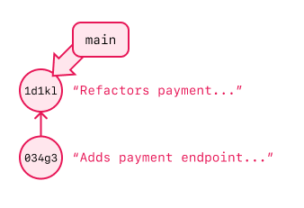

# Branches

## Goals

The goal of this lesson is to introduce the definition and overall concept of Git branches.

## Vocabulary and Synonyms

| Vocab  | Definition                                                                          | How to Use in a Sentence                                                                                                                                                                                                                                                                   |
| ------ | ----------------------------------------------------------------------------------- | ------------------------------------------------------------------------------------------------------------------------------------------------------------------------------------------------------------------------------------------------------------------------------------------ |
| Branch | A feature in Git that captures a snapshot of code changes as one Git commit history | "We worked on the `mark_complete` feature in a new branch `mark_complete`. We finished the `mark_complete` feature and pushed three commits to the branch. During this time, no other branch saw the commits for `mark_complete`. Then, we merged the `mark_complete` branch into `main`." |

## Commits Are on Branches

As we use Git, we know we are creating a Git commit history by building commits.

The parts of a commit we have so far discussed are:

- The current state of our files
- A commit message
- A commit hash (to identify it)
- A sense of the commit that comes before it (its parent commit(s))

Another piece of information Git tracks when committing is the _branch_ of the commit. **Git branches** apply names to a sequence of commits. A Git branch marks the latest commit in a particular commit history. Adding a new commit to a branch moves the name of that branch forward to the newly added commit.

All of our Git work so far has been on a branch.

There is always at least one default branch in every Git project. The default name for the default branch is `main`; all of our commits we've made so far have been on the `main` branch.

### !callout-info

## Default Name Before `main`

[Before the default branch was named `main`, it was named `master`](https://github.com/github/renaming). This is useful to know because:

- It shows the current conversation around shared language and culture in the tech community
- Many tutorials will still refer to the `master` branch
- Some systems that integrate with Git repositories do not yet recognize this change, so we may occasionally need to continue using the old name

<br/>

For most modern software, using `main` for the default branch will work without any issue.

### !end-callout

## Branches Share a Commit History Until Branching

Each branch has a name and a commit history.

The naming conventions of Git branches depends on the use, context, and team. Some example branch names include:

- `main`
- `click-button-feature`
- `ada/click-button-feature`
- `broken_payment_hot_fix`
- `payment-logic-refactor`
- `payment-logic_patch`
- `development`
- `staging`
- `production`
- `release-0875`

Branches are created **from** another branch's commit. Therefore, a new branch and an old branch share the exact same commit history until the point that the branch is created and branches off.

For example, we can have a `main` branch with the following Git log (and these commit hashes):

```
1d1kl "Refactors payment endpoint to use make_payment helper"
034g3 "Adds payment endpoint to create payments"
```

  
_Fig. Git history for the **`main`** branch._

We can create a `click-button-feature` branch while on the `main` branch. When that happens, the `click-button-feature` will have the following Git log:

```
1d1kl "Refactors payment endpoint to use make_payment helper"
034g3 "Adds payment endpoint to create payments"
```

  
_Fig. Git history for the **`main`** and **`click-button-feature`** branches._

The `click-button-feature` starts with the same Git history as the `main` branch at the time of creation.

## Adding Commits to One Branch Doesn't Affect the Others

When we add commits to one branch, the commit isn't included in the Git histories of other branches.

We can add a commit to the `main` branch and change its commit history:

```
2pgs7 "Adjusts payment logic for calculating shipping cost"
1d1kl "Refactors payment endpoint to use make_payment helper"
034g3 "Adds payment endpoint to create payments"
```

And, assuming the `click-button-feature` branch was created earlier, the Git history for `click-button-feature` remains:

```
1d1kl "Refactors payment endpoint to use make_payment helper"
034g3 "Adds payment endpoint to create payments"
```

  
_Fig. Update to Git history after committing in the **`main`** branch._

Similarly, we can add a commit to the `click-button-feature` branch:

```
3gtqq "Enables button when form is complete"
1d1kl "Refactors payment endpoint to use make_payment helper"
034g3 "Adds payment endpoint to create payments"
```

And it won't affect the Git history of the `main` branch:

```
2pgs7 "Adjusts payment logic for calculating shipping cost"
1d1kl "Refactors payment endpoint to use make_payment helper"
034g3 "Adds payment endpoint to create payments"
```

![Git history for the main and click-button-feature branches. There are four commits, 3gtqq "Enables button...", 2pgs7 "Adjusts payment...", 1d1kl, and 034g3. Commit 034g3 points to commit 1d1kl, indicating that 034g3 is the predecessor. Commit 1d1kl points to commit 2pgs7, indicating that 1d1kl is the predecessor. Commit 1d1kl also points to commit 3gtqq, again indicating that 1d1kl is the predecessor. It is the predecessor of both commits. The main branch label refers to commit 2pgs7. The click-button-feature branch label refers to the new commit 3gtqq.](../assets/branches-in-git_branches_commit-second.png)  
_Fig. Update to Git history after committing in the **`click-button-feature`** branch._

## Merging Branches is Merging Commit Histories

We can combine the work represented on two different branches by _merging_ them.

**Merging branches** results in two branches combining their Git histories. More specifically, merging `branch-a` **_into_** `branch-b` means merging the commit history of `branch-a` **_into_** the commit history of `branch-b`.

The actual act of merging `branch-a` into `branch-b` takes this process:

- Rewinding the histories of `branch-a` and `branch-b` to their common commit
- Looking through the commits of `branch-a` and `branch-b` and applying the diffs one at a time until all the commits are applied

This process may re-order some commits out of necessity. Git ultimately applies one of several algorithms to determine the order of applied commits.

The ultimate result is that `branch-b` has one unified Git history that we can follow!

For our above example, we can merge `main` into `click-button-feature`. Then, the history of `click-button-feature` may look like:

```
3gtqq "Enables button when form is complete"
2pgs7 "Adjusts payment logic for calculating shipping cost"
1d1kl "Refactors payment endpoint to use make_payment helper"
034g3 "Adds payment endpoint to create payments"
```

This merge doesn't affect the Git history of the `main` branch:

```
2pgs7 "Adjusts payment logic for calculating shipping cost"
1d1kl "Refactors payment endpoint to use make_payment helper"
034g3 "Adds payment endpoint to create payments"
```

![Git history for the main and click-button-feature branches. There are four commits, 3gtqq "Enables button...", 2pgs7 "Adjusts payment...", 1d1kl, and 034g3. Commit 034g3 points to commit 1d1kl, indicating that 034g3 is the predecessor. Commit 1d1kl points to commit 2pgs7, indicating that 1d1kl is the predecessor. Commit 2pgs7 points to commit 3gtqq, indicating that 2pgs7 is the predecessor. The main branch label refers to commit 2pgs7. The click-button-feature branch label refers to commit 3gtqq.](../assets/branches-in-git_branches_merge.png)  
_Fig. Update to Git history after merging **`main`** into the **`click-button-feature`** branch._

## Branches Have Various Use Cases

Git branches are merely a tool, and how they're used depends on the context and practices of the project at hand and the team working on it.

However, some common patterns for using branches are:

1. Feature branches
1. Experimental proof-of-concept branches

### Feature Branches

A feature branch strategy to software development usually means:

- Designating one branch to represent the ultimate branch of "working" software, usually the `main` branch
- Agreeing that all active development and work-in-progress happens on branches other than `main`
- Each branch is dedicated to making commits solely for one feature at a time

Feature branches can be responsible for:

- Building a new feature and the tests for the new feature
- Modifying an existing feature and updating the tests for this feature
- Bug fixes
- Making small, isolated changes, such as fixing typos

Under this strategy, each feature in development will get its own branch. When the feature development is complete, we will first merge `main` _into_ our feature branch, to handle any divergence in `main` that has happened while the feature work has been underway. This gives us a chance to handle any merge conflicts while still in our own branch.

After resolving any merge conflicts and confirming our code is still working as expected, we will merge the feature branch back _into_ `main`, so that `main` gets the unified, merged commit history.

After merging into `main`, the feature branch can be deleted.

### Proof of Concept Branches

Branches can be used for small, temporary experiments.

Sometimes, we will have a task or a piece of work that prioritizes, for a short amount of time, exploration and discovery over writing clean code or using tests. When we need to work on an experiment rather than on project requirements directly, we can give ourselves a time box for exploring solutions and possibilities. We can perform this investigation on a branch.

Experimental branches tend to take the approach of a "proof of concept." We give ourselves permission to write potentially messy code now, then write more intentional code (considering testing, readability, usability, and flexibility) later.

When we begin on such an endeavor, we should:

- Determine the goal of the exploration at the beginning.
- Create a time limit of less than one day.
- Decide to delete the branch at the end of the experiment, and create a separate new branch with clean commits after the research is over. This intentional step is to help us resist the temptation of including our exploratory code in our production code base.

## Check for Understanding

<!-- Question 1 -->
<!-- prettier-ignore-start -->
### !challenge
* type: multiple-choice
* id: 5e3a4857
* title: Branches
##### !question

Imagine that there is a branch named `main` with the following commit history:

```
1gj8o "Refactors book endpoint to check request verb"
0uwp7 "Adds book endpoint to delete books"
```

Imagine that Wendy creates a branch named `author-routes`.

Which of the following best describes the Git history of `author-routes` immediately after it's created?

##### !end-question
##### !options

* `author-routes` has diverged from `main` and needs to be merged in
* `author-routes` and `main` have identical Git histories
* `author-routes` copies the Git history from `main`, but with different commit hashes

##### !end-options
##### !answer

* `author-routes` and `main` have identical Git histories

##### !end-answer
### !end-challenge
<!-- prettier-ignore-end -->

<!-- Question 2 -->
<!-- prettier-ignore-start -->
### !challenge
* type: multiple-choice
* id: b434d3b2
* title: Branches
##### !question

Imagine that there are two branches: `main` and `sort-books-endpoint`.

The `sort-books-endpoint` is a feature branch. The development on this branch is finished, and we want to merge `main` and `sort-books-endpoint`, such that the Git history of `sort-books-endpoint` is merged into the Git history of `main`.

The end result is that the `main` branch's Git history will include all the commits in the `sort-books-endpoint` branch.

Of the following options, what is the best way to achieve this?

##### !end-question
##### !options

* On the `main` branch, merge `sort-books-endpoint` _into_ `main`
* On the `sort-books-endpoint` branch, merge `main` _into_ `sort-books-endpoint`

##### !end-options
##### !answer

* On the `main` branch, merge `sort-books-endpoint` _into_ `main`

##### !end-answer
### !end-challenge
<!-- prettier-ignore-end -->
