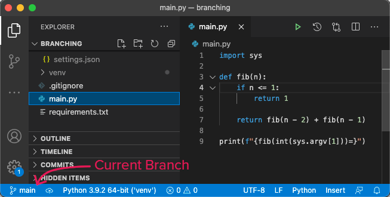
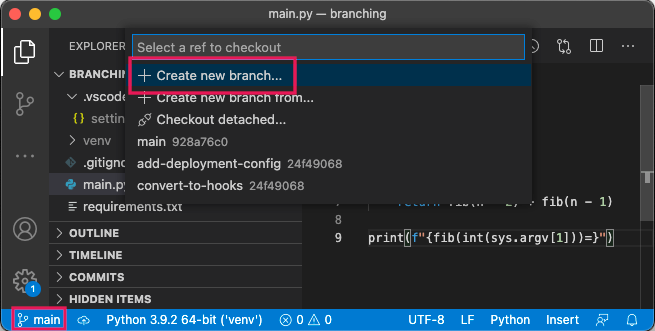
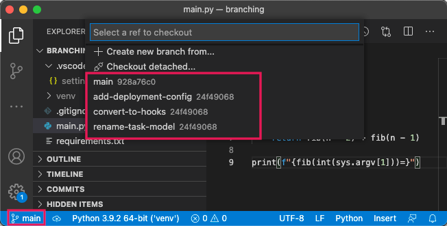
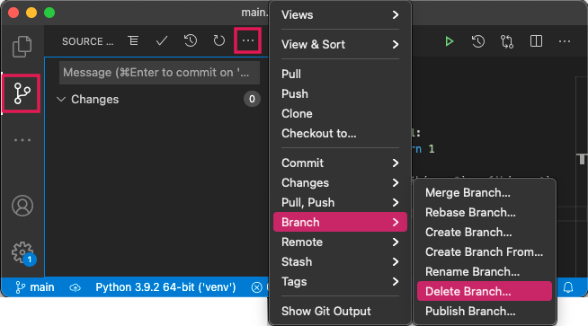

# Using Branches

<!-- ## Learning Goals -->

<!-- ## Introduction -->

## Checking Your Current Branch

Whenever we work on a Git project, we are always located inside a branch. All commits made will belong to the branch in which we're located.

We can determine in which branch we're located using either:

- `git status`
- `git branch`

When we run:

```bash
$ git status
```

We'll get output such as:

```
On branch main
Your branch is up to date with 'origin/main'.

nothing to commit, working tree clean
```

This output tells us that we are on the branch named `main`.

When we run:

```bash
$ git branch
```

We'll get output such as:

```
  add-deployment-config
  convert-to-hooks
* main
  rename-task-model
```

In this example, there are four branches that exist: `add-deployment-config`, `convert-to-hooks`, `main`, and `rename-task-model`.

The asterisk `*` indicates the current branch; in this example, we're currently on the `main` branch.

### Checking Current Branch in VSCode

While working in VSCode, we can also see the currently selected branch. Its name is displayed at the bottom-left of the status bar.

  
_Fig. We can see the current branch in the status bar._

Here, we are in the `main` branch. VSCode will display a `*` by the name if there are uncommitted changes.

## Creating Branches

When we create a branch, we should first and foremost be aware of our _current_ location. In which branch are we currently working? What is the most recent commit?

When we create a branch, the new branch will have the same commit history as the current branch.

After we've established that we want our new branch to branch off the current branch, we can create a new branch with:

```bash
$ git branch <new-branch-name>
```

Where `<new-branch-name>` is the name of the new branch.

### Creating Branches in VSCode

While working in VSCode, we can create a new branch from the current commit. Clicking the current branch in the status bar will open an option picker with a selection for creating a new branch.

  
_Fig. By clicking the current branch in the status bar, an option display will appear where one of the options lets us create a new branch._

After selecting `Create new branch`, we will be able to type a name for the new branch, which will initially be created pointing to the current commit.

## Switching Branches

We can switch our current branch to a different existing branch with:

```bash
$ git switch <destination-branch-name>
```

Where `<destination-branch-name>` is the name of the destination branch.

### !callout-info

## `git switch` Replaces `git checkout`

The following command also changes our location to a different branch:

```bash
$ git checkout <destination-branch-name>
```

<br/>

This command was the dominant way for switching branches for a long time, so it's important to recognize this syntax.

### !end-callout

### Switching Branches in VSCode

While working in VSCode, we can switch between branches. Clicking the current branch in the status bar will open an option picker with selections that display the names of other available branches. Clicking a branch name will switch to the other branch.

  
_Fig. By clicking the current branch in the status bar, an option display will appear where we can pick a branch to which to switch._

After clicking the current branch in the status bar, we see the same four branches available as displayed by `git branch`. Clicking one will switch to that branch.

### Sometimes Switching Is "Unsafe"

When we switch branches, Git will attempt to preserve the unstaged changes and the staged changes.

On occasion, Git will recognize that there isn't a way to keep the unstaged and staged changes intact in another branch. Git will ask us to take action to preserve our changes if we still want to switch branches. We recommend any of the following:

- Create a commit with the unstaged and/or staged changes. This way, these changes will stay on the current branch before switching.
- Use Git's stash feature, which will save unstaged and staged changes in the _stash_, instead of a commit.

Both strategies are equally valid depending on the situation. In general, stashing is most commonly used if we need to switch away from the current branch only briefly. This is because stashed changes aren't specific to a branch, which makes it possible to accidentally apply the stashed change to the wrong branch. And depending on how we reapply the stashed content, we may get only one shot at it!

For more information about the Git stash, follow your curiosity!

## Deleting Branches

We can delete an existing branch with:

```bash
$ git branch -d <branch-name>
```

Where `<branch-name>` is the name of the branch to be deleted.

### Deleting Branches in VSCode

While working in VSCode, we can delete branches. First, switch to the Source Control Panel (highlighted at the left), then click the three dot menu. Navigate to `Branch`, then pick `Delete Branch`. This will open an option picker allowing us to delete a branch in which we aren't currently working.

  
_Fig. In the Source Control Panel, we can get to a menu allowing us to delete a branch in which we are not currently working._

Note that just as in the command line, we cannot delete the branch in which we are currently working. We would need to switch to another branch first, and then delete the branch in which we were previously working.

### !callout-info

## Prune Old, Stale Branches

Because branches are made and finished so frequently (ideally), projects will accumulate a _lot_ of branches. It's worthwhile to organize branches and delete them after they've been merged into `main`, or are no longer actively used.

### !end-callout

## Check for Understanding

<!-- Question 1 -->
<!-- prettier-ignore-start -->
### !challenge
* type: checkbox
* id: 9edcb5fe
* title: Using Branches in Git
##### !question

Imagine an existing branch named `create-books-endpoint`. Which of the following options are valid ways to switch branches in Git?

##### !end-question
##### !options

* `$ git switch create-books-endpoint`
* `$ git branch create-books-endpoint`
* `$ git checkout create-books-endpoint`
* Using VS Code

##### !end-options
##### !answer

* `$ git switch create-books-endpoint`
* `$ git checkout create-books-endpoint`
* Using VS Code

##### !end-answer
### !end-challenge
<!-- prettier-ignore-end -->
