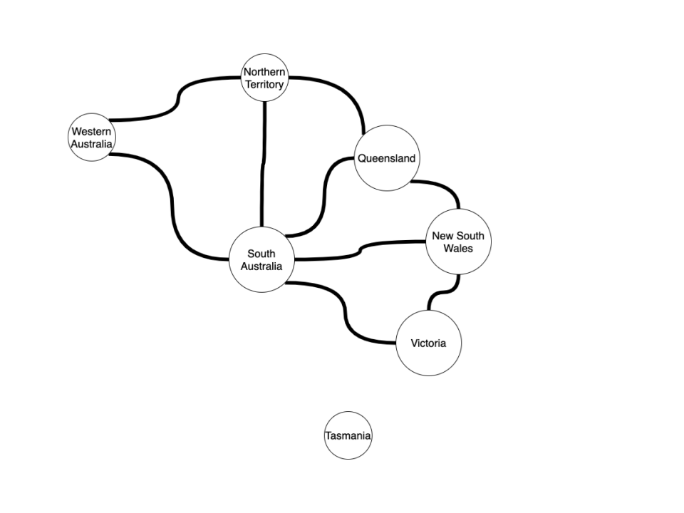
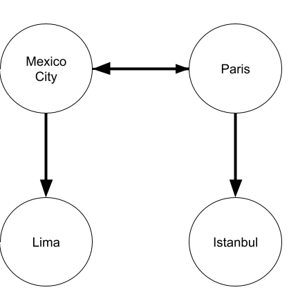
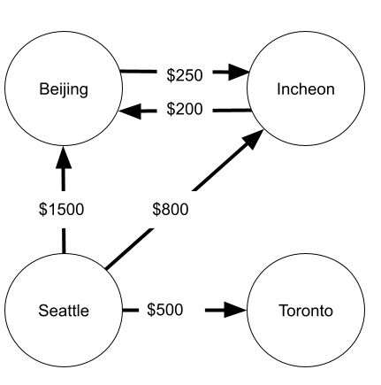
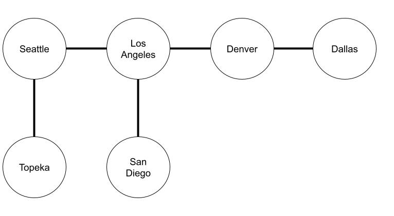
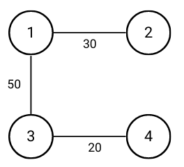

# Graphs

<iframe src="https://adaacademy.hosted.panopto.com/Panopto/Pages/Embed.aspx?id=09cd9474-04a2-4460-8eb8-aad8005b7065&autoplay=false&offerviewer=true&showtitle=true&showbrand=false&start=0&interactivity=all" height="405" width="720" style="border: 1px solid #464646;" allowfullscreen allow="autoplay"></iframe>

Please note that this recording is from C16 and the Graphs topic has been restructured since then. We are providing this as a resource that overviews Graphs, Breadth First Search, and Depth First Search, but it does not align perfectly with the lesson content below. There are updated mini video lessons embedded for the major subtopics at the beginning of each subtopic.

## Learning Goals

By the end of this lesson we should be able to:

- Explain a graph data structure
- Explain how an ordered or unordered set of vertices can represent a graph
- Write algorithms using graphs

## Video Lesson

- [C16 Video Lesson](https://adaacademy.hosted.panopto.com/Panopto/Pages/Viewer.aspx?id=09cd9474-04a2-4460-8eb8-aad8005b7065)
- [C16 Accompanying Slidedeck](https://docs.google.com/presentation/d/1pIAhpb0QL7Pk93P3E-jIRbboz6UPRZOnJ2eyVU1Ga3Q/edit#slide=id.p7)
- [Exercise](https://github.com/ada-c17/Bipartition-Graph)

## Introduction

Graphs are a linked abstract data structure in computer science represented by a set of _nodes_ connected by _edges_. Like binary search trees, graphs are a non-linear data structure. However, graphs are more general than binary search trees. Unlike binary search trees where each node can point to at most two other child nodes, in a graph each node can point to any number of nodes. With graphs, the connection or pointer between two nodes is referred to as an edge from the first node to the second. Every node in the graph can have a different number of edges.

<!--Add image comparing BSTs and graphs-->

Another difference with graphs is that graphs do not have a set 'start' node. When we traverse a list, we always start at the `head` node. When we traverse a binary search tree, we always start at the `root` node. With a graph, traversals can both start and end at any node in the data structure.

<!-- Table: BST traversal v Graph Traversal -->

We may think of nodes in a graph as representing some chosen entity and edges in the graphs as representing relationships between those entities. 

For example, each node in the graph below represents a city. The edges represent flights between those cities. Notice each edge has a cost associated with it. We can use the graph to traverse different paths along the graph and search for the cheapest flight from City A to City B. 


Nodes represent an Australian state in the graph below. The edges represent whether or not it is possible to drive from one state to another. Notice that the edges in the graph don't have a cost associated with them. Additionally notice that the node representing Tasmania is _unconnected_ to the rest of the graph, that is to say it does not have any edges. This is because Tasmania is an island! It's not possible to drive there from another Australian state. 




Graphs can also be used to solve problems like exam or class scheduling. For example, say Fairaday Academy is planning to host exams. They have a number of classes and a number of students.  However they want to schedule exams in such a manner that no student is scheduled to take two exams a the same time.  There are `m` exam slots.


In the example above, each node represents a different course at Fairaday Academy. The edges represent a student taking both courses linked by the edge. To solve the problem, we would look for a way to assign courses to exam slots which are not directly connected by an edge.  

Many, many problems can be represented by graphs even those not involving geographic or navigational problems.  Studying graph problems gives us another way to solve a broad sector of difficult problems.

### Directed vs Undirected Graphs

Graphs can be _directed_ or _undirected_.

**Directed Graph**

In a directed graph, each edge is unidirectional. For any two nodes A and B, an edge from node A to B does not imply that there is an edge going from node B to node A.

As depicted in the example graph below, we use arrows to represent the edges of directed graphs.


Directed graphs can be useful to represent one-way relationships. For example, imagine the graph below depicts available flights for an airline. We can see that there is a flight available from Mexico City to Lima, but there is no available reciprocal flight from Lima back to Mexico City. Likewise, there is a flight from Paris to Istanbul, but no flight from Istanbul to Paris.

Directed graphs can still include bidirectional relationships. For example, the double-ended between Mexico City and Paris indicates that there is both a flight from Mexico City to Paris and from Paris back to Mexico City. 



**Undirected Graph**

In an undirected graph, every edge is bidirectional. In other words, if there is an edge from node A to node B, there is also an edge from node B to node A. 

Undirected graphs use lines without arrows to depict edges between nodes. Imagine the graph below represents friendships between people. In the example graph below, the connection between Ada and Babbage shows that not only does Ada consider Babbage her friend, Babbage also considers Ada his friend. Friendship goes both ways!


### Weighted vs Unweighted Graphs

Graphs can also be either _weighted graphs_ or _unweighted graphs_.  In a weighted graph, each edge is assigned a numeric cost or weight.  A weighted graph can either be directed or undirected.  


Weights are commonly used to represent the monetary cost of a relationship. For example, in the graph below, the weight associated with each edge is the cost of the flight from City A to City B. 

We can see that it costs more to travel from Seattle to Beijing directly ($1500) than if we first travel from Seattle to Incheon and then from Incheon to Beijing ($800 + $200 = $1000). 



Weights are not limited to  monetary cost. They might also represent the distance between two nodes, the priority of a relationship, or any number of things! Weights can also represent a combination of factors. For example, imagine an app which uses a graph to represent a map of the city. Nodes represent intersections between roads and edges represent the roads themselves. Each road might have an associated weight that represents a combination of the current traffic conditions, the speed limit, and the length of the road. The app can then write an algorithm that uses the roads' weights to calculate the fastest route between two locations. 

### !callout-info

## Binary Search Trees, Linked Lists, and Graphs

Binary search trees and linked lists are actually just subtypes of graphs! They are both collections of nodes with edges between them. These two data structures are simply graphs with extra specifications about the number and direction of edges allowed to be connected to a single node.

### !end-callout

## How To Represent A Graph

As called out above, we have already worked with graphs before.  With both binary search trees and linked lists we created a node class with pointers to represent the edges from one node to the next. An example `TreeNode` class is listed below.

```python
class TreeNode:

   def __init__(self, key, val)
      self.key = key
      self.val = val
      self.right = None
      self.left = None
```

In our methods we traversed the structure by writing either iterative or recursive methods which jumped from one node to the next following the links between them using the pointers.

We could represent a graph in a similar way. For example, we could implement a `GraphNode` class as follows:

```python
class GraphNode:

  def __init__(key, val, edges = None)
      self.key = key
      self.val = val
      if not edges:
          self.edges = []
      else:
          self.edges = edges

  def add_connection(self, other_node):
      self.edges.push(other_node)
```

Since each node can have any number of edges, we can represent the edges as a list of other `GraphNode` instances.

To add an edge between two nodes, we can use the `add_connection` method to push node B onto node A's list of edges.

While this could work, it leaves us with a problem. With linked lists and binary search trees, we created a second class in addition to the node class to represent the overall data structure, for example the `Tree` class, which stored the node at which we would start any traversal.  

There is no starting node for a graph. This makes it difficult to set up a `Graph` class in the same way that we set up the `LinkedList` and `Tree` classes. Instead, we need another way to store our graph which provides an easy way for us to start with any node.

### List of Edges

<iframe src="https://adaacademy.hosted.panopto.com/Panopto/Pages/Embed.aspx?id=f67555ac-7850-47a2-ab66-af16013cca1a&autoplay=false&offerviewer=true&showtitle=true&showbrand=true&captions=true&interactivity=all" height="405" width="720" style="border: 1px solid #464646;" allowfullscreen allow="autoplay"></iframe>

The most basic way to store a graph is simply to maintain a list of edges for each node.  For example for the following graph that uses integers to represent each node:


We could represent the graph as a list of edges with the following:

```python
sample_graph = [
        [1, 2], [1, 3], [3, 4]
    ]
```

In the above representation, the graph as a whole is represented by a list. Each element of that list is another list with exactly two elements representing an edge between the two elements. 

For example the list of index 0 of the outer list `[1, 2]` represents the edge between nodes 1 and 2 that we can see reflected in the diagram above.

#### List of Edges Big O

This representation has a couple of advantages it's simple and uses a minimum amount of space.  For a graph _G(N, E)_ where _N_ is the set of nodes and _E_ the set of edges, this representation has a space complexity of _O(E)_.

It does have a major downside: to find out if any particular pair of nodes are connected by an edge, you must traverse the entire list.  This means that the time complexity to find out if any two nodes are connected is _O(E)_ as well.  

Other implementations, such as the adjacency matrix we will look at next, can improve on this time complexity.

### Adjacency Matrix

<iframe src="https://adaacademy.hosted.panopto.com/Panopto/Pages/Embed.aspx?id=a1caaf2a-92aa-4f38-b112-af16014a7337&autoplay=false&offerviewer=true&showtitle=true&showbrand=true&captions=true&interactivity=all" height="405" width="720" style="border: 1px solid #464646;" allowfullscreen allow="autoplay"></iframe>

Let's look at the same graph again.  Instead of maintaining a list of edges we could instead create a 2-dimensional matrix with _N_ rows and _N_ columns where _N_ is the number of nodes in the graph. Each row-column intersection indicates whether an edge exists between two nodes.


Below is an example matrix for the above graph:


In the adjacency matrix above, if two nodes matched by the row-column intersection share an edge, that value in the matrix is `True`.  If they do not share an edge, the value is `False`.  

In Python, the same adjacency matrix would be represented as:

```py
    adj_matrix = [
        [False, False, False, False, False],
        [False, False, True, True, False],
        [False, True, False, False, False],
        [False, True, False, False, True],
        [False, False, False, True, False]
    ]
```

With an adjacency matrix, we take advantage of list indices and use them to represent the nodes in the graph. For example, in the above graph, the `True` value at `adj_matrix[1][2]` (row index 1 and column index 2) indicates that there is an edge between node 1 and node 2. 

Notice that this means that each node in an adjacency matrix is represented by an integer. However, graph nodes often need to encapsulate more information than just an integer. For example, if each node in the graph represented a city, we may want the node to store the city name. As a result, when we use an adjacency matrix to represent a graph, we often need some way to convert or assign each node in the graph to a number. How we encapsulate or convert this data is beyond the scope of this class, but we encourage you to follow your curiosity if this topic interests you. 

<!-- >>>>>>>>>>>>>>>>>>>>>> BEGIN CHALLENGE >>>>>>>>>>>>>>>>>>>>>> -->
<!-- Replace everything in square brackets [] and remove brackets  -->

### !challenge

* type: paragraph
* id: 1fabf01a-31a0-40ed-949f-d505768e0d1e
* title: What would a value of `False` for `adj_matrix[0][0]` indicate?
* points: 1

##### !question

In an adjacency matrix `adj_matrix`, what would a value of `False` for `adj_matrix[0][0]` indicate?

##### !end-question

##### !placeholder

##### !end-placeholder

##### !hint

The value at `adj_matrix[0][0]` indicates whether there is a node from Node 0 to Node 0.

##### !end-hint

##### !explanation 

The 0th node in the graph represented by `adj_matrix` does not have an edge with itself. 

##### !end-explanation

### !end-challenge

<!-- ======================= END CHALLENGE ======================= -->

<!-- >>>>>>>>>>>>>>>>>>>>>> BEGIN CHALLENGE >>>>>>>>>>>>>>>>>>>>>> -->
<!-- Replace everything in square brackets [] and remove brackets  -->

### !challenge

* type: paragraph
* id: 4f55b006-9931-474c-9c13-19a7747ec68f
* title: How could we represent an undirected graph using an adjacency matrix?
* points: 1

##### !question

How could we represent an undirected graph using an adjacency matrix?

##### !end-question

##### !placeholder

##### !end-placeholder

<!-- other optional sections -->
##### !hint 

In an undirected graph, if `adj_matrix[1][2]` is `True`, what does that imply about `adj_matrix[2][1]`?

##### !end-hint 
<!-- !rubric - !end-rubric (markdown, instructors can see while scoring a checkpoint) -->
##### !explanation 
If the graph is undirected, the entries across the central diagonal will be the same. That is to say, if `adj_matrix[1][2]` is `True`, then `adj_matrix[2][1]` must also be `True`. Conversely, if `adj_matrix[1][2]` is `False`, then `adj_matrix[2][1] ` must also be `False`
##### !end-explanation

### !end-challenge


<!-- ======================= END CHALLENGE ======================= -->

Based upon our observations from the above questions, we can notice a couple of things about adjacency matrices:
- Unless a node has an edge with itself the diagonal from [0][0] to [n-1][n-1] will be `False`
- If the graph is undirected, the entries across the central diagonal will be mirror images
  - if (1, 2) is `True`, then (2, 1) must also be `True`
- We need some way to convert a node in the graph to an integer

#### Adjacency Matrix Big O

For a graph _G(N, E)_, where _N_ is the number of nodes and _E_ the number of edges, this solution provides:

- **O(1)** lookup time complexity to find out if any two nodes share an edge
- **O(N<sup>2</sup>)** space complexity to store this representation
- **O(N)** time complexity for getting a list of all the neighbors of a node `n` because you need to read the entire row or column.

This method provides a very fast lookup time and not terrible space complexity if the graph is a _dense graph_ which is a graph where there are a large number of edges compared to nodes.

In the example above, we used a matrix of booleans where true indicates an existing edge and false indicates no edge exists connecting the two nodes. You will often see this represented as a matrix of ones and zeroes where zero indicates no edge exists and 1 indicates it does.  This has the advantage of only requiring one bit per matrix cell.  There are [some strategies](https://github.com/javolio/Bitwise-Adjacency-Matrix) to use this fact to compress the space requirements.  

### Adjacency List


<iframe src="https://adaacademy.hosted.panopto.com/Panopto/Pages/Embed.aspx?id=c50cc66a-5630-471c-a3b6-af16016041ae&autoplay=false&offerviewer=true&showtitle=true&showbrand=true&captions=true&interactivity=all" height="405" width="720" style="border: 1px solid #464646;" allowfullscreen allow="autoplay"></iframe>

An adjacency list provides a bit of a middle ground between a list of edges and an adjacency matrix.  Like an adjacency matrix, an adjacency list is a list of lists where each index of the outer list represents a node. However, the value at each index is an unordered list of neighboring nodes. The adjacency list can be an array or a linked list.

We can craft an adjacency list for the same graph we've been looking at like so:


Represented in Python, the adjacency list would look like the following.

```python
adjacency_list = [
        [],
        [2, 3],
        [1],
        [1, 4],
        [3]
    ]
```

#### Adjacency List With A Dictionary


The examples we used above used numeric identifications for nodes. But what if we want to use other values like strings or objects to represent nodes?  In that case we can use a hash table (dictionary).



```python
adjacency_list_with_dict = {
        "Seattle": ["Los Angelos", "Topeka"],
        "Los Angeles": ["Seattle", "Denver", "San Diego"],
        "Topeka": ["Seattle"],
        "Denver": ["Los Angeles", "Dallas"],
        "San Diego": ["Los Angeles"],
        "Dallas": ["Denver"]
    }
```

This representation provides similar benefits to using an array for an adjacency list, but provides us more flexibility with keys.  We no longer need numeric IDs for our nodes and the IDs do not need to be consecutive.  For example, in the adjacency matrix and list above, there was no node 0, but we maintained space for a node with that id.

<!-- available callout types: info, success, warning, danger, secondary, star  -->
### !callout-info

## Storing Complex Data in Graph Nodes

For simplicity, all of our examples show graphs that store a single simple piece of data such as an integer or a string in each node. Most technical interview questions will also use basic node representations for the same reason. However, in more practical applications, we may want to use instances of a class to represent each node so that each node can hold a more complex set of data. Each instance can be assigned an `id` or `index` so that they can still easily be represented in a list of edges, adjacency matrices, and adjacency lists.
### !end-callout

#### Adjacency List Big O
Generally adjacency lists give a good balance between time and space complexity and perform relatively well. 
- **O(d)** lookup time to find out if any two nodes share an edge, where _d_ is the _degree_ of a node meaning the number of edges the node has
  - The maximum value of d would be the case where a node is connected to every other node (assuming no duplicate edges) which is _N_ - 1 where _N_ is the total number of nodes in the graph.
  - When _d_ begins to approach _N_ for the majority of nodes - in other words, when we have a dense graph - we start to see the advantages of using an adjacency matrix with O(1) lookup time over an adjacency list
- O(2E) = **O(E)** space complexity to store this representation because each element of the array stores a list of the edges a node has
  -  Each edge is stored twice in the case of an undirected graph
- **O(1)** time complexity to get all the neighbors of a particular node because it is an O(1) operation to lookup a node by its index and the list at that location is a list of all the node's neighbors.

## Representing Weighted Edges in Graphs

Thus far, we have only discussed using each graph representation on unweighted graphs. How can we adapt our graph representations so that they can represent weighted graphs?

### List of Edges

In a list of edges, the most common way to include weights is to tack the weight on as an additional element in the list for each individual edge.



```python
sample_graph_with_weights = [
        [1, 2, 30], [1, 3, 50], [3, 4, 20]
    ]
```

Looking at our list of edges `sample_graph_with_weights`, we can see that the inner lists representing each edge in our example graph now have three elements each. The first two elements still represent the two nodes that the edge is connecting. The additional third element represents the weight of the edge. For example, the first edge in the list of edges `[1, 2, 30]` represents an edge between nodes 1 and 2 with a weight of 30. 


### Adjacency Matrix
In an adjacency matrix, the weight becomes the value at each row-column intersection. Typically `0` or `None` values are used to indicate the absence of an edge between two nodes.


```py
    adj_matrix_with_weights = [
        [0,  0,  0,  0,  0],
        [0,  0, 30, 50,  0],
        [0, 30,  0,  0,  0],
        [0, 50,  0,  0, 20],
        [0,  0,  0, 20,  0]
    ]
```
The value at `adj_matrix_with_weights[1][2]` indicates whether there is an edge from node 1 to node 2 just as it did when our example graph was unweighted. However, instead of holding a value of `True` or `1` to indicate the presence of an edge, `adj_matrix_with_weights[1][2]` now holds the value `30`, which is the weight of the edge from node 1 to node 2.

`adj_matrix_with_weights` chooses to use the value `0` to indicate that there is no edge between two nodes.


### Adjacency List

In an adjacency list, it is common to couple the destination node's value with the weight in the form of a tuple. 


Using this strategy, our weighted example graph could be represented as follows:

```python
adjacency_list_with_weights = [
        [],
        [(2, 30), (3, 50)],
        [(1, 30)],
        [(1, 50), (4, 20)],
        [(3, 20)]
    ]
```

If we examine `adjacency_list_with_weights[1]`, we can see that node 1 has two edges:
- `(2, 30)` represents an edge from node 1 to node 2 with a weight of 30
- `(3, 50)` represents an edge from node 1 to node 3 with a weight of 50


## Summary

A graph is a data structure consisting of a finite collection of _nodes_, also called _vertices_, and a collection of connections between nodes known as _edges_.  A graph can be either a _directed graph_, or an _undirected graph_.  In a directed graph, edges are not bidirectional: we may be able to travel from node A to node B, but not from node B to node A. Graphs can also have _weighted_ or _unweighted_ edges. Weighted graphs have some cost or weight assigned to each edge, making it so that the shortest, most direct path from Node A to Node B may not be the cheapest.

Because graphs are non-hierarchical and do not have a set start node, it is difficult to represent graphs in the same way we usually represent linked lists and trees. Instead, there are two common methods for representing a graph data structure:
- Adjacency matrix
- Adjacency list/dictionary

An adjacency matrix has a fast lookup time of O(1) to see if two nodes are connected by an edge, but it can be relatively expensive in terms of space complexity and the time it takes to find all the neighbors of a particular node. An adjacency list, has a better balance between time and space complexity, but the lookup time of O(d) to find if two nodes share an edge can be expensive when a graph is dense. 

Lists of edges are another method for representing graphs, however the lookup time and space complexity are less efeficient than both adjacency matrices and adjacency lists.


<!-- Diagram sources:  https://drive.google.com/file/d/1bOXvfXdWi9pkKfmWnMZd9QK4zoG930c7/view?usp=sharing -->


