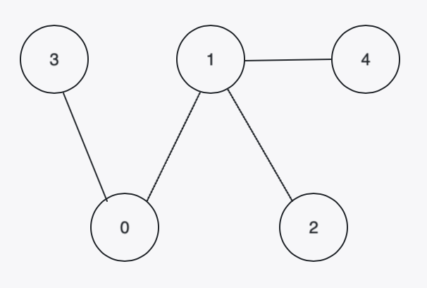
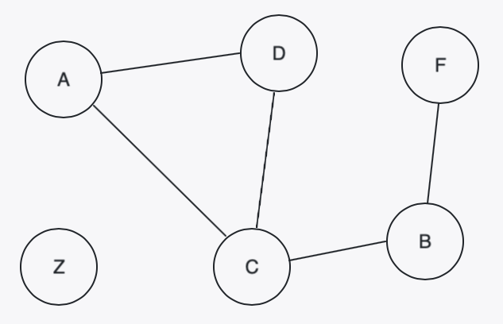
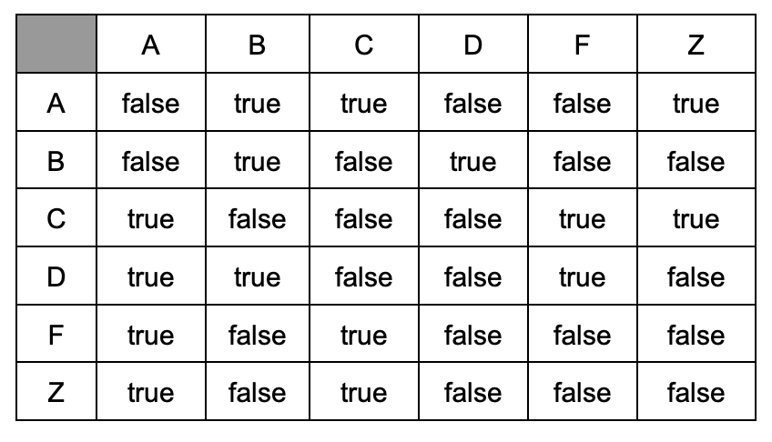
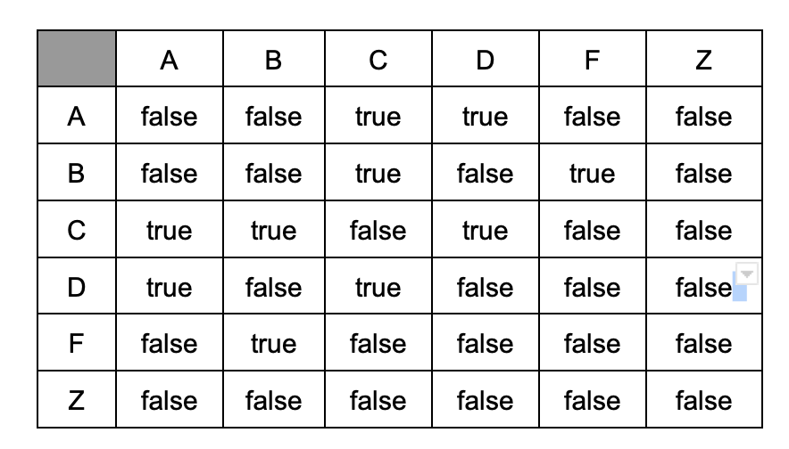
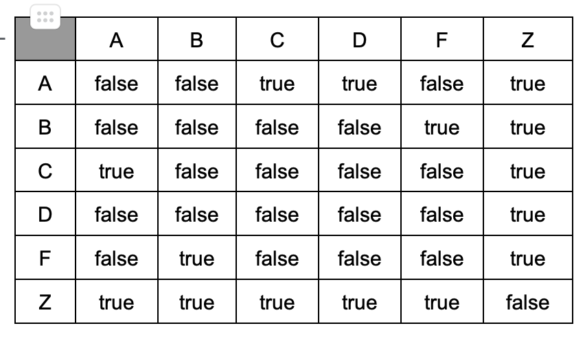
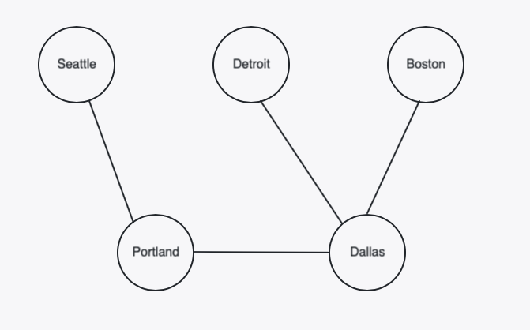
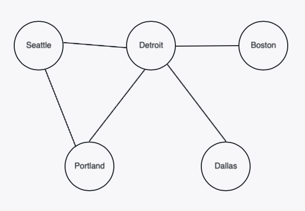
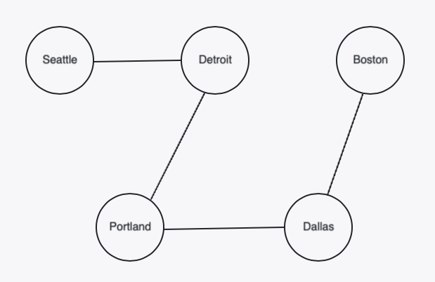
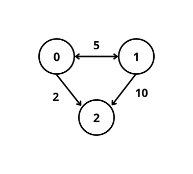

# Representing Graphs Practice

## Graphs and Technical Interviews

Graph questions are very common in technical interviews. One of the first challenges when we encounter a graph problem, is understanding how the problem is choosing to represent graphs. Feeling comfortable navigating each of the graph representations discussed in the previous lesson can help. Answer the following questions to help familiarize yourself with each graph representation. 

<!-- available callout types: info, success, warning, danger, secondary, star  -->
### !callout-info

## Alternative Representations

Some technical interview questions can be considered graph questions, but do not provide any of the representations (list of edges, adjacency matrix, adjacency list) discussed in this lesson. Handling these cases will be discussed more during CS Fundamentals in Internship! 

### !end-callout


<!-- >>>>>>>>>>>>>>>>>>>>>> BEGIN CHALLENGE >>>>>>>>>>>>>>>>>>>>>> -->

### !challenge

* type: multiple-choice
* id: 3490f39e-c8e4-4eaa-9908-ba5407937934
* title: Representing a Graph with a List of Edges
* points: 0

##### !question

Which list of edges represents the graph shown in the diagram below? Assume the graph is undirected.



##### !end-question

##### !options

a| ```py
[
    [0, 2],
    [1, 3],
    [2, 3]
]
```
b| ```py
[
    [0, 3],
    [0, 1],
    [1, 4]
]
```
c| ```py
[
    [0, 3],
    [0, 1],
    [1, 4],
    [1, 3]
]
```
d| ```py
[
    [0, 3],
    [0, 1],
    [1, 2],
    [1, 4]
]
```

##### !end-options

##### !answer

d|

##### !end-answer

### !explanation
Answer D is the correct answer because all of the edges in the graph are represented and correspond correctly to the edges in the graph.

[0, 3] indicates the edge from node 0 to node 3.
[0, 1] indicates the edge from node 0 to node 1.
[1, 2] indicates the edge from node 1 to node 2.
[1, 4] indicates the edge from node 1 to node 4.

### !end-explanation

### !end-challenge

<!-- ======================= END CHALLENGE ======================= -->

<!-- >>>>>>>>>>>>>>>>>>>>>> BEGIN CHALLENGE >>>>>>>>>>>>>>>>>>>>>> -->
<!-- Replace everything in square brackets [] and remove brackets  -->

### !challenge

* type: multiple-choice
* id: bc42d1a0-b66a-4cc2-ad42-b2b5c51323c1
* title: Representing a graph with an adjacency matrix
* points: 0

##### !question

Which adjacency matrix represents the graph shown in the diagram below? Assume the graph is undirected.



Assume the letters are mapped to the following indices:
* A -> 0
* B -> 1
* C -> 2
* D -> 3
* F -> 4
* Z -> 5

#### Option A


#### Option B


#### Option C


##### !end-question

##### !options

a| Option A
b| Option B
c| Option C

##### !end-options

##### !answer

b|

##### !end-answer

##### !explanation

Option B is the correct answer because the edges in the graph are all represented in the adjacency matrix.

For instance:

Row A, column C (Matrix[A][C]) is true because there exists an edge between node A and node C. Similarly, row C, column A (Matrix[C][A]) is true because of the same edge. 

Each cell containing true denotes an edge between the corresponding nodes.

Row Z is all false because node Z does not share an edge with any other node.

##### !end-explanation

### !end-challenge

<!-- ======================= END CHALLENGE ======================= -->

<!-- >>>>>>>>>>>>>>>>>>>>>> BEGIN CHALLENGE >>>>>>>>>>>>>>>>>>>>>> -->
<!-- Replace everything in square brackets [] and remove brackets  -->

### !challenge

* type: multiple-choice
* id: 2a316cff-6a03-4d90-9d15-4cf299afd223
* title: Representing a graph with an adjacency dictionary
* points: 0

##### !question

Which graph is represented by the following adjacency dictionary?

```py
adjacency_dict = {
    "Seattle": ["Portland"],
    "Portland": ["Dallas", "Seattle"],
    "Detroit": ["Dallas"],
    "Dallas": ["Boston", "Detroit", "Portland"],
    "Boston": ["Dallas"]
}
```

#### Option A


#### Option B


#### Option C


##### !end-question

##### !options

a| Option A
b| Option B
c| Option C

##### !end-options

##### !answer

a|

##### !end-answer

##### !explanation

Option A is correct because the nodes/edges in the adjacency dictionary correspond with the nodes and edges in the graph. 

For instance:

* Seattle is connected to only one city: Portland
* Portland is connected to Dallas and Seattle
* Dallas is connected to Boston, Detroit, and Portland
* Detroit is connected to Dallas
* Boston is connected to Dallas

##### !end-explanation 

### !end-challenge

<!-- Challenge Question Representing Weighted Graph -->


<!-- >>>>>>>>>>>>>>>>>>>>>> BEGIN CHALLENGE >>>>>>>>>>>>>>>>>>>>>> -->
<!-- Replace everything in square brackets [] and remove brackets  -->

### !challenge

* type: multiple-choice
* id: 89891857-a9c7-43dc-b3f7-5b713771fa1f
* title: Representing a weighted, directed graph
* points: 1
<!-- * topics: [python, pandas] (Checkpoints only. optional the topics for analyzing points) -->

##### !question

Which of the following options represents the following graph?



##### !end-question

##### !options

a| 
```python
list_of_edges = [
[0, 1, 5],
[1, 2, 10],
[0, 2, 2]
]
```
b| 
```python
adj_matrix = [
[5, 0, 2],
[5, 0, 10],
[2, 10, 0]
]
```
c| 
```python
adj_list = [
[(1, 5), (2, 2)],
[(0, 5), (2, 10)],
[]
]
```

##### !end-options

##### !answer

c|

##### !end-answer

<!-- other optional sections -->
##### !hint 
Consider drawing out what each of the options looks like!
##### !end-hint
<!-- !rubric - !end-rubric (markdown, instructors can see while scoring a checkpoint) -->
##### !explanation
The answer is Option C
```python
adj_list = [
[(1, 5), (2, 2)],
[(0, 5), (2, 10)],
[]
]
```
Node 0 has two edges:
- `(1, 5)` --> an edge from node 0 to node 1 with weight 5
- `(2, 2)` --> an edge from node 0 to node 2 with weight 2

Node 1 also has two edges:
- `(0, 5)` --> an edge from node 1 to node 0 with weight 5
- `(2, 10)` --> an edge from node 1 to node 2 with weight 10

Node 2's list of edges is an empty list, because no edges exist in the list where node 2 is the _source_ node. 

Option A, the list of edges, is incorrect because it is missing the edge `[1, 0, 5]`.

Option B, the adjacency matrix is incorrect because there are multiple incorrect row-column values. For example, `adj_matrix[0][0]` has weight `5` indicating that there is an edge with weight 5 from node 0 to itself. 
##### !end-explanation

### !end-challenge

<!-- ======================= END CHALLENGE ======================= -->

<!-- >>>>>>>>>>>>>>>>>>>>>> BEGIN CHALLENGE >>>>>>>>>>>>>>>>>>>>>> -->
<!-- Replace everything in square brackets [] and remove brackets  -->

### !challenge

* type: multiple-choice
* id: 4760b1f5-b4d0-43c6-a524-c293340d0a7f
* title: Cheapest Flights within K Stops Graph Representation
* points: 1
<!-- * topics: [python, pandas] (Checkpoints only. optional the topics for analyzing points) -->

##### !question

The Leetcode exercise `Cheapest Flights Within K Stops` is a graph problem and has the following problem statement:

"There are `n` cities connected by some number of flights. You are given an array flights where `flights[i] = [from_i, to_i, price_i]` indicates that there is a flight from city `from_i` to city `to_i` with cost `price_i`.

You are also given three integers `src`, `dst`, and `k`, return the cheapest price from `src` to `dst` with at most `k` stops. If there is no such route, return `-1`."

Which of the following graph representations does this problem provide us with?

*Note: You are **not** expected to solve this Leetcode problem!*

##### !end-question

##### !options

a| List of Edges
b| Adjacency Matrix
c| Adjacency List
d| None of the above

##### !end-options

##### !answer

a|

##### !end-answer

<!-- other optional sections -->
##### !hint 
Check out the problem on Leetcode to see example inputs and outputs!
[Cheapest Flights Within K Stops](https://leetcode.com/problems/cheapest-flights-within-k-stops/)
##### !end-hint 
<!-- !rubric - !end-rubric (markdown, instructors can see while scoring a checkpoint) -->
##### !explanation 
This problem provides us with a list of edges. 

The sentence "You are given an array flights where `flights[i] = [from_i, to_i, price_i]` indicates that there is a flight from city `from_i` to city `to_i` with cost `price_i`" tells us this.

The cities are nodes and flights are edges. Each edge is represented by `[from_i, to_i, price_i]` including the edge's source node/city first, the destination node/city second, and the weight or price of the flight third. 

The indices of `flights` aren't used to represent either the source or the destination nodes so we know that the representation given is neither an adjacency list nor an adjacency matrix.
##### !end-explanation 

### !end-challenge

<!-- ======================= END CHALLENGE ======================= -->