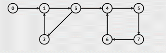
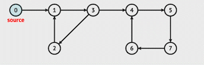

## Graph Algorithms

There are a huge [class of algorithms](https://en.wikipedia.org/wiki/Category:Graph_algorithms) involving graphs.  We will look at two of the most common graph algorithms as a sample.  

### Breadth First Search

Like in a binary search tree a breadth first search in a graph is performed with a queue.  However, unlike trees, graphs often have cycles so we will need to keep track of the nodes we have visited and ensure that we only traverse nodes that have yet to be visited. Otherwise, we will get stuck in a loop visiting the same nodes in the cycle over and over again.

### !callout-info

## Cycles in Graphs
In graph theory, a path that starts from a given node and ends at that same node is called a *cycle*. In the graph below, there is a cycle starting from node A -> node B -> node C -> node A.


### !end-callout

In breadth first search we start with a particular node and visit each node connected to the starting point in the graph starting with the closest node to the starting point and expanding outward.

We do so by adding each of the neighbors of the starting node to a queue. Then we loop through the queue, removing the first element in the queue and adding each of its unvisited neighbors to the queue. We repeat this process until the queue is empty. 

Once the queue is empty we know we have visited all nodes in the graph that are possible to reach from the starting node.



In the above visualization, the algorithm starts its traversal from the specified start node, node 0 in this case, and expands outwards. First the algorithm visits the start node's neighbors, then the neighbor's neighbors, and so on until it has traversed every node reachable from the start node. If a neighbor has already been visited, the algorithm skips over visiting that neighbor and moves on to the next unvisited neighbor.

You can also interact with a breadth first search animation on [HackerEarth](https://www.hackerearth.com/practice/algorithms/graphs/breadth-first-search/visualize/)

**Breadth First Search Pseudocode Walkthrough**
<iframe src="https://adaacademy.hosted.panopto.com/Panopto/Pages/Embed.aspx?id=493ecb29-6431-4e61-b918-af170141a8da&autoplay=false&offerviewer=true&showtitle=true&showbrand=false&captions=true&interactivity=all" height="360" width="640" style="border: 1px solid #464646;" allowfullscreen allow="autoplay"></iframe>

The pseudocode for breadth first search is as follows:
```
    - Start by grabbing the first item in the adjacency dictionary `start_node`
    - Create an empty list called `visited`
    - Create an empty queue `q`
    - Add `start_node` to `q` and `visited`
    - While `q` is not empty:
        - Remove an element from `q` and store it in `current`
        - Loop through each of `current`'s neighbors:
            - If the neighbor is not in `visited`:
                - Add the neighbor to `visited`
                - Add the neighbor to `q`
    - Return `visited`
```

Breadth first search is a solution in a variety of problems including:

- Finding the shortest path in an unweighted graph/maze
- Solving puzzle games like a [Rubik's Cube](https://www.quora.com/How-can-solving-a-Rubiks-Cube-be-framed-as-a-graph-problem)
- Checking to see if a graph is connected

**Questions**

<!-- >>>>>>>>>>>>>>>>>>>>>> BEGIN CHALLENGE >>>>>>>>>>>>>>>>>>>>>> -->
<!-- Replace everything in square brackets [] and remove brackets  -->

### !challenge

* type: code-snippet
* language: python3.6
* id: 3398d942-7078-4567-9b81-67bb6c38d104
* title: Iterative Breadth First Search
* points: 1

##### !question

Write a function returning a list of elements representing a breadth first search of the items in `self.adjacency_dict`.

Spend no more then 15 minutes working through this independently. Use the hints below or reach out for help if you are still feeling stuck after 15 minutes.

##### !end-question

##### !placeholder

```py
class Graph:
    
    # The graph is stored in an adjacency dictionary where each key 
    # represents a node in the graph and each value in the dictionary
    # represents the corresponding key's list of edges
    def __init__(self, adjacency_dict = {}):
        self.adjacency_dict = adjacency_dict

    def bfs(self):
        pass
```

##### !end-placeholder

##### !tests
```py
import unittest
from main import *

class TestPython1(unittest.TestCase):
    def test_bfs(self):
        adjacency_dict = {
            "Seattle": ["Portland", "Chicago"],
            "Chicago": ["Seattle"],
            "Portland": ["Seattle", "Hawaii"],
            "Hawaii": ["Portland"]
        }

        g = Graph(adjacency_dict)

        answer = ["Seattle", "Portland", "Chicago", "Hawaii"]
        self.assertEqual(answer, g.bfs())

    def test_bfs_empty_graph(self):
        g = Graph()
        self.assertEqual([], g.bfs())

    def test_bfs_one_item(self):
        adjacency_dict = {
            "Seattle": []
        }
        g = Graph(adjacency_dict)
        self.assertEqual(["Seattle"], g.bfs())
```

##### !end-tests

##### !hint

Refer to the pseudocode included above this question to guide your implementation. 

Still feeling stuck? Check this video walkthrough of the solution.

<iframe src="https://adaacademy.hosted.panopto.com/Panopto/Pages/Embed.aspx?id=42ac2142-176c-4846-8b69-af1d012341bf&autoplay=false&offerviewer=true&showtitle=true&showbrand=false&captions=true&interactivity=all" height="360" width="640" style="border: 1px solid #464646;" allowfullscreen allow="autoplay"></iframe>

### !end-hint

### !explanation 
An example of a working implementation:

```python
def bfs(self):
    graph = self.adjacency_dict
    
    if len(graph) == 0:
        return []
        
    first_item = list(graph.keys())[0]
    queue = [first_item]
    visited = [first_item]
        
    while queue:
        current = queue.pop(0)
        
        for neighbor in graph[current]:
            if neighbor not in visited:
                visited.append(neighbor)
                queue.append(neighbor)
                
    return visited
```
### !end-explanation

### !end-challenge

<!-- ======================= END CHALLENGE ======================= -->

<!-- >>>>>>>>>>>>>>>>>>>>>> BEGIN CHALLENGE >>>>>>>>>>>>>>>>>>>>>> -->
<!-- Replace everything in square brackets [] and remove brackets  -->

### !challenge

* type: multiple-choice
* id: 7b46c76f-c47e-4ed1-8606-732c610a1eaa
* title: Time complexity of BFS
* points: 1
* topics: graphs

##### !question

What is the time complexity of Breadth First Search with N nodes and E edges.

##### !end-question

##### !options

* O(N)
* O(N^2)
* O(E)
* O(NE)
* O(N + E)
* O(1)

##### !end-options

##### !answer

* O(N + E)

##### !end-answer

##### !explanation

Since we will visit each node once, and loop through each of the edges in each node the Big-O of this algorithm is O(N + E) where `N` is the number of nodes in the graph and `E` is the number of edges since each node and each edge will be explored.

O(N + E) is different from O(NE) because O(NE) implies that we visit each node `E` times. On the contrary, we visit each node at most one time, which is a set of operations resulting in a Big-O of O(N). We examine the edges adjacent to a node only when we visit the node, so each edge is examined at most two times, once for each of the nodes to which it is connected. This gives us a Big-O of O(2E) = O(E). Put together O(N) + O(E) and we get O(N + E).

##### !end-explanation

### !end-challenge

<!-- ======================= END CHALLENGE ======================= -->

<!-- >>>>>>>>>>>>>>>>>>>>>> BEGIN CHALLENGE >>>>>>>>>>>>>>>>>>>>>> -->
<!-- Replace everything in square brackets [] and remove brackets  -->

### !challenge

* type: multiple-choice
* id: 4376fdea-ebec-4fdc-897d-21fc7ca5ff91
* title: Space Complexity of BFS
* points: 1
* topics: graphs

##### !question

What is the space complexity of Breadth First Search with N nodes and E edges?

##### !end-question

##### !options

* O(N)
* O(E)
* O(NE)
* O(N + E)
* O(1)


##### !end-options

##### !answer

* O(N)

##### !end-answer

<!-- other optional sections -->
<!-- !hint - !end-hint (markdown, users can see after a failed attempt) -->
<!-- !rubric - !end-rubric (markdown, instructors can see while scoring a checkpoint) -->
##### !explanation

In the worst-case you will need to add each node to the Queue, so the space complexity is O(N) where `N` is the number of nodes in the graph.

##### !end-explanation

### !end-challenge

<!-- ======================= END CHALLENGE ======================= -->


### Depth First Search

Where breadth first search spreads out from a starting node in order of distance from the starting node, depth first search follows each path as far as possible before backing up and following the next closest path. For this reason we refer to depth first search as a _backtracking_ algorithm.



In the above visualization, observe that the when the algorithm reaches node 3, it visits its first neighbor 2. When node 2 is visited, depth first search chooses to next explore node 2's neighbors instead of going to visit node 3's second neighbor node 4 as breadth first search would have done. It's only when depth first search realizes that node 2's only neighbor node 1 has already been visited that it backtracks to node 3 and moves on to explore node 3's second neighbor, node 4. 

**Depth First Search Pseudocode Walkthrough**
<iframe src="https://adaacademy.hosted.panopto.com/Panopto/Pages/Embed.aspx?id=8e2085ff-4dd1-46aa-a961-af170141a92a&autoplay=false&offerviewer=true&showtitle=true&showbrand=false&captions=true&interactivity=all" height="360" width="640" style="border: 1px solid #464646;" allowfullscreen allow="autoplay"></iframe>

The pseudocode for an iterative depth first search implementation is as follows:
```
- Start by taking the first item in the adjacency dictionary `start_node`
- Create a Stack called `stack`
- Create an empty list called `visited`
- Push `start_node` onto `stack`
- while `stack` is not empty
    - Pop the stack and store it in `current`
    - Add `current` to `visited`
    - Loop through all the neighbors of `current`
        - If they are not in `visited`
            - Push the neighbor onto `stack`
- Return `visited`
```

[HackerEarth](https://www.hackerearth.com/practice/algorithms/graphs/depth-first-search/visualize/) has an excellent description and visualization of the algorithm.

Depth first search has a number of applications in graph problems including:

- Detecting a cycle in a graph
- Finding a path in a maze where there is only one correct path
- Scheduling jobs based on dependencies on other jobs

**Questions**

<!-- >>>>>>>>>>>>>>>>>>>>>> BEGIN CHALLENGE >>>>>>>>>>>>>>>>>>>>>> -->
<!-- Replace everything in square brackets [] and remove brackets  -->

### !challenge

* type: code-snippet
* language: python3.6
* id: ce448643-59d9-44a8-b2c6-ba4a8a2227e5
* title: Iterative Depth First Search
* points: 1

##### !question

Write a function returning a list of elements representing a depth first search of the items in `self.adjacency_dict`. Please write the function iteratively, i.e. without using recursion.

Spend no more then 15 minutes working through this independently. Use the hints below or reach out for help if you are still feeling stuck after 15 minutes.

##### !end-question

##### !placeholder

```py
class Graph:
    
    # The graph is stored in an adjacency dictionary where each key 
    # represents an item in the graph and each value in the dictionary
    # corresponds to a list of edges from the key
    def __init__(self, adjacency_dict = {}):
        self.adjacency_dict = adjacency_dict

    def dfs(self):
        pass
```

##### !end-placeholder

##### !tests

```py
import unittest
from main import *

class TestPython1(unittest.TestCase):
    def test_dfs(self):
        adjacency_dict = {
            "Seattle": ["Chicago", "Portland"],
            "Chicago": ["Seattle"],
            "Portland": ["Seattle", "Hawaii"],
            "Hawaii": ["Portland", "Juneau"],
            "Juneau": ["Hawaii"]
        }

        g = Graph(adjacency_dict)

        answer = ["Seattle", "Portland", "Hawaii", "Juneau", "Chicago"]
        self.assertEqual(answer, g.dfs())

    def test_dfs_empty_graph(self):
        g = Graph()
        self.assertEqual([], g.dfs())

    def test_dfs_one_item(self):
        adjacency_dict = {
            "Seattle": []
        }
        g = Graph(adjacency_dict)
        self.assertEqual(["Seattle"], g.dfs())
```

##### !end-tests

### !hint
Use the pseudocode included above this problem to guide your implementation.

Still feeling stuck? Check this video walkthrough of the solution.

<iframe src="https://adaacademy.hosted.panopto.com/Panopto/Pages/Embed.aspx?id=77eefecf-346b-4fe5-8b31-af1d0123414e&autoplay=false&offerviewer=true&showtitle=true&showbrand=false&captions=true&interactivity=all" height="360" width="640" style="border: 1px solid #464646;" allowfullscreen allow="autoplay"></iframe>

### !end-hint 

### !explanation
An example of a working implementation:

```python
def dfs(self):
    graph = self.adjacency_dict
    
    if len(graph) == 0:
        return []
        
    first_item = list(graph.keys())[0]
    stack = [first_item]
    visited = []

    while stack:
        current = stack.pop()
        visited.append(current)

        for neighbor in graph[current]:
            if neighbor not in visited:
                stack.append(neighbor)

    return visited
```
### !end-explanation

### !end-challenge

<!-- >>>>>>>>>>>>>>>>>>>>>> BEGIN CHALLENGE >>>>>>>>>>>>>>>>>>>>>> -->

### Stacks and recursion

Whenever we deploy the use of a stack to solve a problem, the problem may typically be solved using recursion, especially if the problem involves doing the same operation repeatedly. We can use the program's call stack to replace the explicit creation of a stack by using a recursive call. 

The pseudocode for the recursive implementation is as follows:
```
- For base function:
    - Create empty list called `visited`
    - Take the first item in the adjacency graph `first_item`
    - Call helper function with `visited`, `self.adjacency_dict`, and `first_item`
    - Return `visited`

- For helper function (takes in `visited`, `graph`, and `node`):
    - If `node` is not in `visited`:
        - Append `node` to `visited`
        - For each `neighbor` of the `node`:
            - Call helper with `visited`, `graph`, and the `neighbor`
```

The key difference between our iterative and recursive implementations is that the explicit stack created in the iterative version is replaced by the recursive call stack.


### !challenge

* type: code-snippet
* language: python3.6
* id: 243eaf9a-e87e-48f6-bfa0-9df10c5b15d2
* title: Recursive Depth First Search
* points: 1

##### !question

Write a function returning a list of elements representing a depth first search of the items in `self.adjacency_dict`. Please write the function recursively.

Spend no more then 15 minutes working through this independently. Use the hints below or reach out for help if you are still feeling stuck after 15 minutes.

##### !end-question

##### !placeholder

```py
class Graph:
    
    # The graph is stored in an adjacency dictionary where each key 
    # represents an item in the graph and each value in the dictionary
    # corresponds to a list of edges from the key
    def __init__(self, adjacency_dict = {}):
        self.adjacency_dict = adjacency_dict

    def dfs(self):
        pass
```

##### !end-placeholder

##### !tests
```py
import unittest
from main import *

class TestPython1(unittest.TestCase):
    def test_dfs(self):
        adjacency_dict = {
            "Seattle": ["Chicago", "Portland"],
            "Chicago": ["Seattle", "New York"],
            "Portland": ["Seattle", "Honolulu"],
            "New York": ["Chicago"],
            "Juneau": ["Honolulu"],
            "Honolulu": ["Portland", "Juneau"]
        }

        g = Graph(adjacency_dict)

        answer = ["Seattle", "Chicago", "New York", "Portland", "Honolulu", "Juneau"]
        self.assertEqual(answer, g.dfs())

    def test_dfs_empty_graph(self):
        g = Graph()
        self.assertEqual([], g.dfs())

    def test_dfs_one_item(self):
        adjacency_dict = {
            "Seattle": []
        }
        g = Graph(adjacency_dict)
        self.assertEqual(["Seattle"], g.dfs())
```

##### !end-tests

##### !hint
Use the pseudocode above to guide your implementation.

Still feeling stuck? Check this video walkthrough of the solution.

<iframe src="https://adaacademy.hosted.panopto.com/Panopto/Pages/Embed.aspx?id=25b3e12d-bc1a-40a5-b60c-af1d01234183&autoplay=false&offerviewer=true&showtitle=true&showbrand=false&captions=true&interactivity=all" height="360" width="640" style="border: 1px solid #464646;" allowfullscreen allow="autoplay"></iframe>

##### !end-hint 

##### !explanation
An example of a working implementation:

```python
def dfs_helper(self, visited, graph, node):
    if node not in visited:
        visited.append(node)
        for neighbor in graph[node]:
            self.dfs_helper(visited, graph, neighbor)

def dfs(self):
    graph = self.adjacency_dict
    if len(graph) == 0:
        return []
        
    visited = []
    first_item = list(graph.keys())[0]

    self.dfs_helper(visited, graph, first_item)
    return visited
```

##### !end-explanation 

### !end-challenge

<!-- ======================= END CHALLENGE ======================= -->

<!-- >>>>>>>>>>>>>>>>>>>>>> BEGIN CHALLENGE >>>>>>>>>>>>>>>>>>>>>> -->
<!-- Replace everything in square brackets [] and remove brackets  -->

### !challenge

* type: multiple-choice
* id: 72fd7b4f-2d0b-4f60-9f99-57ede4dc769b
* title: Time complexity of DFS
* points: 1
* topics: graphs

##### !question

What is the time complexity of Depth First Search with N nodes and E edges?

##### !end-question

##### !options

* O(N)
* O(E)
* O(NE)
* O(N + E)
* O(1)


##### !end-options

##### !answer

* O(N + E)

##### !end-answer

<!-- other optional sections -->
<!-- !hint - !end-hint (markdown, users can see after a failed attempt) -->
<!-- !rubric - !end-rubric (markdown, instructors can see while scoring a checkpoint) -->
##### !explanation

Since you will visit each node once, and loop through each of the edges in each node the Big-O of this algorithm is O(N + E) where `N` is the number of nodes in the graph and `E` is the number of edges since each node and each edge will be explored.  Note, this is the same as breadth-first-search.

##### !end-explanation

### !end-challenge

<!-- ======================= END CHALLENGE ======================= -->

<!-- >>>>>>>>>>>>>>>>>>>>>> BEGIN CHALLENGE >>>>>>>>>>>>>>>>>>>>>> -->
<!-- Replace everything in square brackets [] and remove brackets  -->

### !challenge

* type: multiple-choice
* id: ac56a302-147e-44bd-9438-3779d9fe226a
* title: Space complexity of DFS
* points: 1
* topics: graphs

##### !question

What is the space complexity of Depth First Search?

##### !end-question

##### !options

* O(N)
* O(E)
* O(NE)
* O(N + E)
* O(1)

##### !end-options

##### !answer

* O(N)

##### !end-answer

<!-- other optional sections -->
<!-- !hint - !end-hint (markdown, users can see after a failed attempt) -->
<!-- !rubric - !end-rubric (markdown, instructors can see while scoring a checkpoint) -->
##### !explanation

In the worst-case you will need to add each node to the Stack, so the space complexity is O(N) where `N` is the number of nodes in the graph.

##### !end-explanation

### !end-challenge

<!-- ======================= END CHALLENGE ======================= -->
## Choosing Between Traversal Algorithms

How do we decide which algorithm to use? Oftentimes, problems requiring graph traversal can be solved with either breadth first search or depth first search.

If we expect the solution to be relatively close to our start node, we may choose to breadth first search because it explores nodes closest to it first. Conversely, if we expect the solution to be much further away from the start node, we may choose to use depth first search. 

Breadth first search will also find the shortest path in an unweighted graph because it chooses which node to visit next based on proximity (first neighbors, then the neighbor's neighbors, etc.). 

Depth first search goes down one path as far as possible and only turns around and explores other possibilities only once it can't continue down the path its on. For this reason, depth first search is often used to solve problems where we want to test out different possible game outcomes or win conditions.

## Summary

Two popular graph traversal algorithms are breadth first search (BFS) and depth first search (DFS). Both algorithms will visit each node and edge in the graph, but they have different methods of performing the traversal. In most cases, both BFS and DFS can be used to solve a problem. However, there are instances in which the differences in approach make one a better choice than the other. The most common use cases for each are listed below. 

Breadth first search processes nodes by visiting all neighboring nodes before moving on to nodes that are neighbors of its neighbors and so-on.
Depth first search processes nodes by following a path as deep as it can before backing up and following another path.

**Breadth-first-search**|**Depth-first-search**|
:-----:|:-----:|
Typically implemented using a queue|Typically implemented using a stack|
Generally requires more memory than DFS|Generally requires less memory than BFS|
Optimal for finding the shortest distance of a path|Not optimal for finding the shortest distance|

**BFS Use Cases**|**DFS Use Cases**|
:-----:|:-----:|
Shortest path between two nodes|Detecting cycles in a graph|
Testing if a graph is bipartite|Problems that require graph backtracking|
Find all connected nodes in a graph|Topological sorting|
