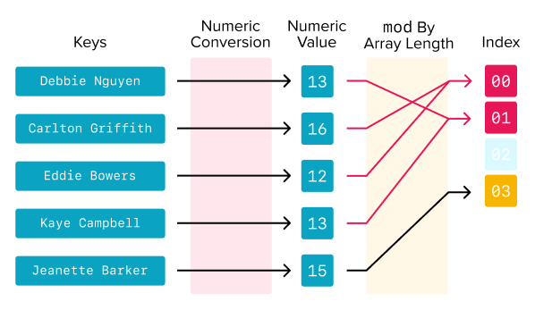
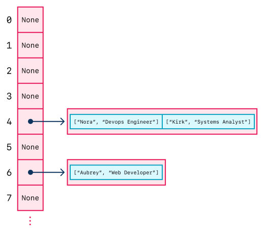

# Overview of Hash Tables

## Learning Goals

- Define hash table
- Define hash function
- Describe how hash tables resolve collisions

## Introduction

Python dictionaries are fascinating! They store key-value pairs, and, as long as we have the key, getting the value has a time complexity of O(1).

This is in direct comparison to arrays/lists. We could store elements in an array, but finding specific entries in an array requires looping through potentially the entire list an O(n) operation.

How do Python dictionaries achieve this speed? How do keys and values get allocated memory? Under the hood, Python dictionaries are _hash tables_.

When we consider how hash tables are designed and implemented, we will:

- Practice algorithmic and design thinking around data structures
- Consider how complex data structures are implemented
- Learn powerful problem-solving techniques for problems often encountered in interviews
- Appreciate dictionaries more!

## Vocabulary and Synonyms

| Vocab         | Definition                                                                                          | Synonyms | How to Use in a Sentence                |
| ------------- | --------------------------------------------------------------------------------------------------- | -------- | --------------------------------------- |
| Hash Table    | A data structure that implements an associative array, which maps unique key identifiers to values. | Hash Map | "Hash tables have an O(1) lookup time." |
| Hash Function | A function used by a hash table to map a key to an index.                                           |
| Collision     | When multiple keys map to the same element in a hash table's internal array.                        |

# Hash Tables

A _hash table_ is a data structure designed to store key-value pairs. They have a method to look up a value by its key (find), add a key-value pair (insert), and delete a key-value pair (remove).

Hash tables can uniquely look up values by key with a time complexity of O(1). With our current knowledge of programming, how is it possible for a data structure to achieve this, even though searching for an item in an array using linear search has a time complexity of O(n)?

Hash tables achieve their speedy lookup times of O(1) by storing their key-value pairs into an array. They take advantage of how arrays have O(1) lookup operations when given an index.

Each hash table has an _internal array_ used for storing. When a hash table inserts a key-value pair, it stores the value into the _internal array_.

Hash tables use _hash functions_ to determine how to add the value into the internal array. **Hash functions** convert a given key into an index for the internal array. Hash tables store the values into that internal array using the computed index, essentially storing the entire key-value pair.

Because the hash function can quickly convert a key to an array index, this operation can result in very quick lookup times.

<!-- Lucidchart link  https://www.lucidchart.com/invitations/accept/5fdcf503-7d8b-4139-94d4-795bfed27883 -->



<!-- Hash function image source: https://en.wikipedia.org/wiki/Hash_function -->

### !callout-info

## Hash Tables Implement Associative Arrays

One reason why hash tables are interesting is because they implement an _abstract data type_ known as an _associative array_. An _abstract data type_ is any data structure that is theoretical, and described not by its concrete implementation, but by its behavior and how it's used. An _associative array_ is a theoretical data structure that describes collections that store key-value pairs.

### !end-callout

## Time Complexity

For all three operations of inserting, finding, and deleting values, hash tables have an O(1) time complexity.

| Action                        | Average Case | Worst Case |
| ----------------------------- | ------------ | ---------- |
| Finding a value by key        | O(1)         | O(n)       |
| Removing a value by key       | O(1)         | O(n)       |
| Inserting a new key and value | O(1)         | O(n)       |

### !callout-info

## We Describe Hash Table Big O by Average Case

Normally, when we estimate the runtime of a data structure's methods with Big O, we assume the worst case. However, a well-designed hash table will attempt to prevent the worst-case scenario from occurring. Therefore when we work with hash tables we **assume the average-case**. The likelihood of the worst case from occurring depends on how well the **hash function** is implemented.

### !end-callout

## Hash Function

**Hash functions** are functions responsible for mapping a given key into an integer index in the internal array.

### Example Hash Function

Imagine that we have a hash table which holds "name"-"job title" key-value pairs. This hash table needs a hash function to transform the "name" into an index.

An example hash function could use the following algorithm:

- Convert the key to a string
- Grab the length of this string
- Get modulo of the length of the string and the length of the internal array
- Use this modulo as the index

```python
def hash_code(key):
  return len(str(key)) % len(hash_array)
```

### !callout-info

## Why Modulo in This Example?

When arrays get created, they get created with a fixed size in memory. This means that they have a maximum length and _can't_ hold an infinite number of things (unless there is an operation which expands the array. Python's list method `append` manages this for us!). Using `len(str(key)) % len(hash_array)` will always result in an index between `0` and the length of the array, meaning it will always be a valid index!

### !end-callout

## Collisions

There is an enormous number of possible keys and a limited-size array. At some point, a hash function will result in some keys being mapped to the same index. When this occurs, it is called a _collision_.

### Example Collision

Let's use the same hash function from before:

```python
def hash_code(key):
  return len(str(key)) % len(hash_array)
```

Imagine a hash table that stores "name"-"job title" key-value pairs. The hash table's internal `hash_array` has a length of `15`. Imagine inserting the following pairs, which have the following indices after applying the above hash function:

| Key (Name) | Value (Job Title)     | Index (`hash_code(key)`) |
| ---------- | --------------------- | ------------------------ |
| `"dan"`    | `"Lead Instructor"`   | `3`                      |
| `"chris"`  | `"CS Fun Instructor"` | `5`                      |
| `"dee"`    | `"Lead Instructor"`   | `3`                      |

If we insert Dan first, and then eventually Dee, our hash function will attempt to add Dee at the index `3`, even though Dan already exists there.

### Resolving Collisions

There are many ways to resolve a collision! One way is to make each element of the hash array a collection itself, and then store new elements into the collection.

### Example Resolution

If the values are stored in an array themselves, we can end up with a hash which looks like this:



In this example, we resolve collisions by creating an array at each index of the main array, then adding the key-value pair to the end of the list.

### !callout-info

## Effective Hash Functions

What would happen if we inserted 600 items, and our hash function happened to insert all 600 items into the same key? If the hash function does not adequately spread values out over the length of the array, we'll have long chains of key-value pairs and an O(n) worst case runtime to find items.

Effective hash functions attempt to spread all possible values over the entire data structure to avoid assigning multiple keys to the same index. Most libraries use well-proven hashing functions which normally prevent high numbers of collisions.

### !end-callout

## Summary

Hash tables are a data structure which allow quick lookup of a value by using a key. Each key is mapped to an index of an internal array with a specialized method called a _hash function_. The average-case lookup is O(1) and the worst-case is O(n). However, most good implementations use a _hash function_ which attempt to uniformly distribute elements and prevent collisions.
