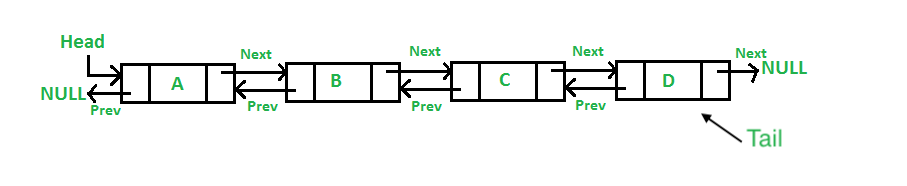

# Linked Lists

<iframe src="https://adaacademy.hosted.panopto.com/Panopto/Pages/Embed.aspx?pid=b1664c7e-f95e-40f5-971f-ad9000fe85d8&autoplay=false&offerviewer=true&showtitle=true&showbrand=false&captions=true&interactivity=all" height="405" width="720" style="border: 1px solid #464646;" allowfullscreen allow="autoplay"></iframe>

## Video Lesson
Please note that this video lesson is from C16 and the content does not fully match the most recent written lesson. We continue to include it until we are able to update the video lesson as the general underlying concepts are consistent.

- [Video Slides](https://docs.google.com/presentation/d/1wWrcROp6MX57lSyZOLjlxBXoWGJbV43WWE_Ub-GxStk/edit?usp=sharing)

## Learning Goals

By the end of this lesson students should be able to:

- Describe the structure of a singly linked list and doubly linked list
- Compare and contrast the advantages and disadvantages of singly and doubly linked lists.
- Design an object oriented singly linked list
- Write methods to perform a variety of tasks on singly and doubly linked lists

### !callout-danger

## Problem Set Layout

This lesson is a precursor to your Thursdays at Ada content. Because Thursdays at Ada teaches more theoretical concepts that can be especially difficult to grasp when first introduced, there is no problem set at the end of the topic. Instead, comprehension checks and coding exercises are embedded into the lesson content directly after walkthroughs of a similar exercise. Please complete all exercises as directed by your instructor. 

### !end-callout

## Overview

Before diving into linked lists, let's remind ourselves how arrays work. An array is an ordered, linear collection of data where each element sits next to the previous element in memory.  Because each element is of uniform size and adjacent to its neighboring element, with some basic math, the interpreter or compiler can jump to any element in the array immediately:  The interpreter takes the memory address of the element at index 0 of the array and adds the size of each element plus the index number of the sought element.  

For example, in the list pictured above, if we wanted to find the element at index of 4 the array the interpreter could easily access the element by adding 200, the memory address of index 0, with the index value of 4 and then looking to see what value is stored at memory address 204. 

Similar to an array, a linked list is also a linear collection where one element is first, another second, etc. The difference between a linked list and an array lies in how each element is stored in memory. Elements of a linked list, also called __nodes__, are not necessarily stored in contiguous memory locations. Instead, in addition to the data it stores, each element contains a _reference_ to the next element in the list.  In that manner we could say that an element _points_ to the next element in the linked list.  Through each node's references, a linked list forms a series of elements linked together like a chain in memory. 

The above image  represented as a linked list. Elements are not stored in contiguous memory. For example, the node at index 0 has a memory address of 200 while the next node in the list at index 1 has a memory address of 512. Each element or node stores not only its data but also a reference to the next node. For example, the node at index 0 stores a value of `U` and a reference, represented by the arrow, to the node at index 1. In actuality, the reference is to the memory location of the node object at index 1, 512. 

### Singly Linked Lists

A singly linked list is the most basic form of a linked list.  Each element of the linked list is itself a data structure called a node. Each node maintains two fields: a field typically called `value` to store the element's data and a field typically called `next` which stores a reference to the next node in the list. The last node in a linked list has `null` as its `next` reference.  

The linked list itself maintains a reference, typically called `head` to the first node in the list. 

<!-- image from https://www.geeksforgeeks.org/difference-between-a-static-queue-and-a-singly-linked-list/ -->

### Doubly Linked Lists

A doubly linked list extends the structure of a singly linked list by adding a `previous` reference to each node. The `previous` reference points to the node in the list directly before it. The `head` node's `previous` field will be `null`.

Doubly linked lists also typically maintain an explicit reference to the last node in the linked list, typically called the `tail`.

## Advantages & Disadvantages

You can use a doubly or singly linked list in any place you could use an array, but they have specific advantages depending on the use case.

### Over Arrays

Both arrays and linked lists are linear data structures and both have a clearly defined order with first and last elements.  An array however has the ability to use an _index_ to select any element in constant time. In contrast, to find an arbitrary element in a linked list, we must start at the head node and iterate through the links until we find the desired element. To visualize and explore linked list operations, try out [visualgo.net](https://visualgo.net/en/list).

### Big-O For Linked Lists & Arrays

**#**|**Data Structure**|**Access**|**Search**|**Insertion (Middle)**|**Deletion (Middle)**|**Add First**|**Add Last**|**Delete First**|**Delete Last**
:-----:|:-----:|:-----:|:-----:|:-----:|:-----:|:-----:|:-----:|:-----:|:-----:|
1|Unsorted Array|O(1)|O(n)|O(n)|O(n)|O(n)|O(1)|O(n)|O(1)|
2|Sorted Array|O(1)|O(log n)|O(n)|O(n)|O(n)|O(1)|O(n)|O(1)|
3|Singly Linked List| O(n)| O(n)| O(n)| O(n)|O(1)|O(n)|O(1)|O(n)|
4|Doubly Linked List|O(n)|O(n)|O(n)|O(n)|O(1)|O(1)|O(1)|O(1)|

On the other hand, as you can see above, doubly linked lists perform in constant time to insert values into or remove values from the ends of a list, because they only require a few references to be redirected toward different nodes. In contrast, arrays can require shifting numerous elements into new indices with each insertion or deletion.

Further, most runtimes allocate more memory to an array than is being used because if the array grows, the interpreter needs to request new memory from the environment and copy the entire array into the new, larger, space.  By starting with extra space available an array can grow as required for some time.  A linked list by contrast only uses memory as required for the nodes available.  

An array also requires each element to be adjacent in memory.  When available memory is limited, this can be problematic.  As a result, in some memory restrictive environments a linked list is attractive. 

### Doubly Linked Lists vs Singly Linked Lists

Doubly linked lists take up additional memory, due to the additional `previous` and `tail` references. However, the additional references also enable us to iterate through doubly linked lists in reverse. Further, it can be a little easier to sort or add/remove elements in the middle of the list more easily.

## Summary

Linked lists have the following advantages:

- **Dynamic Size** Linked lists are of dynamic size, a linked list only uses the memory required for it's current nodes.
- **Insertion/Deletion** Because each element does not need to be adjacent in a linked list it is easier to insert or remove an element from the front of a singly linked list or either end of a doubly linked list in O(1) time.  
  - Arrays require shifting adjacent elements on insertion or deletion at the front of a list, O(n).
  - Appending to an array is an O(1) operation, unless we have filled our allotted stretch of contiguous memory, in which case the entire array will be copied to a larger piece of contiguous memory allow room for the new element making it an O(n) operation.

Arrays have the following advantages:

- **Random Access** Using the index we can quickly access any element in an array, O(1).  A Linked List requires us to traverse the list until we find the element, O(n).
- **No next/previous References** Each node in a Linked List requires, at least, a reference to the next node.  This is an additional complication and a bit of extra memory usage.
- **Caching** Because the memory is colocated, it's easier to move an array into faster system cache memory.

### Questions

<!-- >>>>>>>>>>>>>>>>>>>>>> BEGIN CHALLENGE >>>>>>>>>>>>>>>>>>>>>> -->
<!-- Replace everything in square brackets [] and remove brackets  -->

### !challenge

* type: multiple-choice
* id: 8fcd5e47-5e37-4811-8063-7778ee3c2b20
* title: Suppose you have an online store and need to lookup and access product descriptions by an id (index) number.  What would you pick, LinkedList or Array?
* points: 1
* topics: linked-lists

##### !question

Suppose you have an online store and need to lookup and access product descriptions by an id (index) number.  What would you pick, LinkedList or Array?

##### !end-question

##### !options

* Array
* LinkedList
* Either

##### !end-options

##### !answer

* Array

##### !end-answer

### !end-challenge

<!-- ======================= END CHALLENGE ======================= -->

### !challenge

* type: multiple-choice
* id: 8620f75a-2426-4df7-a51f-3e45a7653db7
* title: You need to look up orders by customer name and the list is maintained in order by the customer name.  What would you pick, LinkedList or Array?
* points: 1
* topics: linked-lists

##### !question

You need to look up orders by customer name and the list is maintained in order by the customer name.  What would you pick, LinkedList or Array?

##### !end-question

##### !options

* Array
* LinkedList
* Either

##### !end-options

##### !answer

* Array

##### !end-answer

<!-- other optional sections -->
<!-- !hint - !end-hint (markdown, users can see after a failed attempt) -->
<!-- !rubric - !end-rubric (markdown, instructors can see while scoring a checkpoint) -->
<!-- !explanation - !end-explanation (markdown, students can see after answering correctly) -->

### !end-challenge

<!-- ======================= END CHALLENGE ======================= -->

<!-- 

You need to look up orders by customer name and the list is maintained in order by the customer name.  What would you pick, LinkedList or Array?

  
An Array because you can search for elements in an Array using binary search O(log n) vs an Array with linear search O(n).

-->

<!-- >>>>>>>>>>>>>>>>>>>>>> BEGIN CHALLENGE >>>>>>>>>>>>>>>>>>>>>> -->
<!-- Replace everything in square brackets [] and remove brackets  -->

### !challenge

* type: multiple-choice
* id: a9e6b3a9-2c97-4c89-901b-4be686fe2e81
* title: You need to regularly add orders to the end of a list and remove orders from the front to process them.  What would you pick, LinkedList or Array?
* points: 1
* topics: linked-lists

##### !question

You need to regularly add orders to the end of a list and remove orders from the front to process them.  What would you pick, LinkedList or Array?

##### !end-question

##### !options

* Array
* LinkedList
* Either

##### !end-options

##### !answer

* LinkedList

##### !end-answer

<!-- other optional sections -->
##### !hint 

A Linked List because you can add and remove elements from the ends in constant time O(1) vs an Array where you have to shift all elements over causing it to run in O(n) time.

##### !end-hint
<!-- !rubric - !end-rubric (markdown, instructors can see while scoring a checkpoint) -->
<!-- !explanation - !end-explanation (markdown, students can see after answering correctly) -->

### !end-challenge

<!-- ======================= END CHALLENGE ======================= -->

<!-- 

You need to regularly add orders to the end of a list and remove orders from the front to process them.  What would you pick, LinkedList or Array?

  
A Linked List because you can add and remove elements from the ends in constant time O(1) vs an Array where you have to shift all elements over causing it to run in O(n) time.

-->

<!-- >>>>>>>>>>>>>>>>>>>>>> BEGIN CHALLENGE >>>>>>>>>>>>>>>>>>>>>> -->
<!-- Replace everything in square brackets [] and remove brackets  -->

### !challenge

* type: multiple-choice
* id: 9a55c30c-75bc-47c9-b847-73cecf096561
* title: You need to regularly look up students from an unordered list and remove them from the list.  What would you pick a LinkedList or an Array?
* points: 1
* topics: linked-lists

##### !question

You need to regularly look up students from an unordered list and remove them from the list.  What would you pick a LinkedList or an Array?

##### !end-question

##### !options

* Array
* LinkedList
* Either

##### !end-options

##### !answer

* Either

##### !end-answer

<!-- other optional sections -->
##### !hint 

Either could work as finding an element will take O(n) for an unordered list in both cases.  Granted removing an element in a LinkedList will take O(1) vs O(n) for an Array.

##### !end-hint
<!-- !rubric - !end-rubric (markdown, instructors can see while scoring a checkpoint) -->
<!-- !explanation - !end-explanation (markdown, students can see after answering correctly) -->

### !end-challenge

<!-- ======================= END CHALLENGE ======================= -->

<!--

You need to regularly look up students from an unordered list and remove them from the list.  What would you pick a LinkedList or an Array?

  
Either could work as finding an element will take O(n) for an unordered list in both cases.  Granted removing an element in a LinkedList will take O(1) vs O(n) for an Array.

-->

<!-- >>>>>>>>>>>>>>>>>>>>>> BEGIN CHALLENGE >>>>>>>>>>>>>>>>>>>>>> -->
<!-- Replace everything in square brackets [] and remove brackets  -->

### !challenge

* type: multiple-choice
* id: 7aad223d-bf1b-4d5d-9ef7-5260c71ea2c1
* title: Your low memory capacity smart lightbulb needs to store a list of data.  What would you pick, LinkedList or Array?
* points: 1
* topics: linked-lists

##### !question

Your low memory capacity smart lightbulb needs to store a list of data.  What would you pick, LinkedList or Array?

##### !end-question

##### !options

* Array
* LinkedList
* Either

##### !end-options

##### !answer

* LinkedList

##### !end-answer

<!-- other optional sections -->
##### !hint

A Linked List because it does not require the items to be adjacent and will only use as much memory as it requires in the moment.

##### !end-hint
<!-- !rubric - !end-rubric (markdown, instructors can see while scoring a checkpoint) -->
<!-- !explanation - !end-explanation (markdown, students can see after answering correctly) -->

### !end-challenge

<!-- ======================= END CHALLENGE ======================= -->

<!--

Your low memory capacity smart lightbulb needs to store a list of data.  What would you pick, LinkedList or Array?

  
A Linked List because it does not require the items to be adjacent and will only use as much memory as it requires in the moment.

-->

## Reflection

<!-- >>>>>>>>>>>>>>>>>>>>>> BEGIN CHALLENGE >>>>>>>>>>>>>>>>>>>>>> -->
<!-- Replace everything in square brackets [] and remove brackets  -->

### !challenge

* type: paragraph
* id: ddfb549a-c3e3-4aa8-b6af-5564b47df40b
* title: Linked Lists Intro Reflection
* points: 1
<!-- * topics: [python, pandas] (Checkpoints only, optional the topics for analyzing points) -->

##### !question

Take 5 minutes to review the above lesson and write down any questions you still have about the material. Is there anything that needs more clarification or you would like to go over again?

Bring these questions to class! If reviewing this material after class, bring these questions to the #study-hall Slack channel or ask in office hours.

##### !end-question

##### !placeholder

Ex. I'm still not understanding why you would use a linked list over an array.
 
Ex. When would you use a doubly linked list vs a singly linked list?

##### !end-placeholder

<!-- other optional sections -->
<!-- !hint - !end-hint (markdown, hidden, students click to view) -->
<!-- !rubric - !end-rubric (markdown, instructors can see while scoring a checkpoint) -->
<!-- !explanation - !end-explanation (markdown, students can see after answering correctly) -->

### !end-challenge

<!-- ======================= END CHALLENGE ======================= -->

