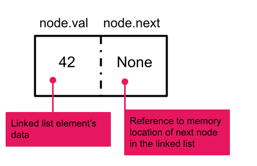
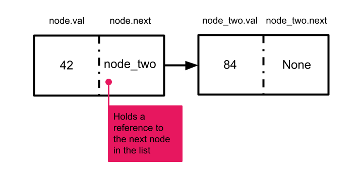
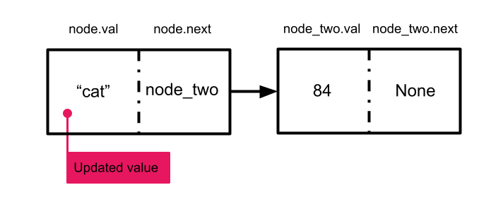

# Object Oriented Design of a Linked List

### Encapsulation

When designing a data structure like a linked list, we typically want our design to include not just our linked nodes but also methods that operate on our linked list, such as methods to add nodes, delete nodes, or get the length of the linked list. Bundling together multiple pieces of data and methods that operate on that data is called __encapsulation__, and you may already be familiar with it in the form of classes. 

Encapsulation also enables us to design our data structure as __abstract__, meaning that the implementation of the data structure is hidden. This allows the internal implementation of the data structure to change without affecting user functionality. As a result, the designer could switch a linked list into an array list without the user needing to know. They could also transition from a singly linked list into a doubly linked list without impacting users. 

## Node Class

Because there is no built in data type that will store a piece of data alongside a reference to where the next piece of data is stored, we need to use a class to build our own. The `Node` class encapsulates each individual element of the linked list. It is comprised of an attribute that stores data and an attribute that stores a reference to the next node in the chain. A separate `LinkedList` class will be created later to allow us to store the head of our linked list. The rest of the list will be accessible via the head node.

```python
# Defines a node in a singly linked list
class Node:
    def __init__(self, value):
        self.val = value
        self.next = None
```

Notice that with our implementation, the `next` attribute for a new node is set to `None` by default. This indicates that our node doesn't reference or link to another node. We can create a new node element by passing in the data we want to store to the `Node` class constructor as follows.

```python
node = Node(42)
```



We can update `new_node` to instead point at a second node by updating the value of its `next` attribute to reference the second node.

```python
node_two = Node(84)
node.next = node_two
```


Similarly, we can update the value of a node by updating its `val` attribute.
```python
node.val = "cat"
```



<!-- available callout types: info, success, warning, danger, secondary, star  -->
### !callout-info

## Modifying the Node Class

There is no reason our `Node` class can't contain attributes and/or methods other than `val` and `next`. 

<break>

For example, we might also track node indices with an `index` attribute or create a method to print out the value of a node. 

### !end-callout
<!-- >>>>>>>>>>>>>>>>>>>>>> BEGIN CHALLENGE >>>>>>>>>>>>>>>>>>>>>> -->

### !challenge

* type: code-snippet
* language: python3.6
* id: bc5f374d-88ba-4c8c-ba99-55df5e5c69af
* title: Doubly Linked List Node Class
* points: 1

##### !question

Above, we wrote the Node class constructor for a singly linked list. Below, write a Node class constructor for a doubly linked list.

Spend no more then 5 minutes working through this independently. Use the hints below or reach out for help if you are still feeling stuck after 5 minutes.

##### !end-question

##### !placeholder

```py
```

##### !end-placeholder

##### !tests

```py
import unittest
from main import *

class TestPython1(unittest.TestCase):
  def test_one(self):
    self.assertEqual(1,1)
```

##### !end-tests

##### !hint
In addition to the `value` and `next` attributes, nodes in a doubly linked list should also maintain a reference to the _previous_ node in the list.

Feeling stuck? Check this video walkthrough of the solution.

<iframe src="https://adaacademy.hosted.panopto.com/Panopto/Pages/Embed.aspx?id=57b9ed93-d9ca-4f09-a5aa-aef90130df5e&autoplay=false&offerviewer=true&showtitle=true&showbrand=false&captions=true&interactivity=all" height="360" width="640" style="border: 1px solid #464646;" allowfullscreen allow="autoplay"></iframe>

##### !end-hint 

##### !explanation 

An example of a working implementation:

```python
class Node:
    def __init__(self, value):
        self.val = value
        self.next = None
        self.prev = None
```
You might also consider giving users the option to pass in a value for `next` and `prev`. 
##### !end-explanation

### !end-challenge

<!-- ======================= END CHALLENGE ======================= -->

## LinkedList Class

Now that we have the `Node` class to represent individual elements of a linked list, we can create a `LinkedList` class to represent an entire list. The  `LinkedList` class has a single attribute `head` which stores a reference to the first node in the list. Our constructor initializes `head` to `None` so that when a new `LinkedList` instance is instantiated, we are creating an empty list.  

```python
# Defines the singly linked list
class LinkedList:
    def __init__(self):
        self.head = None
```

<!-- >>>>>>>>>>>>>>>>>>>>>> BEGIN CHALLENGE >>>>>>>>>>>>>>>>>>>>>> -->
<!-- Replace everything in square brackets [] and remove brackets  -->

### !challenge

* type: code-snippet
* language: python3.6
* id: c7f40307-2a09-4086-ad37-908a590c7132
* title: Doubly LinkedList Class Constructor
* points: 1

##### !question

Above, we wrote the `LinkedList` class constructor for a singly linked list. Alter the code below to write a `LinkedList` class constructor for a doubly linked list.

Spend no more then 5 minutes working through this independently. Use the hints below or reach out for help if you are still feeling stuck after 5 minutes.

##### !end-question

##### !placeholder
```py
class Node:
    def __init__(self, value):
        self.val = value
        self.next = None
        self.prev = None

class LinkedList:
    #write your code here
    pass
```

##### !end-placeholder

##### !tests

```py
import unittest
from main import *

class TestPython1(unittest.TestCase):
  def test_one(self):
    self.assertEqual(1,1)
```

##### !end-tests

##### !hint
In addition to a head pointer, doubly linked lists typically maintain a tail pointer.

Feeling stuck? Check this video walkthrough of the solution.

<iframe src="https://adaacademy.hosted.panopto.com/Panopto/Pages/Embed.aspx?id=ae392a8d-3aa1-4beb-9671-aef90132016d&autoplay=false&offerviewer=true&showtitle=true&showbrand=false&captions=true&interactivity=all" height="360" width="640" style="border: 1px solid #464646;" allowfullscreen allow="autoplay"></iframe>

##### !end-hint

##### !explanation 
An example of a working implementation:

```python

class LinkedList:
    def __init__(self):
        self.head = None
        self.tail = None
```
##### !end-explanation

### !end-challenge

<!-- ======================= END CHALLENGE ======================= -->
## Linked List Methods

Just as with standard Python lists, it is useful for the `LinkedList` class to also include several methods which allow users to perform operations on or pull information out of the linked list. Below we provide function stubs for several possible methods our class may have. Other `LinkedList` classes may choose to extend this functionality with additional methods. For example, the designer could add a `reverse` method to reverse the linked list or a `search` method to find the first element with a specified value in the linked list.

```py
class LinkedList:
    def __init__(self):
        # The first node in the linked list.
        # The head is either a Node object or None if the list is empty.
        self.head = None

    # Method. Adds a new node with the specific data value to the beginning of the linked list.
    def add_first(self, value):
        pass

    # Method. Returns the value in the first node in the linked list.
    # Returns None if the list is empty.
    def get_first(self):
        pass

    # Method. Returns the value of the last node in the linked list. Returns None if the list is empty.
    def get_last(self):
        pass

    # Method. Returns the value at a given index in the linked list.
    # Index count starts at 0.
    # Returns None if there are fewer nodes in the linked list than the index value.
    def get_at_index(self, index):
        pass
```
<!-- available callout types: info, success, warning, danger, secondary, star  -->

<!-- >>>>>>>>>>>>>>>>>>>>>> BEGIN CHALLENGE >>>>>>>>>>>>>>>>>>>>>> -->
<!-- Replace everything in square brackets [] and remove brackets  -->

Abstraction allows us to use a class even if we don't know the details of how it is implemented. Simply having clearly documented properties and methods for the class available as detailed above is sufficient to use the linked list class.

### !challenge

* type: ordering
* id: e316d9d2-dcbd-4992-a588-1c7ee6f01f2c
* title: Array to Linked List
<!-- * points: [1] (optional, the number of points for scoring as a checkpoint) -->
<!-- * topics: [python, pandas] (Checkpoints only, optional the topics for analyzing points) -->

##### !question

Using the documented linked list class and associated function stubs above, order the lines of code such that they will create the linked list equivalent of the following array:

`arr = ["ada", "charles", "alan", "katherine"]`

##### !end-question

##### !answer

1. `ll = LinkedList()`
2. `ll.add_first("katherine")`
3. `ll.add_first("alan")`
4. `ll.add_first("charles")`
5. `ll.add_first("ada")`

##### !end-answer

<!-- other optional sections -->
<!-- !hint - !end-hint (markdown, hidden, students click to view) -->
<!-- !rubric - !end-rubric (markdown, instructors can see while scoring a checkpoint) -->
#### !explanation 
```python
    # instantiate a new linked list object
    ll = LinkedList()
    
    # add the last element to the list to obtain the list `katherine -> None`
    ll.add_first("katherine")
    
    # add the second to last element of the list in front of katherine
    # to obtain the list `alan -> katherine -> None`
    ll.add_first("alan")
    
    # add the second element of the list in front of alan and katherine
    # to obtain the list `charles -> alan -> katherine -> None`
    ll.add_first("charles")

    # add ada in front of all other elements as the head of the list
    # to obtain the list `ada -> charles -> alan -> katherine -> None`
    ll.add_first("ada")

```
#### !end-explanation 

### !end-challenge

<!-- ======================= END CHALLENGE ======================= -->

## Reflection
<!-- >>>>>>>>>>>>>>>>>>>>>> BEGIN CHALLENGE >>>>>>>>>>>>>>>>>>>>>> -->
<!-- Replace everything in square brackets [] and remove brackets  -->

### !challenge

* type: paragraph
* id: 252f094f-5efb-4a8d-bf14-2897c3c1fa69
* title:  OOP Linked Lists Reflection
* points: 1
<!-- * topics: [python, pandas] (Checkpoints only, optional the topics for analyzing points) -->

##### !question

Take 5 minutes to review the above lesson and write down any questions you still have about the material. Is there anything that needs more clarification or you would like to go over again?

Bring these questions to class! If reviewing this material after class, bring these questions to the #study-hall Slack channel or ask in office hours.

##### !end-question

##### !placeholder

Ex. I'm still not understanding the answer to question 3 in the lesson.

Ex. In what cases would we want to change the internal implementation of our data structures?

##### !end-placeholder

<!-- other optional sections -->
<!-- !hint - !end-hint (markdown, hidden, students click to view) -->
<!-- !rubric - !end-rubric (markdown, instructors can see while scoring a checkpoint) -->
<!-- !explanation - !end-explanation (markdown, students can see after answering correctly) -->

### !end-challenge

<!-- ======================= END CHALLENGE ======================= -->

