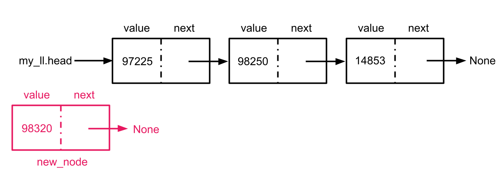
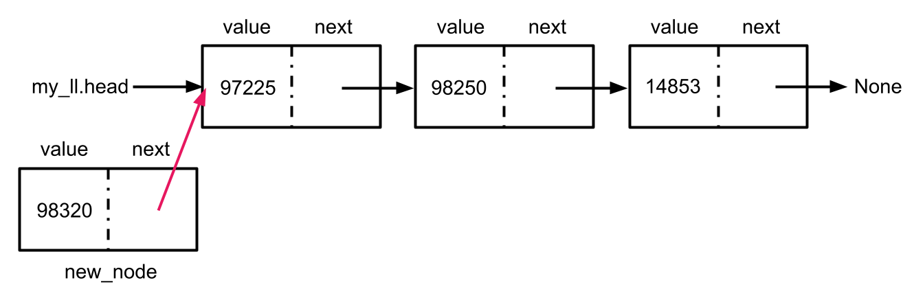
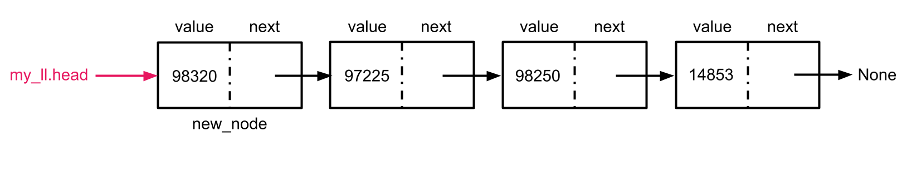
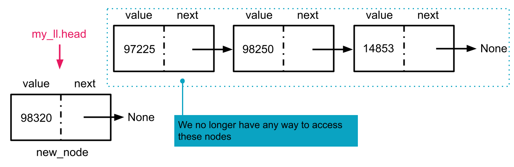
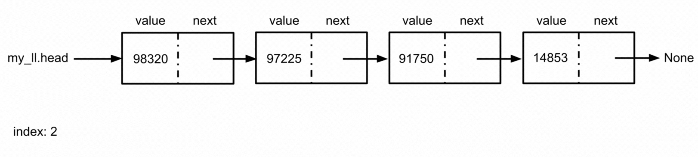
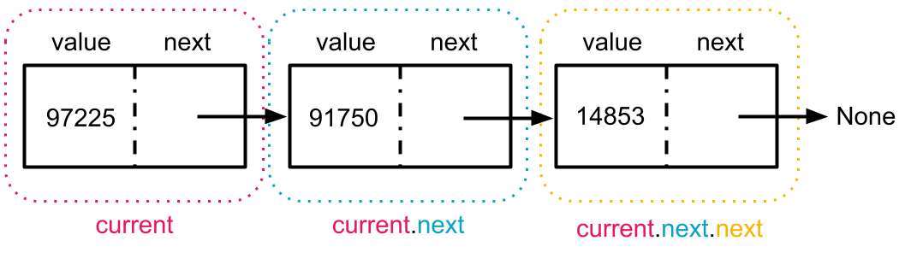
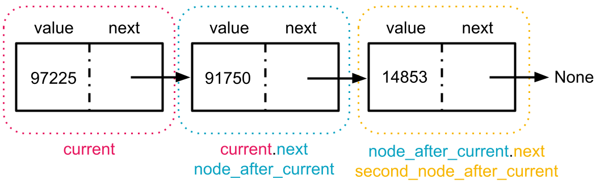

# Linked List Methods

Many languages have linked lists as a built-in data structure or well established libraries to import linked lists. Linked lists are not built-in to Python and while there are [several options](https://www.geeksforgeeks.org/python-library-for-linked-list/) we can leverage if we are interested in utilizing a linked list it can be a useful exercise to implement some common `LinkedList` methods ourselves.

Solving many technical interview questions about linked lists requires using the same techniques used to implement the methods for a `LinkedList` class. We recommend paying particular attention to traversing a linked list (traveling from node to node) and manipulating the `next` and/or `prev` references of linked list nodes.


### Adding A Node

Inserting a new node at the front of the `LinkedList` class is relatively straightforward. The steps are as follows:


1. Create a new `Node` object

2. Set the new node's `next` field

3. Update the linked list's `head` field to point at the new node.


We can write this method in Python as:

```python
def add_first(self, value):
    new_node = Node(value)
    new_node.next = self.head
    self.head = new_node
```

Notice that because we are adding to the front of the list, the new node's `next` attribute should always point to the current (soon to be former) head of the list.

We cannot set the new node as the head of the list before linking it to the rest of the list. In a singly linked list, the `head` reference is the only route through which we can access nodes in the list. If we redirect the `head` to point at an unconnected node, we lose access to all nodes except that unconnected node.



<!-- >>>>>>>>>>>>>>>>>>>>>> BEGIN CHALLENGE >>>>>>>>>>>>>>>>>>>>>> -->
<!-- Replace everything in square brackets [] and remove brackets  -->

### !challenge

* type: code-snippet
* language: python3.6
* id: ea25df32-d73d-456c-885a-8f9d419eedb0
* title: implement get_first
* points: 1
* 
##### !question

Now that we have implemented `add_first` together, try implementing `get_first` on your own. `get_first` should return the value of the first node in the linked list. If the list is empty, `get_first` should return `None`. 

Spend no more then 10 minutes working through this independently. Use the hints below or reach out for help if you are still feeling stuck after 10 minutes.

##### !end-question

##### !placeholder

```py
class Node:
    def __init__(self, value):
        self.val = value
        self.next = None

class LinkedList:
    def __init__(self):
        self.head = None
    
    def add_first(self, value):
        new_node = Node(value)
        new_node.next = self.head
        self.head = new_node

    def get_first(self):
        #write your code here
        pass

```

##### !end-placeholder

##### !tests

```py
import unittest
from main import *

class TestPython1(unittest.TestCase):
    def test_get_first_returns_none_for_empty_list(self):
        lst = LinkedList()
        self.assertEqual(None, lst.get_first())

    def test_get_first_returns_head_of_list_length_one(self):
        lst = LinkedList()
        lst.add_first(3)
        self.assertEqual(3, lst.get_first())

    def test_get_first_returns_head_of_list_length_two(self):
        lst = LinkedList()
        lst.add_first(3)
        lst.add_first(5)
        self.assertEqual(5, lst.get_first())
```

##### !end-tests

### !hint

`self.head` is the first node in the list!

Still feeling stuck? Check this video walkthrough of the solution.

<iframe src="https://adaacademy.hosted.panopto.com/Panopto/Pages/Embed.aspx?id=23ebdac4-d6cb-4673-9467-aef3013568cd&autoplay=false&offerviewer=true&showtitle=true&showbrand=false&captions=true&interactivity=all" height="360" width="640" style="border: 1px solid #464646;" allowfullscreen allow="autoplay"></iframe>

### !end-hint

### !explanation

An example of a working implementation:

```python
def get_first(self):
    if not self.head:
        return None
    return self.head.val
```

### !end-explanation

### !end-challenge

<!-- ======================= END CHALLENGE ======================= -->

<!-- >>>>>>>>>>>>>>>>>>>>>> BEGIN CHALLENGE >>>>>>>>>>>>>>>>>>>>>> -->
<!-- Replace everything in square brackets [] and remove brackets  -->

### !challenge

* type: multiple-choice
* id: aa294ae0-b667-4b52-8f82-347206a2f054
* title: `get_first` Time Complexity
* points: 1

##### !question

What is the time complexity of `get_first`?

##### !end-question

##### !options

a| O(1)
b| O(log n)
c| O(n log n)
d| O(n)
e| O(n^2)

##### !end-options

##### !answer

a|

##### !end-answer


##### !explanation
The time complexity will be O(1) or constant as we are simply accessing an attribute of our linked list.

##### !end-explanation

### !end-challenge
<!-- ======================= END CHALLENGE ======================= -->

<!-- >>>>>>>>>>>>>>>>>>>>>> BEGIN CHALLENGE >>>>>>>>>>>>>>>>>>>>>> -->

### !challenge

* type: multiple-choice
* id: 8ae6fcd5-2707-42c8-a48b-c66b9ce57b23
* title: Space complexity `get_first`
* points: 1

##### !question

What is the space complexity of `get_first`?

##### !end-question

##### !options

a| O(1)
b| O(log n)
c| O(n log n)
d| O(n)
e| O(n^2)

##### !end-options

##### !answer

a|

##### !end-answer


##### !explanation
The space complexity will be O(1) or constant as we are not creating any new data structures or call stacks whose size are proportional to the length of our list.

##### !end-explanation

### !end-challenge

<!-- ======================= END CHALLENGE ======================= -->

### Traversing Linked Lists
Because linked lists are not stored in contiguous memory, most read and write operations will require us to traverse the list. This means we must follow the pointers to travel from one node to the next. With a singly linked list, we only maintain a reference to the `head` node, so all of our traversals will start at the `head` of the list.

Consider a `search` method which allows users to determine whether any nodes in the list have a specified value. The `search` method takes one parameter: a value to search for. The method should return `True` if a node with that value exists within the linked list. 

We can break down the `search` method as follows:

1. Create a variable `current` and set it to reference (point to) the head of the list
2. While there are nodes we haven't looked at yet:
  1. Return `True` if the current node has the specified value
  2. Otherwise, redirect `current` to reference the next node in the list
3. Return `False` if we have looked at all nodes and still have not found any nodes that have the specified value

We can visualize using this algorithm to determine whether a node with the value `19750` exists in the example list below. 


Our pseudocode can be translated to Python as follows:

```python
   def search(self, value):
    current = self.head

    while current:
        if current.val == value:
            return True
        current = current.next
    
    return False
```
Notice that our loop condition checks whether `current` is truthy or falsy - a `Node` instance or `None`. If we were to search for a value that does not exist within our linked list, `current` would eventually hold the tail of our list and then get updated to hold the tail's `next` attribute, `None`. At this point, our loop condition would become falsy, and we would exit the loop and return `False`.

Creating a `current` pointer to help iterate through the nodes in a linked list is a useful strategy that can be applied in many similar linked list applications. 

<!-- >>>>>>>>>>>>>>>>>>>>>> BEGIN CHALLENGE >>>>>>>>>>>>>>>>>>>>>> -->

### !challenge

* type: code-snippet
* language: python3.6
* id: 2673cbc3-f24b-4e4c-8ba3-99fb8f011ab9
* title: `get_at_index`
* points: 1

##### !question

Write a `get_at_index` method for a singly linked list that returns the value at a given index in the linked list. The index count should begin at 0 and the function should return `None` if there are fewer nodes in the linked list than the given index value.

Spend no more then 15 minutes working through this independently. Use the hints below or reach out for help if you are still feeling stuck after 15 minutes.

##### !end-question

##### !placeholder
```py
class Node:
    def __init__(self, value):
        self.val = value
        self.next = None

class LinkedList:
    def __init__(self):
        self.head = None
    
    def add_first(self, value):
        new_node = Node(value)
        new_node.next = self.head
        self.head = new_node

    def get_at_index(self, index):
        #write your code here
        pass
```

##### !end-placeholder

##### !tests
```py
import unittest
from main import *

class TestPython1(unittest.TestCase):
    def test_get_at_index_is_none_with_empty_list(self):
        lst = LinkedList()
        self.assertEqual(None, lst.get_at_index(0))
    
    def test_get_at_index_multiple_elements_in_list(self):
        lst = LinkedList()
        lst.add_first(1)
        lst.add_first(2)
        lst.add_first(3)
        lst.add_first(4)

        self.assertEqual(4, lst.get_at_index(0))
        self.assertEqual(3, lst.get_at_index(1))
        self.assertEqual(2, lst.get_at_index(2))
        self.assertEqual(1, lst.get_at_index(3))

    def test_get_at_index_returns_none_when_index_out_of_bounds(self):
        lst = LinkedList()
        lst.add_first(1)
        lst.add_first(2)

        self.assertEqual(2, lst.get_at_index(0))
        self.assertEqual(1, lst.get_at_index(1))
        self.assertEqual(None, lst.get_at_index(2))
```

##### !end-tests

##### !hint

Create a `current` pointer that initially points to the `head` node to help you iterate through the list. You may also consider initializing an `index` variable that increments every time you look at a new node.

Still feeling stuck? Check this video walkthrough of the solution.

<iframe src="https://adaacademy.hosted.panopto.com/Panopto/Pages/Embed.aspx?id=4f88bc07-bed3-4720-85a2-aef601438444&autoplay=false&offerviewer=true&showtitle=true&showbrand=false&captions=true&interactivity=all" height="360" width="640" style="border: 1px solid #464646;" allowfullscreen allow="autoplay"></iframe>

##### !end-hint

##### !explanation
An example of a working implementation:

```py
    def get_at_index(self, index):
        current_index = 0
        current = self.head

        while current_index < index and current:
            current_index += 1
            current = current.next

        if current_index == index and current:
            return current.val
        return None

```
##### !end-explanation

### !end-challenge

<!-- ======================= END CHALLENGE ======================= -->


<!-- >>>>>>>>>>>>>>>>>>>>>> BEGIN CHALLENGE >>>>>>>>>>>>>>>>>>>>>> -->
<!-- Replace everything in square brackets [] and remove brackets  -->

### !challenge

* type: multiple-choice
* id: 7e0e23a7-17f6-4507-817e-f0bc856c52ef
* title: `get_at_index` Time Complexity
* points: 1

##### !question

What is the time complexity of `get_at_index`?

##### !end-question

##### !options

a| O(1)
b| O(log n)
c| O(n log n)
d| O(n)
e| O(n^2)

##### !end-options

##### !answer

d|

##### !end-answer


##### !explanation
The time complexity will be O(n) or linear as in the worst case, we will loop through every element in our linked list. 

##### !end-explanation

### !end-challenge
<!-- ======================= END CHALLENGE ======================= -->

<!-- >>>>>>>>>>>>>>>>>>>>>> BEGIN CHALLENGE >>>>>>>>>>>>>>>>>>>>>> -->

### !challenge

* type: multiple-choice
* id: e477c5ad-1093-4afc-9ee1-14d5455bd9fb
* title: Space complexity `get_at_index`
* points: 1

##### !question

What is the space complexity of `get_at_index`?

##### !end-question

##### !options

a| O(1)
b| O(log n)
c| O(n log n)
d| O(n)
e| O(n^2)

##### !end-options

##### !answer

a|

##### !end-answer


##### !explanation
The space complexity will be O(1) or constant as we are not creating any new data structures or call stacks whose size are proportional to the length of our list.

##### !end-explanation

### !end-challenge

<!-- ======================= END CHALLENGE ======================= -->


<!-- >>>>>>>>>>>>>>>>>>>>>> BEGIN CHALLENGE >>>>>>>>>>>>>>>>>>>>>> -->
<!-- Replace everything in square brackets [] and remove brackets  -->

### !challenge

* type: code-snippet
* language: python3.6
* id: 8dca2f03-cd69-49fe-a5ec-1350d67cdcee
* title: `add_last`
* points: 1
  
##### !question

Implement a method `add_last` that inserts a new node with a given value as the new last node of the singly linked list.

Spend no more then 15 minutes working through this independently. Use the hints below or reach out for help if you are still feeling stuck after 15 minutes

##### !end-question

##### !placeholder
```py
class Node:
    def __init__(self, value):
        self.val = value
        self.next = None

class LinkedList:
    def __init__(self):
        self.head = None
    
    def add_first(self, value):
        new_node = Node(value)
        new_node.next = self.head
        self.head = new_node

    def add_last(self, value):
        #write your code here
        pass
```

##### !end-placeholder

##### !tests
```py
import unittest
from main import *

class LinkedListExtended(LinkedList):
    
    def get_first(self):
        if self.head:
            return self.head.val
        return None

    def get_at_index(self, index):
        current_index = 0
        current = self.head

        while current_index < index and current:
            current_index += 1
            current = current.next

        if current_index == index and current:
            return current.val
        return None
    
    def length(self):
        count = 0
        current = self.head
        while current:
            count += 1
            current = current.next
        return count

    def get_last(self):
        if not self.head:
            return None

        current = self.head
        while current.next:
            current = current.next
        return current.val
        

class TestPython1(unittest.TestCase):
    def test_add_last_on_empty_list(self):
        lst = LinkedListExtended()
        lst.add_last(1)
        self.assertEqual(1, lst.get_at_index(0))

    def test_add_last_on_empty_lst_head_is_tail(self):
        lst = LinkedListExtended()
        lst.add_last(1)
        self.assertEqual(1, lst.get_last())
        self.assertEqual(1, lst.get_first())
    
    def test_add_last_increases_length(self):
        lst = LinkedListExtended()
        
        self.assertEqual(0, lst.length())

        lst.add_last(5)

        self.assertEqual(1, lst.length())

        lst.add_last(4)
        self.assertEqual(2, lst.length())

        lst.add_last(3)
        self.assertEqual(3, lst.length())

    def test_add_last_adds_new_item_to_back_of_list(self):
        lst = LinkedListExtended()

        lst.add_last(3)
        self.assertEqual(3, lst.get_last())
        self.assertEqual(3, lst.get_first())

        lst.add_last(2)
        self.assertEqual(2, lst.get_last())
        self.assertEqual(3, lst.get_first())

        lst.add_last(1)
        self.assertEqual(1, lst.get_last())
        self.assertEqual(3, lst.get_first())
```

##### !end-tests

##### !hint
This method will require us to combine our skills of traversing linked lists with redirecting some of the nodes' pointers. 

Start by creating the new node with the `value` passed in.

The ultimate goal for this function is to redirect the current last node in the list to point at the new last node in the list.

Consider how you might handle the edge case in which the list is empty. 

In the nominal case, where the list already has some number of nodes, consider using a `current` pointer to find the last node in the list. Recall that the last node in the list will have a `next` pointer with a `None` value. 


Still feeling stuck? Check this video walkthrough of the solution.

<iframe src="https://adaacademy.hosted.panopto.com/Panopto/Pages/Embed.aspx?id=60f22d0f-5fc5-4054-9cc0-aef6014384ac&autoplay=false&offerviewer=true&showtitle=true&showbrand=false&captions=true&interactivity=all" height="360" width="640" style="border: 1px solid #464646;" allowfullscreen allow="autoplay"></iframe>

##### !end-hint

##### !explanation
An example of a working implementation:

```py
    def add_last(self, value):
        if not self.head:
            self.add_first(value)
        else:
            new_node = Node(value)
            current = self.head
            while current.next:
                current = current.next
            current.next = new_node

```
##### !end-explanation

### !end-challenge

<!-- ======================= END CHALLENGE ======================= -->


<!-- >>>>>>>>>>>>>>>>>>>>>> BEGIN CHALLENGE >>>>>>>>>>>>>>>>>>>>>> -->
<!-- Replace everything in square brackets [] and remove brackets  -->

### !challenge

* type: multiple-choice
* id: 46980cd5-6319-4627-975b-49cbfa5c6d1b
* title: `add_last` Time Complexity
* points: 1

##### !question

What is the time complexity of `add_last`?

##### !end-question

##### !options

a| O(1)
b| O(log n)
c| O(n log n)
d| O(n)
e| O(n^2)

##### !end-options

##### !answer

d|

##### !end-answer


##### !explanation
The time complexity will be O(n) or linear as in the worst case, we will loop through every element in our linked list. 

##### !end-explanation

### !end-challenge
<!-- ======================= END CHALLENGE ======================= -->

<!-- >>>>>>>>>>>>>>>>>>>>>> BEGIN CHALLENGE >>>>>>>>>>>>>>>>>>>>>> -->

### !challenge

* type: multiple-choice
* id: d8f308c6-f593-4d89-b86b-82d00488fd08
* title: Space complexity `add_last`
* points: 1

##### !question

What is the space complexity of `add_last`?

##### !end-question

##### !options

a| O(1)
b| O(log n)
c| O(n log n)
d| O(n)
e| O(n^2)

##### !end-options

##### !answer

a|

##### !end-answer
##### !explanation
The space complexity will be O(1) or constant as we are not creating any new data structures or call stacks whose size are proportional to the length of our list.

##### !end-explanation

### !end-challenge

<!-- ======================= END CHALLENGE ======================= -->

<!-- >>>>>>>>>>>>>>>>>>>>>> BEGIN CHALLENGE >>>>>>>>>>>>>>>>>>>>>> -->
<!-- Replace everything in square brackets [] and remove brackets  -->

### !challenge

* type: code-snippet
* language: python3.6
* id: 10523d72-e7ee-4a81-bfa3-4883aed1e459
* title: add_last for a doubly linked list
* points: 1


##### !question

Would anything change if we implemented `add_last` for a doubly linked list? Implement a method `add_last` that inserts a new node with a given value as the new last node of the doubly linked list.

Spend no more then 10 minutes working through this independently. Use the hints below or reach out for help if you are still feeling stuck after 10 minutes

##### !end-question

##### !placeholder
```py
class Node:
    def __init__(self, value):
        self.val = value
        self.prev = None
        self.next = None

class LinkedList:
    def __init__(self):
        self.head = None
        self.tail = None

    def add_first(self, value):
        new_node = Node(value)
        if not self.head:
            self.head = new_node
            self.tail = new_node
        else:
            new_node.next = self.head
            self.head.prev = new_node
            self.head = new_node

    def add_last(self, value):
        #write your code here
        pass

```

##### !end-placeholder

##### !tests
```py
import unittest
from main import *

class LinkedListExtended(LinkedList):
    
    def get_first(self):
        if self.head:
            return self.head.val
        return None

    def get_at_index(self, index):
        current_index = 0
        current = self.head

        while current_index < index and current:
            current_index += 1
            current = current.next

        if current_index == index and current:
            return current.val
        return None
    
    def length(self):
        count = 0
        current = self.head
        while current:
            count += 1
            current = current.next
        return count

    def get_last(self):
        if not self.head:
            return None
        return self.tail.val
        

class TestPython1(unittest.TestCase): 

    def test_add_last_on_empty_list(self):
        lst = LinkedListExtended()
        lst.add_last(1)
        self.assertEqual(1, lst.get_at_index(0))

    def test_add_last_on_empty_lst_head_is_tail(self):
        lst = LinkedListExtended()
        lst.add_last(1)
        self.assertEqual(1, lst.get_last())
        self.assertEqual(1, lst.get_first())
    
    def test_add_last_increases_length(self):
        lst = LinkedListExtended()
        
        self.assertEqual(0, lst.length())

        lst.add_last(5)
        self.assertEqual(1, lst.length())

        lst.add_last(4)
        self.assertEqual(2, lst.length())

        lst.add_last(3)
        self.assertEqual(3, lst.length())

    def test_add_last_adds_new_item_to_back_of_list(self):
        lst = LinkedListExtended()

        lst.add_last(3)
        self.assertEqual(3, lst.get_last())
        self.assertEqual(3, lst.get_first())

        lst.add_last(2)
        self.assertEqual(2, lst.get_last())
        self.assertEqual(3, lst.get_first())

        lst.add_last(1)
        self.assertEqual(1, lst.get_last())
        self.assertEqual(3, lst.get_first())
```

##### !end-tests

<!-- other optional sections -->
##### !hint
Remember that doubly linked lists maintain a tail pointer! How can we use the tail reference to avoid the need to traverse the linked list?

Still feeling stuck? Check this video walkthrough of the solution.

<iframe src="https://adaacademy.hosted.panopto.com/Panopto/Pages/Embed.aspx?id=14965c22-76ad-4be8-985c-aef60143840c&autoplay=false&offerviewer=true&showtitle=true&showbrand=false&captions=true&interactivity=all" height="360" width="640" style="border: 1px solid #464646;" allowfullscreen allow="autoplay"></iframe>
##### !end-hint

##### !explanation 
An example of a working implementation:

```py
    def add_last(self, value):
        if not self.head:
            self.add_first(value)
        else:
            new_node = Node(value)
            new_node.prev = self.tail
            self.tail.next = new_node
            self.tail = new_node
```
##### !end-explanation

### !end-challenge

<!-- ======================= END CHALLENGE ======================= -->


<!-- >>>>>>>>>>>>>>>>>>>>>> BEGIN CHALLENGE >>>>>>>>>>>>>>>>>>>>>> -->
<!-- Replace everything in square brackets [] and remove brackets  -->

### !challenge

* type: multiple-choice
* id: 93ee5ef5-20e7-474a-b5ad-859ed075a770
* title: add_last Time Complexity for Doubly Linked List
* points: 1

##### !question

What is the time complexity of `add_last` in a doubly linked list?

##### !end-question

##### !options

a| O(1)
b| O(log n)
c| O(n log n)
d| O(n)
e| O(n^2)

##### !end-options

##### !answer

a|

##### !end-answer


##### !explanation
The time complexity will be O(1) or constant because we now just need to access the `tail` attribute and redirect our pointers which are all O(1) operations.

##### !end-explanation

### !end-challenge
<!-- ======================= END CHALLENGE ======================= -->

<!-- >>>>>>>>>>>>>>>>>>>>>> BEGIN CHALLENGE >>>>>>>>>>>>>>>>>>>>>> -->

### !challenge

* type: multiple-choice
* id: 2ab6dd25-84bd-463a-9537-3aa143f6ad87
* title: add_last Space Complexity for a Doubly Linked List
* points: 1

##### !question

What is the space complexity of `add_last` in a doubly linked list?

##### !end-question

##### !options

a| O(1)
b| O(log n)
c| O(n log n)
d| O(n)
e| O(n^2)

##### !end-options

##### !answer

a|

##### !end-answer
##### !explanation
The space complexity will be O(1) or constant as we are not creating any new data structures or call stacks whose size are proportional to the length of our list.

##### !end-explanation

### !end-challenge

<!-- ======================= END CHALLENGE ======================= -->
### Removing a node at a specific index

Removing a node at a specific index also requires list traversal. We traverse the list until we find the index before the node to delete. Remove also requires some more complex redirection of pointers. 

We can pseudocode the following algorithm:

1. If the list is empty, return as there are no nodes to remove
2. If the given index is 0, redirect `head` to point at the second node in the list and return to exit the function
3. Initialize a `current` pointer to `head`. We will use `current` to store whichever node we are currently iterating over
4. Initialize an index variable to track the index of the node we are currently iterating over
5. While we have neither reached the end of the list nor found the node prior to the one we are looking to remove
   1. Redirect `current` to point at the next node in the list
   2. Increment `index` by one
6. If there is a node after `current`, remove that node by updating `current`'s next to point at the next node's `next`  

Below, we can see how our algorithm would remove the node at index 2 from the depicted list.



We can translate our pseudocode into Python as follows:

```python
def remove(self, index):
    if not self.head:
        return 

    if index == 0:
        self.head = self.head.next
        return

    current = self.head
    current_index = 0
    while current.next and current_index < index - 1:
        current = current.next
        current_index += 1

    if current.next:
        current.next = current.next.next
```

Notice the use of dot notation in the last line of the algorithm above. `current` references the current node we are iterating over. `current.next` accesses `current`'s `next` attribute which references the node in the list that comes after `current`. We can then use dot notation again to go even deeper into the list and access `current.next`'s attributes. `current.next.next` references the node that comes after `current.next`. 



Alternatively we could initialize additional variables to break up `current.next.next` as follows.

```python
node_after_current = current.next
second_node_after_current = node_after_current.next
```


Use whatever syntax is most readable to you!

<!-- >>>>>>>>>>>>>>>>>>>>>> BEGIN CHALLENGE >>>>>>>>>>>>>>>>>>>>>> -->
<!-- Replace everything in square brackets [] and remove brackets  -->

### !challenge

* type: paragraph
* id: c6513e71-66c3-493c-be6d-8607cad7142a
* title: Invalid Input for `remove`
* points: 1
<!-- * topics: [python, pandas] (Checkpoints only, optional the topics for analyzing points) -->

##### !question

Imagine a user passes in an `index` value that is greater than the length of the list to our `remove` method. For example, imagine they call `my_ll.remove(10)` when `my_ll` is a linked list with only 5 elements. 

How does the `remove` algorithm above handle this edge case? Explain. 

##### !end-question

##### !placeholder


##### !end-placeholder

<!-- other optional sections -->
<!-- !hint - !end-hint (markdown, hidden, students click to view) -->
<!-- !rubric - !end-rubric (markdown, instructors can see while scoring a checkpoint) -->
##### !explanation
We will traverse the entire list but not remove any nodes. Our method will return after traversing the entire list.

If we pass in an index that is too large, our algorithm's while loop condition will eventually become falsy.  When `current` is updated to reference the tail node, `current.next` becomes `None` and our condition `while current.next and...` becomes falsy. 

Once we exit the while loop, our algorithm asks if `current.next` is truthy or falsy. We know that it is falsy, so we do not enter the body of our if statement. At this point, our algorithm is finished so the function returns by default.

##### !end-explanation 

### !end-challenge

<!-- ======================= END CHALLENGE ======================= -->
## Summary

Linked lists are not a built-in data type in Python, however we can implement our own `Node` and `LinkedList` classes to represent individual elements of a linked list and an overall linked list respectively. 

Because we only have direct access to the `head` node in a singly linked list (we also have access to the last node in the list, the `tail`, for a doubly linked linked list), to access other nodes in the list we need to traverse it. We can do this by maintaining a variable `current` which tracks the node we are currently iterating over, and following node's `next` pointers to update the node that `current` references.

To add, move, and delete elements from a linked list, we can redirect a node's `next` and/or `previous` pointers to reference other nodes in the list.


Most technical interview questions regarding linked lists will involve these two techniques of traversing a linked list and manipulating pointers within the list.


## Reflection
<!-- >>>>>>>>>>>>>>>>>>>>>> BEGIN CHALLENGE >>>>>>>>>>>>>>>>>>>>>> -->
<!-- Replace everything in square brackets [] and remove brackets  -->

### !challenge

* type: paragraph
* id: 10f06fe9-d958-4d1d-8731-9012e3971eea
* title:  Linked Lists Methods Reflection
* points: 1
<!-- * topics: [python, pandas] (Checkpoints only, optional the topics for analyzing points) -->

##### !question

Take 5 minutes to review the above lesson and write down any questions you still have about the material. Is there anything that needs more clarification or you would like to go over again?

Bring these questions to class! If reviewing this material after class, bring these questions to the #study-hall Slack channel or ask in office hours.

##### !end-question

##### !placeholder

Ex. I'm still not understanding how the solution to `add_last` works.

Ex. When should my while loop condition should be `while current` vs `while current.next`?

##### !end-placeholder

<!-- other optional sections -->
<!-- !hint - !end-hint (markdown, hidden, students click to view) -->
<!-- !rubric - !end-rubric (markdown, instructors can see while scoring a checkpoint) -->
<!-- !explanation - !end-explanation (markdown, students can see after answering correctly) -->

### !end-challenge

<!-- ======================= END CHALLENGE ======================= -->

