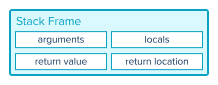
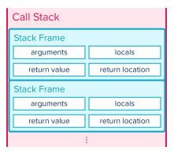

# Reading Recursive Code

<iframe src="https://adaacademy.hosted.panopto.com/Panopto/Pages/Embed.aspx?pid=afeadfe6-9730-4c07-bbce-ad2d001b5392&autoplay=false&offerviewer=true&showtitle=true&showbrand=false&start=0&interactivity=all" height="405" width="720" style="border: 1px solid #464646;" allowfullscreen allow="autoplay"></iframe>

## Learning Goals

- Define base case
- List the parts of a recursive function
- Define stack
- Practice reading recursive function calls

## Vocabulary and Synonyms

| Vocab                        | Definition                                                                                                                                                            | How to Use in a Sentence                                                                                                                               |
| ---------------------------- | --------------------------------------------------------------------------------------------------------------------------------------------------------------------- | ------------------------------------------------------------------------------------------------------------------------------------------------------ |
| Recursion (computer science) | A programming technique where a function calls itself                                                                                                                 | "One way to compute the nth Fibonacci number is with recursion, where a function `fibonacci` calls itself until it's finished."                        |
| Base Case                    | A condition which will end the recursion. For this condition, the function can immediately calculate a solution.                                                                                 | "The base case for computing the nth Fibonacci number is when `n` is 1 or 2, as the first two numbers of the Fibonacci sequence are always 1 and 1." |
| Recursive Case               | A situation in a recursive function that will call the function itself with a smaller problem                                                                                               | "When computing the nth Fibonacci number, if `n` is greater than 2, the `fibonacci` function will call itself with a smaller `n`."                                        |
| Stack (data structure)       | A data structure that operates as "Last-In-First-Out," where new data is pushed onto the top, and data is popped off from the top                                     |
| Call stack                 | A part of memory dedicated to storing the method calls and local variables of a running program. The call stack is responsible for keeping track of function calls. |

## Recursion

In programming, a recursive function is a function that calls itself.

Consider the following recursive function:

```python
def hello_crash():
    print("Hello, crash!")
    hello_crash()
```

When we call `hello_crash`, it will print a greeting, and then invoke itself, `hello_crash`. Of course, when _this_ function calls begins execution, it will also print a greeting, and then invoke itself. This will invoke itself, which will invoke itself, until... well, until the program crashes. More on that later!

The main thing to notice is that when a function calls itself, the logic within the function gets run multiple times. Each call prints its output, and then calls itself again. The next call starts from the beginning of the function, printing and calling as it continues.

In this way, recursion can be used to repeat logic and behavior, much in the same way as iteration does. There are often iterative and recursive solutions to the same problem!

When would we choose to solve a problem with recursion? Once we're used to thinking about recursion, recursive algorithms may be more readable and understandable compared to iterative solutions, especially in cases where the data itself has self-similar, recursive properties.

## Anatomy of a Recursive Function

Functions that recurse, like the crash-prone `hello_crash` function, will continuously call themselves an infinite number of times.

However, if a function calls itself an infinite number of times, when will we actually get an answer and solve our problem? Recursive functions are more helpful when they actually _do_ stop!

In order to better read and debug recursive functions, let's inspect the anatomy of one.

### Base Cases are Stopping Conditions

Recursive algorithms will usually take in at least one argument. A recursive algorithm handles different situations based on the value of the argument. The algorithm should handle:

- At least one _base case_
- At least one _recursive case_

| Part           | Definition                                                            |
| -------------- | --------------------------------------------------------------------- |
| Base Case      | A case or situation where there is a solution without using recursion |
| Recursive Case | A case or situation that depends on the solution of other cases       |

The responsibility of the _base case_ is to immediately answer a particular form of the problem.

The responsibility of the _recursive case_ is to transform the current problem into one that can be expressed as a "smaller" version of the same problem. Eventually it should reach a configuration that can be handled by the base case.

We can imagine that a recursive function will handle recursive cases by calling itself, until it reaches a base case. Most recursive functions will follow this pattern:

1. If we are in a situation that the base case can handle
   - Solve using the base case's solution
2. Otherwise solve by recursively calling the same function with "smaller" input

The "smaller" input in the recursive call should be working towards bringing the problem to something that can be handled by the base case.

## Example: Exponentiation

Read through this recursive function, `power(num, exponent)`, whose responsibility is to calculate [exponentiation](https://en.wikipedia.org/wiki/Exponentiation) of the form `num`<sup>`exponent`</sup>. It takes in two arguments:

1. `num`, which is the base number
1. `exponent`, which is the exponent

For example, 3<sup>5</sup>, where `3` is `num` and `5` is `exponent`, is expressed and calculated like this:

```
3 * 3 * 3 * 3 * 3
```

And 3<sup>6</sup> is expressed as:

```
3 * 3 * 3 * 3 * 3 * 3
```

Notice that 3<sup>6</sup> is equal to 3 ⋅ 3<sup>5</sup>, or more generally `num`<sup>`exponent`</sup>` == num * num`<sup>`(exponent - 1)`</sup>. We can express this relationship in the following recursive implementation.

```python
def power(num, exponent):
    if exponent == 0:
        return 1

    return num * power(num, exponent - 1)
```

#### Base Case

In exponentiation, any number raised to the power of zero equals one.

```python
if exponent == 0:
    return 1
```

This code snippet is the _base case_. Whenever `power` is called **and** the argument `exponent` is `0`, then we return `1`. This base case gives us an immediate solution to the problem: `1`.

#### Recursive Cases

```python
return num * power(num, exponent - 1)
```

This code snippet handles the recursive cases. A recursive case _calls itself while making the problem smaller_. Recursive cases should move the problem closer and closer to the base case.

The problem gets smaller by calling `power` with a smaller exponent. As the `exponent` shrinks, it will eventually equal `0`.

### !callout-danger

## This Function Has Unhandled Edge Cases

In general, exponentiation allows non-integer, and negative exponents. Neither of these cases is handled in this implementation. Take a moment to consider why negative numbers and non-integer numbers will not produce the correct result.

<br />

<details>
    <summary>Hint</summary>

<br />

Will the value of `exponent` ever equal zero?

</details>

### !end-callout

### Running `power`

How can we visualize the flow of code execution? Let's add some print statements to `power`, and then run it.

```python
def power(num, exponent):
    print("Calling power! num:", num, "exponent:", exponent)
    if exponent == 0:
        return 1

    return num * power(num, exponent - 1)


print(3, "raised to the power of", 5, "is", power(3, 5))

print("-------------")

print(3, "raised to the power of", 6, "is", power(3, 6))
```

We should get the following output:

```
Calling power! num: 3 exponent: 5
Calling power! num: 3 exponent: 4
Calling power! num: 3 exponent: 3
Calling power! num: 3 exponent: 2
Calling power! num: 3 exponent: 1
Calling power! num: 3 exponent: 0
3 raised to the power of 5 is 243
-------------
Calling power! num: 3 exponent: 6
Calling power! num: 3 exponent: 5
Calling power! num: 3 exponent: 4
Calling power! num: 3 exponent: 3
Calling power! num: 3 exponent: 2
Calling power! num: 3 exponent: 1
Calling power! num: 3 exponent: 0
3 raised to the power of 6 is 729
```

We can confirm that the `power` function was called multiple times. Each time, the problem was made smaller, and `exponent` was decremented by one. Eventually, when `exponent` was `0`, it met the conditions for the base case, and returned `1`.

The `1` was multiplied by `num` as each call returned: `1 * 3` returns `3`. `3 * 3` returns 9, and so on back through the calls, until `power(3, 5)` calculates `1 * 3 * 3 * 3 * 3 * 3`, or `243`. Similarly, `power(3, 6)` calculates `1 * 3 * 3 * 3 * 3 * 3 * 3`, or `729`.

## Infinite Recursion

A function that calls itself without working towards a base case will repeat infinitely.

```python
def infinite_recursion(n):
    return n + infinite_recursion(n)
```

Even if the function modifies its argument, if it doesn't have a base case it will never stop! Consider this code which decrements its argument but has no base case:

```python
def infinite_recursion(n):
    return n + infinite_recursion(n - 1)
```

Executing either of these functions crashes with a `RecursionError`! This is the same behavior that we encountered with our `hello_crash` function.

A `RecursionError` is caused by a situation called a _stack overflow_.

What's a _stack_, and how does it _overflow_? Let's find out!

## Stacks and Function Calls

A running program has a dedicated section of memory called the **call stack**.

The main responsibility of the call stack is to keep track of function calls. It stores information about the argument values and local variables used in the function. It also records the location from where the current function was called (the _call site_), so that it can _return_ there when the function ends.

The "stack" in "call stack" implies that it uses a _stack_ data structure.

### Intro to the Stack Data Structure

How does a stack organize data? A stack organizes data like a stack of plates! When we add a plate to the stack of plates, we add it to the top. When we need a plate from the stack of plates, we remove it from the top.

When a stack adds a new piece of data, it goes on top. When a stack removes one piece of data, it pops off the top item.

### !callout-info

## Stacks Are LIFO

Stacks operate in a Last-In-First-Out (LIFO) manner. They remove things in the reverse order they were added.

### !end-callout

### Stack Frames Are Stored on the Stack

Each time we call a function, some tracking information is set up and pushed onto the stack. This collection of information is called a _stack frame_, or sometimes an _activation record_.

The exact structure and content of the stack frame varies from language to language, but a representative description of a stack frame would include:

- function arguments
- function local variables
- return value
- return location (where the function was called from)

  
_Fig. Basic structure of a stack frame_

A stack frame is _pushed_ onto the call stack each time we call a function, and it is _popped_ off the call stack when the function completes.

  
_Fig. The top of a call stack with two visible stack frames. Additional frames exist below these, indicated by the ellipsis._

The top of the call stack represents where the program is currently running. The frames below the current frame provide the sequence of nested function calls that led to the program being in the current function.

### !callout-info

## We Use the Call Stack When Debugging

There are two main ways we use the call stack while debugging.

1. We can view the call stack directly in the debugger. When we stop at a breakpoint, the debugging panel labeled `Call Stack` shows the sequence of function calls that led to the program arriving at that breakpoint.
2. When our programs crash, we see the call stack printed to the terminal. It shows the sequence of nested function calls that led to the program crashing.

### !end-callout

The call stack can become very deep and complicated. But with practice, we can get used to looking through the call stack to help understand what our programs are doing!

## Tracing Recursive Functions and Illustrating the Stack

Let's read another recursive function, and apply our new knowledge about the _call stack_ in order to visualize it. Consider the following function.

```python
def mystery(num):
    if num <= 1:
        return 1

    return num * mystery(num - 1)
```

What happens when we invoke the function when `num` is `5`?

```python
mystery(5)
```

We can begin to illustrate the _call stack_. Because the call stack keeps track of function calls, we add the function call `mystery(5)` onto the stack.

.png>)  
_Fig. The top of the call stack after calling **`mystery(5)`**_

When `mystery(5)` executes, the base case is not met. It will call `mystery(4)`.

The function call `mystery(4)` is added to the _top_ of the stack.

.png>)  
_Fig. The top of the call stack after calling **`mystery(4)`**_

Here, `num` is `4`, and the base case is still not met. This will call `mystery(3)`

We add `mystery(3)` to the top of the stack.

.png>)  
_Fig. The top of the call stack after calling **`mystery(3)`**_

This calls `mystery(2)`. Calling `mystery(2)` gets pushed onto the stack.

.png>)  
_Fig. The top of the call stack after calling **`mystery(2)`**_

The base case is still not met. The function calls `mystery(1)`, which gets pushed onto the stack.

.png>)  
_Fig. The top of the call stack after calling **`mystery(1)`**_

At this point, `num` is `1`, which is our base case! The base case provides a solution and `return`s `1`.

As the function finishes and `return`s, its time on the call stack is over. The call stack pops off the top function call after executing `return 1`.

-return.png>)  
_Fig. When the base case is encountered, it returns its result back to the previous function call._

The call stack returns to `mystery(2)`.

`mystery(2)` takes that return value (`1`), and executes `num * mystery(num - 1)`, and then **returns this result**. In this case, where `num` is `2`, it **returns** `2 * 1`, or `2`.

The function `mystery(2)` is popped off the call stack. The call stack returns to `mystery(3)` on the stack.

We can summarize the remaining returns like so:

| Frame Executed | `num` | `num * mystery(num-1)` | Return value |
| -------------- | ----- | ---------------------- | ------------ |
| `mystery(3)`   | `3`   | `3 * 2`                | `6`          |
| `mystery(4)`   | `4`   | `4 * 6`                | `24`         |
| `mystery(5)`   | `5`   | `5 * 24`               | `120`        |

  
_Fig. As each call completes, its result is returned to the next call in the stack, eventually producing 120._

As a final result, we see that `mystery(5)` returns `120`.

Illustrating the stack like this can help us visualize recursive calls.

## Infinite Recursion "Overflows" the Stack 

We see that every nested function call causes additional information to be pushed onto the stack. This means that every function call requires a small (but not zero!) amount of memory.

In our example, we also saw that the stack frames for earlier calls (e.g. `mystery(5)`) cannot be released until the later calls complete (e.g. `mystery(1)`). So as we nest function calls deeper and deeper, more and more memory is used.

There is a finite amount of memory in our machines, so systems place a limit on how large the call stack is allowed to grow. Eventually, if we keep making nested function calls, we will exceed this limit, and the call stack "overflows" its bounds. This is why the `hello_crash` and `infinite_recursion` functions result in a `RecursionError`.

Base cases are extremely important!

## Check for Understanding

<!-- Question Takeaway -->
<!-- prettier-ignore-start -->
### !challenge
* type: paragraph
* id: Do3G8s
* title: Reading Recursive Code
##### !question

What was your biggest takeaway from this lesson? Feel free to answer in 1-2 sentences, draw a picture and describe it, or write a poem, an analogy, or a story.

##### !end-question
##### !placeholder

My biggest takeaway from this lesson is...

##### !end-placeholder
### !end-challenge
<!-- prettier-ignore-end -->
